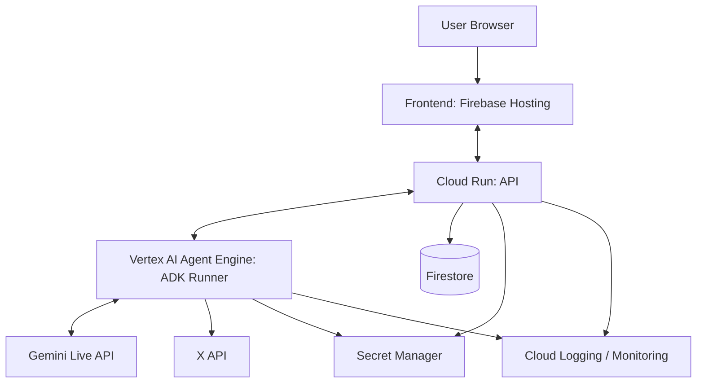
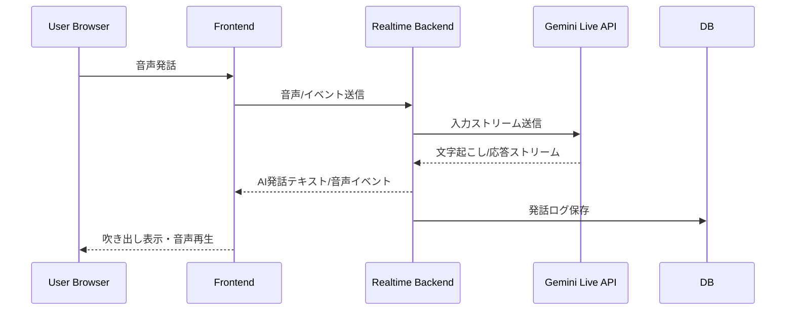
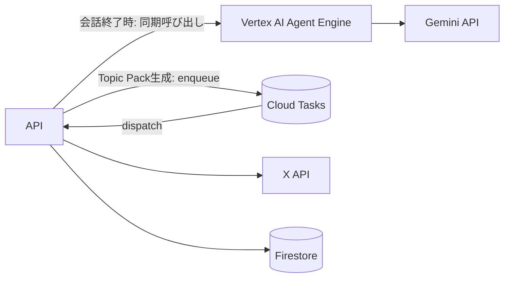
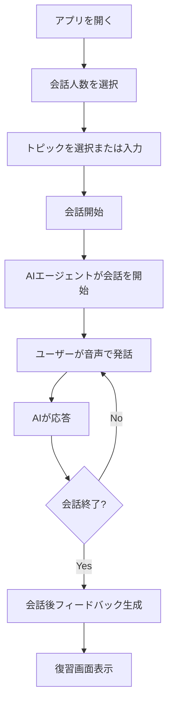
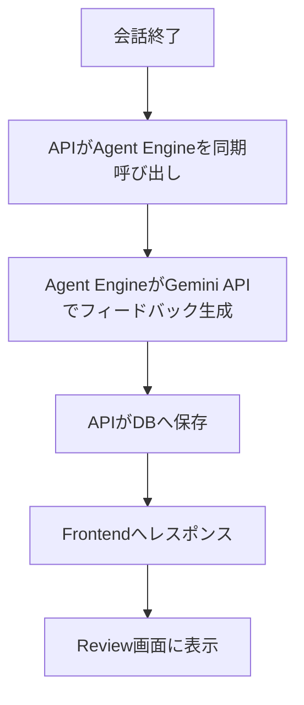
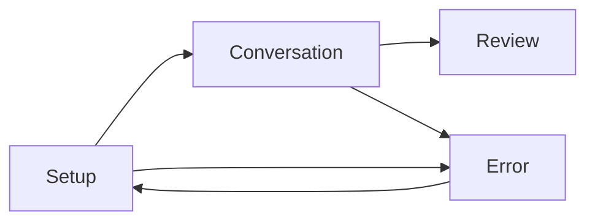
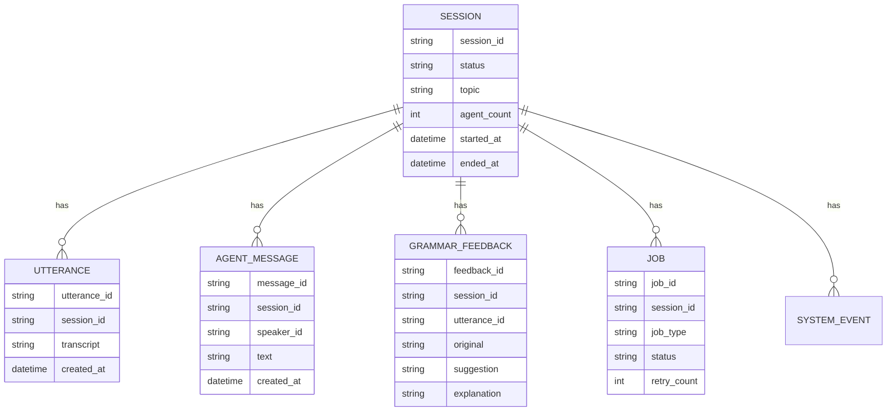

# リアルな複数人英会話トレーニングエージェント 基本設計書

## 目次

- [リアルな複数人英会話トレーニングエージェント 基本設計書](#リアルな複数人英会話トレーニングエージェント-基本設計書)
  - [目次](#目次)
  - [0. 文書情報](#0-文書情報)
  - [1. システム概要](#1-システム概要)
  - [2. 基本設計の前提V・設計原則](#2-基本設計の前提v設計原則)
    - [2.1 前提](#21-前提)
    - [2.2 設計原則](#22-設計原則)
  - [3. リポジトリ構成方針](#3-リポジトリ構成方針)
  - [4. システム全体構成](#4-システム全体構成)
    - [4.1 全体構成](#41-全体構成)
    - [4.2 構成の考え方](#42-構成の考え方)
  - [5. 環境構成・検証方針](#5-環境構成検証方針)
    - [5.1 環境構成](#51-環境構成)
    - [5.2 検証方針](#52-検証方針)
    - [5.3 フロントエンド統合テスト方針](#53-フロントエンド統合テスト方針)
  - [6. 主要コンポーネント基本設計](#6-主要コンポーネント基本設計)
    - [6.1 Frontend](#61-frontend)
    - [6.2 API](#62-api)
    - [6.3 Agent実行基盤（Vertex AI Agent Engine）](#63-agent実行基盤vertex-ai-agent-engine)
    - [6.4 DB](#64-db)
    - [6.5 Infra](#65-infra)
  - [7. リアルタイム会話基本設計](#7-リアルタイム会話基本設計)
    - [7.1 会話制御の基本方針](#71-会話制御の基本方針)
    - [7.2 リアルタイム会話フロー](#72-リアルタイム会話フロー)
    - [7.3 無音検知・ターン制御](#73-無音検知ターン制御)
  - [8. AI Agent基本設計](#8-ai-agent基本設計)
    - [8.1 Agent構成](#81-agent構成)
    - [8.2 MVPでの実装方針（確定）](#82-mvpでの実装方針確定)
    - [8.3 Agent出力形式](#83-agent出力形式)
  - [9. Gemini / Google Cloud AI連携基本設計](#9-gemini--google-cloud-ai連携基本設計)
    - [9.1 利用候補](#91-利用候補)
    - [9.2 連携方針](#92-連携方針)
  - [10. 外部API連携基本設計](#10-外部api連携基本設計)
    - [10.1 X API連携](#101-x-api連携)
    - [10.2 Secret Manager連携](#102-secret-manager連携)
  - [11. 非同期処理方針（常設Workerサービスは採用しない）](#11-非同期処理方針常設workerサービスは採用しない)
  - [12. 業務フロー基本設計](#12-業務フロー基本設計)
    - [12.1 ユーザー利用フロー](#121-ユーザー利用フロー)
    - [12.2 後処理フロー](#122-後処理フロー)
  - [13. 画面構成基本設計](#13-画面構成基本設計)
    - [13.1 画面一覧](#131-画面一覧)
    - [13.2 画面遷移](#132-画面遷移)
    - [13.3 画面設計方針](#133-画面設計方針)
  - [14. 機能構成基本設計](#14-機能構成基本設計)
  - [15. データ基本設計](#15-データ基本設計)
    - [15.1 主要データ](#151-主要データ)
    - [15.2 概念データモデル](#152-概念データモデル)
    - [15.3 音声データ方針](#153-音声データ方針)
  - [16. 状態管理基本設計](#16-状態管理基本設計)
    - [16.1 セッション状態](#161-セッション状態)
    - [16.2 ジョブ状態](#162-ジョブ状態)
    - [16.3 会話ターン状態](#163-会話ターン状態)
  - [17. セキュリティ・データ保護基本設計](#17-セキュリティデータ保護基本設計)
  - [18. 非機能要件への対応方針](#18-非機能要件への対応方針)
  - [19. エラー・例外対応基本方針](#19-エラー例外対応基本方針)
  - [20. ログ・進捗表示基本方針](#20-ログ進捗表示基本方針)
    - [20.1 ログ方針](#201-ログ方針)
    - [20.2 進捗表示方針](#202-進捗表示方針)
  - [21. テスト基本方針](#21-テスト基本方針)
  - [22. 詳細設計書への申し送り](#22-詳細設計書への申し送り)
    - [22.1 API詳細設計](#221-api詳細設計)
    - [22.2 Frontend詳細設計](#222-frontend詳細設計)
    - [22.3 Agent詳細設計](#223-agent詳細設計)
    - [22.4 DB詳細設計](#224-db詳細設計)
    - [22.5 Infra詳細設計](#225-infra詳細設計)
  - [23. 未決定事項](#23-未決定事項)
    - [23.1 解決済み](#231-解決済み)
    - [23.2 未決定事項](#232-未決定事項)
  - [24. 参考資料](#24-参考資料)

---

## 0. 文書情報

| 項目        | 内容                                                                            |
| --------- | ----------------------------------------------------------------------------- |
| 文書名       | リアルな複数人英会話トレーニングエージェント 基本設計書                                                  |
| 版数        | v0.1                                                                          |
| 作成日       | 2026-07-09                                                                    |
| 対象        | 開発メンバー、設計担当、実装担当、発表資料作成担当                                                     |
| 前提文書      | 要件定義書 `docs/REQUIREMENTS_DEFINITION.md`                                       |
| 位置づけ      | 要件定義をもとに、システム構成、主要コンポーネント、データ、状態、外部連携、非機能対応方針を整理する文書                          |
| 本書で扱わない内容 | 詳細なAPI仕様、DBスキーマ定義、prompt本文、CI/CDの実装手順、PRルール、命名規則など。これらは詳細設計書または開発規則ドキュメントで扱う。 |

---

## 1. システム概要

本システムは、複数人のリアルな英会話に参加する練習を提供するWebアプリケーションである。

ユーザーはブラウザ上で会話人数とトピックを選択し、AIエージェントが構成する英会話グループに音声で参加する。AIエージェントは、複数の話者として会話を進行し、必要に応じてユーザーへ質問を振る。会話中は自然なやり取りを優先し、文法・表現上の改善点は会話を妨げない形で記録し、会話終了後に復習画面で提示する。

本システムの中心価値は、単なる1対1のAI英会話ではなく、複数AIエージェントによる会話空間の運営にある。

---

## 2. 基本設計の前提V・設計原則

### 2.1 前提

| ID | 前提 |
|---|---|
| PRE-001 | MVPはWebアプリとして提供する。 |
| PRE-002 | ログイン機能はMVPスコープ外とする。 |
| PRE-003 | Google Cloudのアプリケーション実行プロダクトを利用する。 |
| PRE-004 | Gemini Live API、Gemini API、ADK、Speech-to-Text、Text-to-Speech等のGoogle Cloud AI技術を少なくとも1つ以上利用する。 |
| PRE-005 | リアルタイム音声会話は低遅延を重視する。 |
| PRE-006 | 会話後フィードバック、要約、トピック取得等の重い処理は、リアルタイム会話本体から分離できる構成とする。 |
| PRE-007 | 音声データは原則として永続保存しない。 |
| PRE-008 | 外部APIが失敗しても、事前トピックで会話体験を継続できるようにする。 |

### 2.2 設計原則

| ID     | 原則              | 説明                                                   |
| ------ | --------------- | ---------------------------------------------------- |
| DP-001 | リアルタイム処理と後処理の分離 | 会話本体は低遅延を優先し、文法フィードバック詳細化・要約・トレンド取得等は非同期処理へ逃がす。      |
| DP-002 | AI Agent中心の設計   | UIやAPIは、AIエージェントが複数人会話を運営するための入出力基盤として設計する。          |
| DP-003 | フォールバック可能性      | Gemini、X API、音声処理などの外部依存に失敗した場合でも、アプリ全体が停止しないようにする。  |
| DP-004 | MVPでは安定性を優先     | 機能の多さよりも、デモ時に確実に体験価値が伝わることを優先する。                     |
| DP-005 | 設計と開発規則の分離      | 基本設計書には構成・方針を記載し、ブランチ運用やCI/CD手順等は開発規則ドキュメントへ分離する。    |
| DP-006 | 将来的な拡張余地        | MVPでは簡易実装を許容しつつ、stg環境追加、DB拡張、Agent構成の見直し、監視強化が可能な構成にする。 |

---

## 3. リポジトリ構成方針

本プロジェクトは、フロントエンド、バックエンドAPI、Agent実行基盤（Vertex AI Agent Engine）、インフラ、設計文書を単一リポジトリで管理するmonorepo構成とする。

リポジトリrootは `real_conversation_agents/` とする。以下は本書作成時点（2026-07-09）の実際のリポジトリ構成を土台に、今後実装で追加するディレクトリを含めた構成方針である。

```text
real_conversation_agents/
├── README.md
├── AGENTS.md
├── CLAUDE.md
├── COC.md
├── CHANGE_LOG.md
├── .env.example
├── .dockerignore
├── .gitignore
├── docs/
│   ├── README.md
│   ├── BASE_IDEA.md
│   ├── REQUIREMENTS_DEFINITION.md
│   ├── BASIC_DESIGN.md
│   ├── CONTRIBUTION.md
│   ├── DEVOPS.md
│   ├── asset/
│   │   ├── media/
│   │   └── mmd/
│   ├── frontend/          # frontend領域の詳細設計文書置き場
│   ├── backend/           # api / worker / Agent領域の詳細設計文書置き場
│   └── infra/             # インフラ領域の詳細設計文書置き場
├── frontend/               # 未作成。今後の実装で追加する
├── api/                    # 未作成。今後の実装で追加する
├── agent/                  # 未作成。今後の実装で追加する
├── packages/               # 未作成。今後の実装で追加する
├── infra/                  # 未作成（root直下）。今後の実装で追加する
└── .github/                # 未作成。今後の実装で追加する
```

| ディレクトリ           | 責務                                                                                   | 状態  |
| ---------------- | ------------------------------------------------------------------------------------ | --- |
| `docs/`          | 要件定義書、基本設計書、開発規則、DevOpsメモ、図表を管理する。`asset/`に図表、`frontend/` `backend/` `infra/`に領域別の詳細設計書を今後追加していく。 | 既存  |
| `frontend/`      | Web UI、画面遷移、音声入力UI、吹き出し表示、復習画面を管理する。                                                   | 未作成 |
| `api/`           | ユーザー操作を受けるAPI、リアルタイム会話制御、Gemini Live APIとの中継、セッション管理、Cloud Tasksハンドラ（`api/src/tasks/`）を担当する。 | 未作成 |
| `agent/` | ADKで実装するAgent本体（Conversation Director / Persona Agents / Topic Pack Workflow / Scoring Observer / Hint Generator / Review Agent）を管理する。Vertex AI Agent Engineへ独立してデプロイする（`docs/infra/01_ARCHITECTURE.md` §2）。 | 未作成 |
| `packages/`      | frontend / api / agentで共有するJSON Schema等を管理する（`packages/shared-schemas/`）。MVPでは未使用でもよい。 | 未作成 |
| `infra/`（root直下） | Terraform等のIaC、GCPリソース定義を管理する。`bootstrap/`（人力実行専用）と`terraform/environments/`（CI管理）に分かれる。 | 未作成 |
| `.github/`       | GitHub Actions等のCI/CD設定、Issue/PRテンプレートを管理する。                                          | 未作成 |

`app/BE` のような曖昧なディレクトリは設けず、バックエンド系の責務は `api/` と `agent/` に分離する。ミドルウェアは `api/src/middleware/` に配置する想定とする。常設のWorker Cloud Runサービスは設けず、Cloud Tasksのターゲットは`api/src/tasks/`に統合する。

なお、`docs/infra/` はインフラ領域の詳細設計文書を置く場所であり、root直下の `infra/`（Terraform等のIaCコード）とは役割が異なる。同様に `docs/frontend/` `docs/backend/` もそれぞれの領域の詳細設計文書置き場であり、実装コードを置く `frontend/` `api/` `agent/` とは別物である。

---

## 4. システム全体構成

> 本章は要約のみ。GCP構成・IAM・環境差分の詳細は`docs/infra/01_ARCHITECTURE.md`を正とする。

### 4.1 全体構成



### 4.2 構成の考え方

| 領域 | 方針 |
|---|---|
| フロントエンド | React（Vite）+ Tailwind CSSのSPA。Firebase Hostingで配信し、音声入力、会話表示、会話後復習を担当する。 |
| API | FastAPI（Cloud Run）。password認証、セッション管理、Agent Engineへの中継を行う薄いゲートウェイ。 |
| Agent実行基盤 | Vertex AI Agent Engine（ADK）。会話進行、話者制御、文法フィードバック、トピック生成、Gemini Live APIとのセッション保持を担当する。 |
| DB | Firestore。セッション、発話、AI応答、フィードバックを保存する（TTLで自動クリーンアップ）。 |
| Secret Manager | APIキー、認証情報、環境別secretを管理する。 |
| Logging / Monitoring | エラー、レイテンシ、レートリミット、利用量を観測する。 |

Worker / Cloud Tasksは採用しない。会話後フィードバック・要約はAPIからAgent Engineへの同期呼び出しで完結させる（11章、`docs/infra/01_ARCHITECTURE.md` §8）。

---

## 5. 環境構成・検証方針

本章では、設計上の環境構成と検証方針のみを記載する。具体的なブランチ保護、CI/CD workflow、PR規則、命名規則は開発規則ドキュメントで扱う。

### 5.1 環境構成

**dev / prdから開始し、必要になった時点でstgを追加する**（`docs/infra/01_ARCHITECTURE.md` §1, `docs/infra/04_DEPLOY.md` §8）。

| 環境      | 目的          | 主な利用者      | 想定構成                                       |
| ------- | ----------- | ---------- | ------------------------------------------ |
| local   | 手元開発・単体確認   | 開発者        | ローカルfrontend / API、mock外部API、必要に応じてdev API |
| preview | PRレビュー・UI確認 | 開発者・レビュー担当 | frontend preview、mock APIまたはdev API        |
| dev     | 開発者向け統合確認   | 開発者        | frontend-dev、api-dev（ALB/Cloud Armorなし、直接公開）、dev DB |
| prd     | デモ・本番相当     | 利用者・審査員    | frontend-prd、api-prd（ALB + Cloud Armor経由）、prd DB |
| stg（将来） | リリース前統合確認   | 開発者・発表担当   | 時間が許せばprd構成をコピーして追加する |

### 5.2 検証方針

| 段階           | 検証内容                                                       |
| ------------ | ---------------------------------------------------------- |
| local        | ユニットテスト、コンポーネントテスト、型チェック、mock APIによる画面確認を行う。               |
| PR / preview | lint、typecheck、build、mock E2Eにより、UIフローと基本動作が壊れていないことを確認する。 |
| dev          | frontend、api、Agent Engineを接続し、開発中機能の統合動作を確認する。                   |
| prd          | 本番に近い構成で、音声入力、AI応答、会話ログ保存、会話後フィードバック生成まで確認する。              |
| prd（リリース後） | smoke testを実施し、主要画面とヘルスチェックが正常であることを確認する。            |
| stg（将来） | stg導入後は、prdへ進む前の統合確認として位置づける。                            |

### 5.3 フロントエンド統合テスト方針

フロントエンドの統合テストは、外部AI APIに毎回接続するのではなく、以下のように分離する。

| テスト種別 | 実行環境 | 外部API |
|---|---|---|
| mock E2E | PR / preview | 原則mock |
| real E2E | dev（stg導入後はstg） | 実APIを利用 |
| smoke test | prd | 最小限の疎通確認 |

PR段階では高速性と再現性を重視し、Gemini Live APIやX APIへの直接接続は原則行わない。devでは実APIを用いた統合確認を行う。

---

## 6. 主要コンポーネント基本設計

### 6.1 Frontend

| 項目 | 内容 |
|---|---|
| 主な責務 | 会話設定、音声入力、吹き出し表示、AI音声再生、会話後復習表示 |
| 想定技術 | React（Vite） / TypeScript / Tailwind CSS |
| ホスティング | Firebase Hosting |
| 主要画面 | Setup画面、Conversation画面、Review画面 |
| 外部接続 | API（Cloud Run） |
| 設計上の注意 | マイク権限、接続切断、ローディング、AI応答中断、エラー表示をユーザーにわかりやすく示す。 |

### 6.2 API

| 項目     | 内容                                                        |
| ------ | --------------------------------------------------------- |
| 主な責務   | password認証、セッション作成、会話状態管理、Agent Engineへの中継、発話ログ保存、同時実行数バックプレッシャー |
| 想定技術   | Cloud Run、FastAPI |
| 主なI/O  | Frontendからの会話操作、Agent Engineとの通信、DB更新 |
| 設計上の注意 | 低遅延、セッション管理、接続切断、レートリミット、secret秘匿を考慮する。詳細は`docs/infra/01_ARCHITECTURE.md` §7。 |

### 6.3 Agent実行基盤（Vertex AI Agent Engine）

Worker / Cloud Tasksは採用しない（11章）。ADKで実装したAgentは、Cloud Run上に自前ホストせず**Vertex AI Agent Engine**にデプロイする。

| 項目 | 内容 |
|---|---|
| 主な責務 | 会話進行、話者制御、文法フィードバック生成、会話要約、トピック生成、Gemini Live APIとの双方向ストリーミング保持 |
| 想定技術 | ADK、Vertex AI Agent Engine |
| 主なI/O | APIからの中継リクエスト、Gemini Live API、X API（Topic Agent tool）、`VertexAiSessionService`によるセッション永続化 |
| 設計上の注意 | セッション状態の情報源（SoT）はAgent Engine Sessions側とする。詳細は`docs/infra/01_ARCHITECTURE.md` §3.3・§6.1、`docs/backend/03_AGENT_ORCHESTRATION_DRAFT.md`。 |

### 6.4 DB

| 項目 | 内容 |
|---|---|
| 主な責務 | セッション、発話、AI応答、フィードバックの保存（復習画面・ログ用） |
| 採用技術 | Firestore（Native mode。マルチデータベース機能でdev/prdを分離） |
| 設計上の注意 | TTLポリシーでセッションクリーンアップを自動化する。詳細は`docs/infra/01_ARCHITECTURE.md` §3.4・§6、`docs/backend/02_BACKEND_PROCESS_DRAFT.md`。 |

### 6.5 Infra

| 項目 | 内容 |
|---|---|
| 主な責務 | GCPリソースをIaCで管理する |
| 候補 | Terraform |
| 管理対象 | Cloud Run、Vertex AI Agent Engine実行用IAM、Firestore、Secret Manager、Artifact Registry、IAM等 |
| 設計上の注意 | dev / prdは単一プロジェクト内でFirestoreマルチデータベース等を用いて分離し、stgは将来追加する。詳細は`docs/infra/04_DEPLOY.md`、`docs/infra/02_PARAMS_DEF.md`。 |

---

## 7. リアルタイム会話基本設計

### 7.1 会話制御の基本方針

リアルタイム会話は、ユーザーが安心して発話できることを優先する。AIはユーザー発話中に割り込まず、ユーザー発話終了後の無音を検知して応答する。

| ID | 方針 |
|---|---|
| RTC-001 | ユーザー発話中はAI発話を開始しない。 |
| RTC-002 | ユーザー発話後、一定時間の無音を検知した場合にAI応答を開始する。 |
| RTC-003 | AI発話中にユーザーが話し始めた場合、可能な範囲でAI発話を中断する。 |
| RTC-004 | AI応答は音声とテキストの両方で提示する。 |
| RTC-005 | 会話ログは発話単位で保存できるようにする。 |

### 7.2 リアルタイム会話フロー



### 7.3 無音検知・ターン制御

MVPでは、無音検知は簡易方式から開始する。具体的な実装方式は詳細設計で決定する。

候補は以下である。

| 方式 | 説明 | 備考 |
|---|---|---|
| フロントエンド側VAD | ブラウザ側で音声入力状態・無音時間を検知する | 低遅延だが実装差分に注意 |
| Live API側のturn detection | Gemini Live APIの会話制御機能を利用する | API仕様確認が必要 |
| ハイブリッド | フロント側で補助し、最終制御をbackendで行う | 安定性と制御性のバランスがよい可能性 |

---

## 8. AI Agent基本設計

### 8.1 Agent構成

| Agent | 役割 | MVPでの扱い |
|---|---|---|
| Conversation Manager Agent | 発話順序、話題遷移、ユーザーへの質問、会話継続を管理する。 | 必須 |
| Persona Agent | 複数のAI話者として会話に参加する。 | 必須 |
| Grammar Feedback Agent | ユーザー発話から文法・表現改善点を抽出する。 | 必須 |
| Topic Agent | 事前トピック、任意トピック、トレンド情報から会話テーマを生成する。 | 必須または一部実装 |
| Summary / Compression Agent | 会話の要約・文脈圧縮を行う。 | Should |

### 8.2 MVPでの実装方針（確定）

Agentの実行基盤として**Vertex AI Agent Engine**を採用する（「Cloud Run上に自前でADKをホストする」方式は、Gemini Live APIとの双方向ストリーミングにおけるセッションアフィニティ問題を解決できないため不採用とした）。

Conversation Manager、Persona、Grammar Feedback、Topic、Summary/Compressionの各Agentは、ADKの1つのRuntime内で論理的に構成し、Agent Engineというマネージド基盤に実行・スケーリング・セッション永続化（`VertexAiSessionService`）を委譲する。判断の詳細な経緯は`docs/infra/01_ARCHITECTURE.md` §12を参照。

### 8.3 Agent出力形式

AI Agentの出力は、UI表示とログ保存に利用できるよう、構造化された形式を基本とする。

例：

```json
{
  "speaker_id": "alice",
  "speaker_name": "Alice",
  "message_text": "That's interesting. What do you think about it?",
  "message_type": "agent_utterance",
  "should_play_audio": true,
  "next_action": "wait_user"
}
```

Grammar Feedback Agentの出力例：

```json
{
  "utterance_id": "utt_001",
  "original": "I am agree with you.",
  "suggestion": "I agree with you.",
  "explanation": "agree は動詞なので be 動詞は不要です。",
  "severity": "medium"
}
```

---

## 9. Gemini / Google Cloud AI連携基本設計

### 9.1 利用候補

| サービス                          | 用途                               |
| ----------------------------- | -------------------------------- |
| Gemini Live API               | リアルタイム音声対話、barge-in、音声入出力        |
| Gemini API / Vertex AI Gemini | 文法フィードバック、会話要約、トピック生成            |
| ADK                           | Agent実装、tool call、複数Agent構成、デバッグ |
| Speech-to-Text                | ユーザー発話文字起こし。Live APIで不足する場合に検討   |
| Text-to-Speech                | AI音声出力。Live APIで不足する場合に検討        |

### 9.2 連携方針

| ID | 方針 |
|---|---|
| GAI-001 | リアルタイム会話はGemini Live APIを第一候補とする。 |
| GAI-002 | 文法フィードバック・要約等はGemini API / Vertex AI Geminiを利用する。 |
| GAI-003 | ADKはAgent実装に用い、Vertex AI Agent Engineにデプロイする（`docs/infra/01_ARCHITECTURE.md` §12）。 |
| GAI-004 | ADKを利用してもGemini API / Vertex AI / Agent Platformのquotaは適用される前提で設計する。 |
| GAI-005 | API失敗時のfallbackをアプリ側で設計する。 |

---

## 10. 外部API連携基本設計

### 10.1 X API連携

X APIは、最新トレンドをもとに英会話トピックを生成するために利用する。

| ID | 方針 |
|---|---|
| X-001 | MVPではX API連携は加点要素として扱い、必須体験は事前トピックで成立させる。 |
| X-002 | 取得したトレンドはそのまま会話に使わず、Topic Agentが英会話練習向けに安全化・簡略化する。 |
| X-003 | X API失敗時は事前トピックへfallbackする。 |
| X-004 | API rate limitを考慮し、トレンド取得は必要に応じて非同期・キャッシュ化する。 |

### 10.2 Secret Manager連携

APIキー、認証情報、環境別設定はSecret Managerで管理する。frontendにsecretを直接埋め込まない。

---

## 11. 非同期処理方針（常設Workerサービスは採用しない）

Cloud Run Worker常設サービス + Cloud Tasksによるjobキュー方式のうち、**常設Workerサービスは不採用**とした。一方で、X API呼び出し・Topic Pack生成はCloud Run API内の内部エンドポイントをCloud Tasksがターゲットする形で非同期化する（詳細は`docs/infra/01_ARCHITECTURE.md` §5、`docs/infra/04_DEPLOY.md` §1）。

| 旧job | 代替方式 |
|---|---|
| feedback_generation | 会話終了APIでAgent Engineを**同期呼び出し**（クライアントは数秒待つ） |
| conversation_summary | 同上 |
| trend_topic_fetch / topic_pack_generation | Cloud Tasksがキューイングし、Cloud Run API内の内部エンドポイント（`api/src/tasks/`）が処理。フロントは`job_id`を受け取りポーリングする |
| session_cleanup | **Firestore TTLポリシー**で自動削除（Cloud Functions/cron不要） |



| ID | 方針 |
|---|---|
| JOB-001 | リアルタイム会話本体はqueueに入れない（従来通り）。 |
| JOB-002 | 会話後フィードバック等はAgent Engineへの同期呼び出しで完結させる。Cloud Tasksを使うのはX API/Topic Pack生成のみとし、常設Workerサービスは設けない。 |
| JOB-003 | Cloud Tasksのretryに加え、Gemini / Agent Engine呼び出しのretry/backoffはアプリコード側でも明示的に実装する。 |
| JOB-004 | 同時実行数バックプレッシャー（閾値超過時は429 + Retry-Afterを返す）で過負荷を防ぐ。「確実な実行」の保証ではなく過負荷保護である点に注意。 |

---

## 12. 業務フロー基本設計

### 12.1 ユーザー利用フロー



### 12.2 後処理フロー



---

## 13. 画面構成基本設計

### 13.1 画面一覧

| 画面ID | 画面名 | 目的 |
|---|---|---|
| SCR-001 | Setup画面 | 会話人数、トピック、モードを選択する。 |
| SCR-002 | Conversation画面 | 音声入力、AI発話、会話ログ、話者表示を行う。 |
| SCR-003 | Review画面 | 会話後フィードバック、改善例、会話サマリーを表示する。 |
| SCR-004 | Error / Fallback表示 | マイク権限、API失敗、接続切断等を説明する。 |

### 13.2 画面遷移



### 13.3 画面設計方針

| ID | 方針 |
|---|---|
| UI-001 | MVPではSetup、Conversation、Reviewの3画面を中心にする。 |
| UI-002 | Conversation画面では、誰が話しているかを吹き出し・名前・アイコンで明確にする。 |
| UI-003 | 文法フィードバックは会話中に過度に目立たせず、Review画面で学習価値を出す。 |
| UI-004 | マイク権限や接続失敗時には、ユーザーが次に何をすればよいかを表示する。 |

---

## 14. 機能構成基本設計

| 機能分類 | 主な機能 |
|---|---|
| 会話設定 | 会話人数選択、トピック選択、任意トピック入力、トレンドモード選択 |
| リアルタイム会話 | 音声入力、文字起こし、AI音声応答、吹き出し表示、barge-in、無音検知 |
| Agent制御 | 発話順序決定、話者生成、会話継続、ユーザーへの質問 |
| フィードバック | 文法ミス記録、改善例生成、会話後復習表示 |
| 外部連携 | Gemini Live API、Gemini API、X API、Secret Manager |
| 非同期処理 | feedback job、summary job、trend fetch job |
| 運用 | ログ出力、エラー記録、メトリクス取得、ヘルスチェック |

---

## 15. データ基本設計

### 15.1 主要データ

| データ | 内容 |
|---|---|
| session | 会話セッションの設定、状態、開始終了時刻 |
| utterance | ユーザー発話テキスト、時刻、文字起こし結果 |
| agent_message | AI話者の発話、話者ID、表示テキスト、音声イベント情報 |
| grammar_feedback | 発話に対する改善案、説明、重要度 |
| job | 非同期処理の状態、種類、retry回数、エラー |
| system_event | 接続、エラー、API呼び出し、状態遷移等のイベント |

### 15.2 概念データモデル



### 15.3 音声データ方針

音声データはMVPでは原則として永続保存しない。必要な場合は、文字起こし結果、AI応答テキスト、フィードバックを保存する。

---

## 16. 状態管理基本設計

### 16.1 セッション状態

| 状態 | 説明 |
|---|---|
| created | セッション作成済み |
| connecting | Gemini Live API等へ接続中 |
| active | 会話中 |
| ending | 会話終了処理中 |
| reviewing | フィードバック生成・表示中 |
| completed | セッション完了 |
| failed | セッション失敗 |
| cancelled | ユーザーにより中断 |

### 16.2 ジョブ状態

| 状態 | 説明 |
|---|---|
| queued | キュー投入済み |
| running | 実行中 |
| succeeded | 成功 |
| failed | 失敗 |
| retrying | 再試行待ち |
| dead_letter | 再試行上限超過 |

### 16.3 会話ターン状態

| 状態 | 説明 |
|---|---|
| waiting_user | ユーザー発話待ち |
| user_speaking | ユーザー発話中 |
| processing | 入力処理中 |
| agent_speaking | AI発話中 |
| interrupted | AI発話中断 |
| idle | 一時停止または待機 |

---

## 17. セキュリティ・データ保護基本設計

| ID | 方針 |
|---|---|
| SEC-001 | APIキーや認証情報はSecret Managerで管理する。 |
| SEC-002 | frontendに外部API secretを露出しない。 |
| SEC-003 | Cloud Runのサービスアカウントは最小権限とする。 |
| SEC-004 | ログにAPIキー、secret、不要な個人情報を出力しない。 |
| SEC-005 | 音声データは原則保存しない。 |
| SEC-006 | 会話ログを保存する場合は、用途を復習・デバッグ・品質改善に限定する。 |
| SEC-007 | CORS、入力バリデーション、rate limitの基本方針を詳細設計で定義する。 |

---

## 18. 非機能要件への対応方針

| 分類 | 方針 |
|---|---|
| 性能 | リアルタイム会話では低遅延を優先し、AI応答は短めに制御する。 |
| 可用性 | 外部API失敗時のfallbackとユーザー向けエラー表示を用意する。 |
| 拡張性 | API、Agent実行基盤（Agent Engine）、Frontendを分離し、後から拡張できるようにする。 |
| 保守性 | monorepoでdocs、infra、api、frontend、workerを管理し、責務を明確化する。 |
| セキュリティ | secret管理、最小権限、ログ出力制御を基本方針とする。 |
| コスト | セッション時間制限、後処理の非同期化、利用量ログにより制御する。 |
| ユーザビリティ | 3画面構成、明確な話者表示、マイク権限説明、エラー時の案内を重視する。 |

---

## 19. エラー・例外対応基本方針

| エラー | 方針 |
|---|---|
| マイク権限拒否 | 権限が必要であることと再設定方法を表示する。 |
| Gemini Live API接続失敗 | 再接続または安全な終了を行い、ユーザーへ案内する。 |
| Gemini API 429 | retry / backoff、または後処理遅延として扱う。 |
| X API失敗 | 事前トピックへfallbackする。 |
| Agent Engine呼び出し失敗 | フィードバック/要約生成をエラーとしてユーザーへ通知し、必要に応じて再試行できるようにする。 |
| DB書き込み失敗 | ユーザー体験を可能な範囲で継続し、ログに記録する。 |
| 予期しない例外 | 共通エラーハンドラで捕捉し、ユーザーには簡潔なエラーを表示する。 |

---

## 20. ログ・進捗表示基本方針

### 20.1 ログ方針

| ログ対象 | 内容 |
|---|---|
| session event | セッション開始、終了、失敗、接続切断 |
| agent event | 発話生成、次話者決定、tool call |
| external API event | Gemini、X API、Agent Engineの呼び出し結果 |
| error event | 例外、API失敗、rate limit |
| performance event | 応答遅延、処理時間、job実行時間 |

### 20.2 進捗表示方針

| 場面 | 表示 |
|---|---|
| 接続中 | 「会話を準備しています」 |
| AI応答生成中 | 話者単位のtyping / speaking表示 |
| フィードバック生成中 | 「フィードバックを生成しています」 |
| エラー時 | 簡潔な理由と次の操作を表示 |
| fallback時 | 「トレンド取得に失敗したため、事前トピックで開始します」等を表示 |

---

## 21. テスト基本方針

本章ではテストの大方針のみを記載する。具体的なテストコマンド、CIでの実行条件、PR必須条件は開発規則ドキュメントで定義する。

| テスト分類 | 対象 | 方針 |
|---|---|---|
| Unit Test | frontend hooks、utils、api services、agent tool関数 | 外部APIをmockして高速に実行する。 |
| Component Test | UI部品、吹き出し、トピック選択、復習表示 | ユーザー操作に対する表示変化を確認する。 |
| API Test | session作成、会話開始、job投入 | DB・外部APIをmockまたはtest用に差し替える。 |
| Mock E2E | Setup→Conversation→Review | PR段階でmock APIを用いて安定実行する。 |
| Real E2E | 音声入力、Gemini応答、フィードバック生成 | dev環境で実施する（stg導入後はstg）。 |
| Agent Behavior Test | 複数人会話、英語応答、文法フィードバック | 固定入力に対して期待する振る舞いを確認する。 |
| Smoke Test | prdリリース後の最小動作 | 主要画面、ヘルスチェック、接続を確認する。 |

---

## 22. 詳細設計書への申し送り

詳細設計では、以下を決定・記述する。

### 22.1 API詳細設計

- endpoint一覧
- request / response schema
- WebSocket / SSE / HTTPの使い分け
- 認証・CORS方針
- エラーコード体系
- API rate limit方針

### 22.2 Frontend詳細設計

- 画面ごとのコンポーネント構成
- 状態管理方式
- 音声入力処理
- WebSocket接続管理
- エラー・fallback表示
- テスト対象コンポーネント

### 22.3 Agent詳細設計

- prompt
- persona定義
- tool schema
- Agent出力JSON schema
- 会話制御ロジック
- Grammar Feedback出力仕様

### 22.4 DB詳細設計

- Firestore collectionまたはRDB table
- index
- TTL / cleanup方針
- 保存期間
- migration方針

### 22.5 Infra詳細設計

- Terraform module構成
- Cloud Run service設定
- Vertex AI Agent Engineデプロイ設定
- IAM、Organization Policy
- Secret Manager
- Logging / Monitoring
- 環境別変数

上記の多くは`docs/infra/01_ARCHITECTURE.md`〜`04_DEPLOY.md`で既に詳細化済み。

---

## 23. 未決定事項

### 23.1 解決済み

| TBD ID | 結論 |
|---|---|
| ~~TBD-001~~ | Next.jsではなく、React（Vite）+ Tailwind CSSのSPAに確定 |
| ~~TBD-002~~ | FastAPI（Python）に確定 |
| ~~TBD-004~~ | ADKで実装し、Vertex AI Agent Engineにデプロイする方式に確定 |
| ~~TBD-005~~ | Firestoreに確定 |
| ~~TBD-008~~ | 常設Workerサービスは採用しないことに確定。ただしX API/Topic Pack生成はCloud Run API内の内部エンドポイントをCloud Tasksがターゲットする形で非同期化する（`docs/infra/01_ARCHITECTURE.md` §5） |
| ~~TBD-010~~ | dev/prdから開始し、必要になった時点でstgを追加する方針に確定 |
| ~~TBD-003~~ | Gemini Live APIはCloud Run APIが`runner.run_live()`を保持しAgent Engineと直結する構成に確定。フロントエンドからの直接接続は行わない。`session_resumption`必須実装（`docs/infra/01_ARCHITECTURE.md` §3.3・§4・§7） |
| ~~TBD-009~~ | 会話ログの保存期間はセッション終了後24時間のFirestore TTLに確定（`docs/infra/02_PARAMS_DEF.md` §7） |

### 23.2 未決定事項

| TBD ID | 未決定事項 | 判断観点 |
|---|---|---|
| TBD-006 | X API連携をMVPに含めるか | API制限、実装負荷、審査加点 |
| TBD-007 | barge-inをMVPでどこまで実装するか | 体験価値、実装難度 |

インフラ関連の残りのTBDは`docs/infra/00_OVERVIEW.md` §7、`01_ARCHITECTURE.md` §8、`02_PARAMS_DEF.md`各章、`03_SECURITY.md` §10、`04_DEPLOY.md` §8に集約されている。

---

## 24. 参考資料

- `docs/REQUIREMENTS_DEFINITION.md`
- `docs/CONTRIBUTION.md`
- `docs/infra/01_ARCHITECTURE.md`（GCP構成の詳細はこちらが正）
- `docs/infra/02_PARAMS_DEF.md`
- `docs/infra/03_SECURITY.md`
- `docs/infra/04_DEPLOY.md`
- Google Cloud Agent Development Kit Documentation
- Vertex AI Agent Engine Documentation
- Gemini Live API Documentation
- Cloud Run Documentation
- Secret Manager Documentation
- X API Documentation
