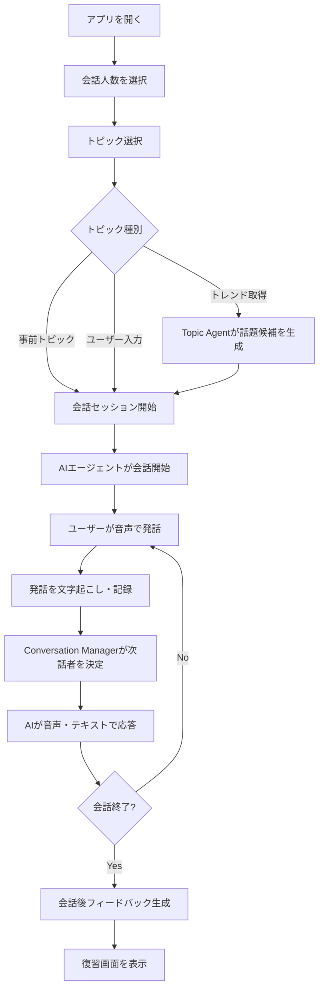

## 目次

- [0. 文書情報](#0-文書情報)
- [1. プロジェクト概要](#1-プロジェクト概要)
- [2. 背景・目的](#2-背景目的)
- [3. 解決したい課題](#3-解決したい課題)
- [4. 提供価値・コンセプト](#4-提供価値コンセプト)
- [5. 用語定義](#5-用語定義)
- [6. 対象ユーザー・ステークホルダー](#6-対象ユーザーステークホルダー)
- [7. MVPスコープ](#7-mvpスコープ)
- [8. 想定ユースケース](#8-想定ユースケース)
- [9. ユーザーストーリー](#9-ユーザーストーリー)
- [10. 利用フロー要件](#10-利用フロー要件)
- [11. 入力要件](#11-入力要件)
- [12. 出力要件](#12-出力要件)
- [13. 機能要件](#13-機能要件)
- [14. AI Agent要件](#14-ai-agent要件)
- [15. データ取扱・プライバシー要件](#15-データ取扱プライバシー要件)
- [16. 非機能要件](#16-非機能要件)
- [17. 信頼性・説明可能性要件](#17-信頼性説明可能性要件)
- [18. 外部連携要件・技術制約](#18-外部連携要件技術制約)
- [19. スコープ外](#19-スコープ外)
- [20. 前提・制約条件](#20-前提制約条件)
- [21. 受入基準](#21-受入基準)
- [22. 評価基準・KPI](#22-評価基準kpi)
- [23. リスク・課題](#23-リスク課題)
- [24. 未決定事項（TBD）](#24-未決定事項tbd)
- [25. 設計書への申し送り](#25-設計書への申し送り)
- [26. 付録：要件ID体系](#26-付録要件id体系)
- [付録B. MVPで特に守るべき方針](#付録b-mvpで特に守るべき方針)
- [参考リンク](#参考リンク)

---

## 0. 文書情報

| 項目   | 内容                                                  |
| ---- | --------------------------------------------------- |
| 文書名  | リアルな複数人英会話トレーニングエージェント 要件定義書                        |
| 版数   | v0.1                                                |
| 作成日  | 2026-07-09                                          |
| 対象   | 開発メンバー、設計担当、実装担当、発表資料作成担当                           |
| 位置づけ | MVP開発前の要件定義。詳細設計・タスク分解・審査向け説明資料の前提文書                |
| 目的   | プロダクトの課題、提供価値、MVP範囲、AI Agent要件、GCP利用要件、運用上の注意点を整理する |
| 更新方針 | 仕様変更・技術検証結果・審査要件の変更があった場合に更新する                      |

---

## 1. プロジェクト概要

本プロジェクトは、複数人の会話に参加するリアルな英会話体験を提供するWebアプリケーションである。

従来のAI英会話アプリは、ユーザーとAIが1対1で会話する形式が中心であり、現実の会話で発生する「複数人の話者がいる」「話題が自然に移り変わる」「自分が会話に入るタイミングを判断する」といった状況を十分に再現しにくい。

本アプリでは、2〜4人のAIエージェントが会話相手として登場し、ユーザーはその会話グループに参加する。AIエージェントは、トピック選定、発話順序の制御、会話の継続、文法フィードバック、会話後の復習支援を行う。

---

## 2. 背景・目的

### 2.1 背景

英会話学習では、文法や単語の知識だけでなく、実際の会話に参加する力が重要である。特に留学、国際交流、海外カンファレンス、職場での英語コミュニケーションでは、1対1の会話だけでなく、複数人の会話に自然に入る力が求められる。

しかし、既存のAI英会話サービスの多くは、ユーザーとAIの1対1会話を中心としており、以下のような現実の会話特性を再現しにくい。

- 複数人がそれぞれ異なる立場・話し方で発話する
- 会話の流れを読みながら発話する
- 他者の発話を聞き、相槌や質問を挟む
- 話題がニュース、流行、身近な出来事に応じて変化する
- 会話後に、自分の発話を振り返る

### 2.2 目的

本プロジェクトの目的は、AIエージェントを用いて、現実に近い複数人英会話の練習環境を提供することである。

MVPでは、以下を重視する。

- 複数AIエージェントによる自然な会話体験
- ユーザーが会話に参加しやすいUI
- 音声とテキストを併用した英会話体験
- 会話後に学習につながる文法・表現フィードバック
- GCPおよびGoogle Cloud AI技術を活用した実装

---

## 3. 解決したい課題

| 課題ID | 課題 | 説明 | 優先度 |
|---|---|---|---|
| ISS-001 | 1対1会話に偏った英会話練習 | 既存のAI英会話では、先生役AIとユーザーの1対1会話が中心で、複数人会話に入る練習がしづらい。 | High |
| ISS-002 | 話題のリアル性不足 | あらかじめ用意された不自然な話題では、現実の雑談や時事的な会話に近づきにくい。 | High |
| ISS-003 | 会話参加タイミングの練習不足 | 実際の複数人会話では、自分がいつ発話するかを判断する必要があるが、既存アプリではその練習が難しい。 | High |
| ISS-004 | フィードバックと会話体験の分断 | 文法訂正を重視しすぎると会話が止まり、会話を重視しすぎると学習効果が弱くなる。 | Medium |
| ISS-005 | AIエージェントの実用運用設計 | 複数回のLLM呼び出し、音声処理、外部API連携、レートリミットを考慮した安定運用が必要である。 | High |

---

## 4. 提供価値・コンセプト

### 4.1 一言コンセプト

**複数人のリアルな英会話に参加する力を鍛える、AI英会話トレーニングエージェント。**

### 4.2 提供価値

| 価値ID    | 提供価値               | 内容                                                   |
| ------- | ------------------ | ---------------------------------------------------- |
| VAL-001 | 複数人会話の再現           | 2〜4人のAIエージェントが会話相手となり、ユーザーが会話グループに参加する体験を提供する。       |
| VAL-002 | リアルな話題設定           | 事前トピック、ユーザー指定トピック、X API等を用いたトレンドトピックにより、会話のリアル性を高める。 |
| VAL-003 | 会話を止めない学習支援        | 会話中は自然な進行を優先し、文法ミスや改善点は記録して会話後に振り返れるようにする。           |
| VAL-004 | 音声・テキスト併用          | AI発話を音声と吹き出しテキストで表示し、ユーザー発話も可能な範囲で文字起こしする。           |
| VAL-005 | AIエージェントによる自律的会話運営 | 発話順序、話題展開、質問の振り方、フィードバック生成をAIエージェントが担う。              |

---

## 5. 用語定義

| 用語 | 定義 |
|---|---|
| ユーザー | 本アプリを利用して英会話練習を行う学習者。 |
| AIエージェント | 会話、トピック選定、文法記録、会話管理など、特定の役割を持って自律的に処理を行うAI。 |
| Persona Agent | 会話に登場するAI話者。性格、話し方、立場を持ち、ユーザーと会話する。 |
| Conversation Manager Agent | 会話の進行、発話順序、無音時の応答開始、話題遷移を管理するAIエージェント。 |
| Grammar Feedback Agent | ユーザー発話から文法ミス、不自然表現、改善例を抽出・記録するAIエージェント。 |
| Topic Agent | 事前トピック、ユーザー指定トピック、外部トレンド情報から会話トピックを生成するAIエージェント。 |
| 会話セッション | ユーザーがアプリ上で開始し、終了するまでの一連の英会話体験。 |
| barge-in | AI発話中にユーザーが割り込んで発話できる機能。 |
| ターン制 | ユーザー発話中はAIが遮らず、ユーザーの発話終了後にAIが応答する会話制御方針。 |
| MVP | 最小限の価値を検証できる初期プロダクト。 |

---

## 6. 対象ユーザー・ステークホルダー

### 6.1 対象ユーザー

| ユーザーID | 対象 | 想定ニーズ |
|---|---|---|
| USR-001 | 留学予定者 | 複数人の英語雑談や授業前後の会話に慣れたい。 |
| USR-002 | 英会話学習者 | 1対1ではなく、より現実に近い英会話練習をしたい。 |
| USR-003 | 国際交流・海外イベント参加者 | 初対面の複数人会話に入る練習をしたい。 |
| USR-004 | 英語での議論に慣れたい学生 | 身近な話題やニュースについて英語で会話する練習をしたい。 |

### 6.2 ステークホルダー

| ステークホルダー | 関心 |
|---|---|
| 開発メンバー | 実装可能性、技術構成、スコープ管理、デモ品質。 |
| 審査員 | AIエージェントの必然性、GCP活用、ユーザー体験、実装力。 |
| 利用者 | 使いやすさ、会話の自然さ、学習効果、安心感。 |
| 運用者 | コスト、API制限、障害対応、ログ管理、プライバシー。 |

---

## 7. MVPスコープ

### 7.1 MVPで実現すること

| スコープID  | 内容                                                                                         | 優先度    |
| ------- | ------------------------------------------------------------------------------------------ | ------ |
| MVP-001 | Webアプリとして利用できるUIを提供する。                                                                     | Must   |
| MVP-002 | 2〜3人のAIエージェントによる英会話セッションを提供する。                                                             | Must   |
| MVP-003 | ユーザーが会話人数を選択できる。                                                                           | Must   |
| MVP-004 | 事前に用意された3つ程度のトピックから選択できる。                                                                  | Must   |
| MVP-005 | ユーザーが任意のトピックを入力できる。                                                                        | Must   |
| MVP-006 | AI発話を吹き出し形式で表示する。                                                                          | Must   |
| MVP-007 | AI発話を音声で再生する。                                                                              | Must   |
| MVP-008 | ユーザーが音声で発話できる。                                                                             | Must   |
| MVP-009 | ユーザー発話を可能な範囲で文字起こしする。                                                                      | Should |
| MVP-010 | 会話中に文法・表現上の改善点を記録する。                                                                       | Must   |
| MVP-011 | 会話終了後に文法フィードバック一覧を表示する。                                                                    | Must   |
| MVP-012 | X API等を用いたトレンドトピックモードを提供する。                                                                | Could  |
| MVP-013 | 会話ログをセッション単位で保存し、デバッグ・振り返りに利用できる。                                                          | Should |
| MVP-014 | Cloud Run等のGCP実行環境を利用する。                                                                   | Must   |
| MVP-015 | Gemini API、Gemini Live API、ADK、Speech-to-Text、Text-to-Speech等のGoogle Cloud AI技術のいずれかを利用する。 | Must   |

### 7.2 MVPで優先する体験

MVPでは、機能の多さよりも以下を優先する。

1. 複数人会話に参加している感覚があること
2. AIがユーザー発話を遮らないこと
3. AI発話が音声とテキストで自然に提示されること
4. 会話後に学習価値のあるフィードバックが得られること
5. デモ時に安定して動作すること

---

## 8. 想定ユースケース

| ユースケースID | 名称 | 概要 |
|---|---|---|
| UC-001 | 留学前の雑談練習 | ユーザーが「campus life」を選び、2人のAIエージェントと大学生活について英語で会話する。 |
| UC-002 | 最新トレンドについて会話 | ユーザーがトレンドモードを選び、取得された話題をもとにAIエージェントと短いディスカッションを行う。 |
| UC-003 | 苦手トピックの練習 | ユーザーが「job interview」「housing」「travel trouble」など任意トピックを入力して練習する。 |
| UC-004 | 会話後の復習 | 会話終了後、ユーザーが自分の発話の文法ミス、不自然な表現、改善例を確認する。 |
| UC-005 | デモ利用 | 審査員がログインなしでアプリを開き、トピックを選んで短時間の複数人英会話を体験する。 |

---

## 9. ユーザーストーリー

| ストーリーID | ユーザーストーリー | 優先度 |
|---|---|---|
| ST-001 | 英会話学習者として、複数人のAIと英語で話したい。なぜなら、実際の会話に近い状況で練習したいから。 | Must |
| ST-002 | 留学予定者として、会話人数や話題を選びたい。なぜなら、自分が練習したい場面に近づけたいから。 | Must |
| ST-003 | ユーザーとして、AI発話を音声でもテキストでも確認したい。なぜなら、聞き取れない場合でも内容を追えるようにしたいから。 | Must |
| ST-004 | ユーザーとして、自分が話している間はAIに遮られたくない。なぜなら、安心して発話したいから。 | Must |
| ST-005 | ユーザーとして、AIの発話中には割り込みたい。なぜなら、実際の会話のように反応したいから。 | Should |
| ST-006 | ユーザーとして、会話後に文法や表現の改善点を見たい。なぜなら、会話体験を学習につなげたいから。 | Must |
| ST-007 | 開発者として、AIエージェントの発話・tool call・エラーを追跡したい。なぜなら、品質改善と障害対応を行うため。 | Should |
| ST-008 | 運用者として、外部APIの失敗時にもアプリ全体を止めたくない。なぜなら、デモや本番利用時の体験を守るため。 | Should |

---

## 10. 利用フロー要件

### 10.1 基本利用フロー

### 10.2 会話中のターン制御

| フローID    | 要件                                                   |
| -------- | ---------------------------------------------------- |
| FLOW-001 | ユーザー発話中はAIエージェントが発話を開始しない。                           |
| FLOW-002 | ユーザー発話後、一定時間の無音を検出した場合にAIエージェントが応答を開始する。             |
| FLOW-003 | 無音判定の待ち時間は、MVPでは固定値または簡易設定とする。                       |
| FLOW-004 | AI発話中にユーザーが発話した場合、可能であればAI発話を中断し、ユーザー発話を優先する。        |
| FLOW-005 | 会話が不自然に停止した場合、Conversation Manager Agentがユーザーに質問を振る。 |

---

## 11. 入力要件

| 入力ID | 入力 | 入力元 | 内容 | 必須 |
|---|---|---|---|---|
| IN-001 | 会話人数 | ユーザーUI | 2〜4人から選択。MVPでは2〜3人を優先。 | Yes |
| IN-002 | トピック選択 | ユーザーUI | 事前定義トピックから選択。 | Yes |
| IN-003 | 任意トピック | ユーザーUI | ユーザーが自由入力する会話テーマ。 | No |
| IN-004 | トレンド取得モード | ユーザーUI / X API | 最新ニュース・トレンドをもとに会話テーマを生成する。 | No |
| IN-005 | ユーザー音声 | マイク | 英語発話の音声入力。 | Yes |
| IN-006 | ユーザー発話テキスト | 音声文字起こし | 文法フィードバック、会話ログ、応答生成に利用する。 | Should |
| IN-007 | 会話終了操作 | ユーザーUI | 会話セッションを終了し、フィードバック画面へ進む。 | Yes |
| IN-008 | API設定値 | 環境変数 / Secret | Gemini API、X API、GCP認証情報等。 | Yes |

---

## 12. 出力要件

| 出力ID | 出力 | 出力先 | 内容 | 優先度 |
|---|---|---|---|---|
| OUT-001 | AI発話テキスト | 画面 | 吹き出し形式で、話者名とともに表示する。 | Must |
| OUT-002 | AI発話音声 | ブラウザ音声再生 | AIエージェントの発話を音声で再生する。 | Must |
| OUT-003 | ユーザー発話文字起こし | 画面 | 可能な範囲でユーザー発話をテキスト表示する。 | Should |
| OUT-004 | 文法フィードバック | 画面 | 誤り、不自然表現、改善例、簡単な説明を表示する。 | Must |
| OUT-005 | 会話終了後サマリー | 画面 | 会話の要点、よく使えた表現、改善点を表示する。 | Should |
| OUT-006 | エラー表示 | 画面 | マイク権限、API失敗、接続切断、レート制限などをわかりやすく表示する。 | Must |
| OUT-007 | 開発・運用ログ | Cloud Logging等 | セッションID、エラー、レイテンシ、tool call、モデル利用状況を記録する。 | Should |

---

## 13. 機能要件

### 13.1 会話開始・設定機能

| 機能ID | 機能 | 要件 | 優先度 |
|---|---|---|---|
| FR-001 | 会話人数選択 | ユーザーは会話に参加するAIエージェント人数を選択できる。 | Must |
| FR-002 | トピック選択 | ユーザーは事前定義トピックから会話テーマを選択できる。 | Must |
| FR-003 | 任意トピック入力 | ユーザーは自由入力で会話テーマを指定できる。 | Must |
| FR-004 | トレンドトピック取得 | X API等から取得したトレンドをもとに会話テーマを生成できる。 | Could |
| FR-005 | セッション開始 | 設定完了後、会話セッションを開始できる。 | Must |

### 13.2 リアルタイム会話機能

| 機能ID | 機能 | 要件 | 優先度 |
|---|---|---|---|
| FR-101 | 音声入力 | ユーザーはマイクで発話できる。 | Must |
| FR-102 | 無音検知 | ユーザー発話後、一定時間の無音を検知してAI応答へ移る。 | Must |
| FR-103 | AI音声応答 | AIエージェントは音声で応答する。 | Must |
| FR-104 | AIテキスト応答 | AIエージェントの発話内容を吹き出しとして表示する。 | Must |
| FR-105 | barge-in対応 | AI発話中にユーザーが発話した場合、可能な範囲でAI発話を中断できる。 | Should |
| FR-106 | 発話者表示 | 各AIエージェントの名前またはアイコンを表示する。 | Must |
| FR-107 | 会話継続制御 | 会話が止まりそうな場合、AIエージェントが質問や相槌で会話を継続する。 | Must |

### 13.3 フィードバック機能

| 機能ID | 機能 | 要件 | 優先度 |
|---|---|---|---|
| FR-201 | 文法ミス記録 | ユーザー発話から文法ミスや不自然表現を記録する。 | Must |
| FR-202 | 会話中の軽量表示 | 会話を邪魔しない範囲で、改善点が記録されていることを示す。 | Could |
| FR-203 | 会話後フィードバック | 会話終了後、文法ミス、改善例、説明を一覧表示する。 | Must |
| FR-204 | 会話サマリー | 会話内容を簡潔に要約する。 | Should |
| FR-205 | よい表現の提示 | ユーザーが使えたよい表現や自然な表現を表示する。 | Could |

### 13.4 セッション管理・運用機能

| 機能ID | 機能 | 要件 | 優先度 |
|---|---|---|---|
| FR-301 | セッションID発行 | 会話セッションごとに一意のIDを発行する。 | Should |
| FR-302 | 会話ログ保存 | ユーザー発話、AI発話、時刻、話者、tool callを保存する。 | Should |
| FR-303 | エラー処理 | API失敗、接続失敗、マイク権限エラーをユーザーに表示する。 | Must |
| FR-304 | 後処理キュー | 会話後の要約・詳細フィードバックなどを非同期処理できる。 | Should |
| FR-305 | ログ出力 | デバッグと運用のため、主要イベントをログ出力する。 | Should |

---

## 14. AI Agent要件

### 14.1 AIエージェント全体方針

本アプリの価値の中心は、単一のAI応答ではなく、複数AIエージェントが役割分担しながら会話空間を運営する点にある。

AIエージェントは以下を満たすこと。

| 要件ID | 要件 | 優先度 |
|---|---|---|
| AGT-001 | 複数人会話として自然に見えるよう、話者ごとに役割・性格・発話傾向を分ける。 | Must |
| AGT-002 | ユーザー発話中はAIが割り込まない。 | Must |
| AGT-003 | AI発話中にユーザーが割り込んだ場合、可能な範囲でユーザー発話を優先する。 | Should |
| AGT-004 | ユーザーに会話参加機会を与えるため、定期的に質問を振る。 | Must |
| AGT-005 | 会話が長くなった場合、内部的に会話文脈を圧縮・要約できる。 | Should |
| AGT-006 | 文法フィードバックは会話進行を妨げない形で記録する。 | Must |
| AGT-007 | 不確かなフィードバックは断定せず、改善案として提示する。 | Must |

### 14.2 エージェント構成

| エージェントID | 名称 | 役割 |
|---|---|---|
| AGENT-001 | Conversation Manager Agent | 発話順序、会話継続、話題遷移、無音時の応答開始を管理する。 |
| AGENT-002 | Persona Agent | 会話に参加するAI話者。性格、英語表現、興味関心を持つ。 |
| AGENT-003 | Grammar Feedback Agent | ユーザー発話から文法・表現上の改善点を抽出する。 |
| AGENT-004 | Topic Agent | 事前トピック、任意トピック、トレンド情報から会話テーマを生成する。 |
| AGENT-005 | Summary / Compression Agent | 会話内容を要約し、長い会話の文脈維持を支援する。 |

### 14.3 AI Agentの入力・出力

| 対象 | 入力 | 出力 |
|---|---|---|
| Conversation Manager Agent | 会話ログ、直近発話、無音検知結果、参加エージェント一覧 | 次話者、応答方針、会話継続指示 |
| Persona Agent | トピック、会話履歴、話者設定、Conversation Managerの指示 | 英語発話テキスト、音声応答 |
| Grammar Feedback Agent | ユーザー発話テキスト、会話文脈 | 誤り候補、自然な表現、説明 |
| Topic Agent | 事前トピック、任意入力、外部トレンド情報 | 会話用トピック、導入質問 |
| Summary Agent | 会話履歴 | 要約、重要文脈、次ターンへの引き継ぎ情報 |

### 14.4 エージェント品質要件

| 要件ID | 要件 | 優先度 |
|---|---|---|
| AGT-101 | AIエージェントは原則英語で会話する。 | Must |
| AGT-102 | ユーザーの英語レベルに合わせ、難しすぎる表現を避ける。 | Should |
| AGT-103 | 複数Persona Agentが同じ口調・同じ意見になりすぎないようにする。 | Should |
| AGT-104 | 1人のAIだけが話し続けないように、発話量を制御する。 | Must |
| AGT-105 | 攻撃的、差別的、過度に政治的・性的・危険な内容への誘導を避ける。 | Must |
| AGT-106 | X API等から取得したトレンドを使う場合、英会話練習に適した安全な話題へ変換する。 | Must |

---

## 15. データ取扱・プライバシー要件

### 15.1 取得するデータ

| データID | データ | 利用目的 | 保存方針 |
|---|---|---|---|
| DATA-001 | 会話設定 | 会話人数、トピック、モードの管理 | セッション単位で保存可 |
| DATA-002 | ユーザー音声 | リアルタイム会話・文字起こし | MVPでは永続保存しない方針を優先 |
| DATA-003 | ユーザー発話テキスト | 応答生成、文法フィードバック、会話ログ | セッション単位で保存可 |
| DATA-004 | AI発話テキスト | 会話ログ、画面表示、復習 | セッション単位で保存可 |
| DATA-005 | 文法フィードバック | 会話後復習 | セッション単位で保存可 |
| DATA-006 | ログ・メトリクス | デバッグ、性能改善、障害対応 | 個人識別性を下げて保存 |
| DATA-007 | 外部トレンド情報 | トピック生成 | 必要に応じて短期保存 |

### 15.2 保存しない、または慎重に扱うデータ

| 要件ID | 要件 |
|---|---|
| PRIV-001 | ユーザー音声の永続保存はMVPでは原則行わない。保存する場合は明示的な同意を必要とする。 |
| PRIV-002 | ログイン機能を持たないため、個人を直接識別する情報は取得しない。 |
| PRIV-003 | APIキー、認証情報、サービスアカウントキーをリポジトリに含めない。 |
| PRIV-004 | 会話ログはデモ・改善目的に限定し、不要になったデータは削除できるようにする。 |
| PRIV-005 | ユーザー発話を外部APIに送信する場合、その処理目的をUI上または説明文で明示する。 |

---

## 16. 非機能要件

### 16.1 性能

| 要件ID | 要件 | 目標 |
|---|---|---|
| NFR-001 | ユーザー発話終了後、AI応答開始までの遅延を短くする。 | MVPでは体感上不自然でないこと |
| NFR-002 | AI発話テキストは可能な範囲で逐次表示する。 | ストリーミング表示を優先 |
| NFR-003 | 同時利用者数はMVP想定に合わせて制限する。 | デモ利用に耐えること |
| NFR-004 | 会話後フィードバックはリアルタイム会話本体から分離する。 | 重い処理は非同期化 |

### 16.2 可用性・信頼性

| 要件ID | 要件 |
|---|---|
| NFR-101 | Gemini API、X API等が失敗しても、アプリ全体が停止しないようにする。 |
| NFR-102 | トレンド取得失敗時は事前トピックにフォールバックする。 |
| NFR-103 | レートリミット発生時はユーザーにわかりやすく表示し、必要に応じて再試行する。 |
| NFR-104 | 会話セッション中の接続切断に備え、再接続または安全な終了を行う。 |

### 16.3 セキュリティ

| 要件ID | 要件 |
|---|---|
| NFR-201 | APIキー・シークレットはSecret Manager等で管理する。 |
| NFR-202 | Cloud Run等の実行環境には最小権限のサービスアカウントを付与する。 |
| NFR-203 | 外部から呼び出されるAPIには必要な認証・CORS制御を設定する。 |
| NFR-204 | ログにAPIキーや機密情報を出力しない。 |

### 16.4 ユーザビリティ

| 要件ID | 要件 |
|---|---|
| NFR-301 | 初回利用者が説明なしでも会話を開始できるUIにする。 |
| NFR-302 | 会話人数、トピック、開始ボタンを明確に配置する。 |
| NFR-303 | マイク権限が必要であることをわかりやすく示す。 |
| NFR-304 | エラー発生時、ユーザーが次に何をすべきかを表示する。 |
| NFR-305 | 吹き出しUIにより、誰が話しているかを直感的に理解できるようにする。 |

### 16.5 コスト・運用

| 要件ID | 要件 |
|---|---|
| NFR-401 | Gemini API等の利用量をログまたはメトリクスで確認できるようにする。 |
| NFR-402 | ユーザーごとの会話時間またはセッション数に上限を設定できるようにする。 |
| NFR-403 | 重い後処理はCloud Tasks等に分離し、同時実行数を制御できるようにする。 |
| NFR-404 | 429や外部APIエラーを監視できるようにする。 |

---

## 17. 信頼性・説明可能性要件

| 要件ID | 要件 |
|---|---|
| REL-001 | 文法フィードバックは「誤りの可能性」「より自然な表現」として提示し、過度に断定しない。 |
| REL-002 | AIエージェントの回答が必ず正しいとは限らないことを、必要に応じてUIや説明文で示す。 |
| REL-003 | トレンドトピックを使う場合、取得元や生成された話題が外部情報に基づくことを示す。 |
| REL-004 | 会話後フィードバックには、元発話、改善例、簡単な理由を表示する。 |
| REL-005 | 会話ログとエージェント設定のバージョンを残し、品質低下時に原因を追えるようにする。 |
| REL-006 | 不適切・危険・センシティブな話題は、英会話練習に適した安全な話題へ言い換える。 |

---

## 18. 外部連携要件・技術制約

### 18.1 利用予定技術

| 分類 | 候補 | 用途 |
|---|---|---|
| フロントエンド | React / Next.js | WebアプリUI、吹き出し表示、音声入力 |
| バックエンド | Cloud Run + FastAPI / Node.js | セッション管理、Agent実行、外部API連携 |
| AI Agent | ADK | 複数AIエージェントの実装・管理 |
| リアルタイムAI | Gemini Live API | 低遅延音声会話、barge-in、音声入出力 |
| LLM | Gemini API / Vertex AI Gemini | 応答生成、文法フィードバック、要約 |
| 非同期処理 | Cloud Tasks + Cloud Run Worker | 会話後フィードバック、要約、トレンド取得 |
| データ保存 | Firestore / Cloud SQL | セッション、会話ログ、フィードバック保存 |
| シークレット管理 | Secret Manager | APIキー・認証情報管理 |
| ログ・監視 | Cloud Logging / Cloud Monitoring | 障害対応、性能確認 |
| 外部API | X API | トレンド取得、話題生成 |
| 任意技術 | Elasticsearch | 会話ログ検索等。MVPでは原則利用しない |

### 18.2 GCP必須要件への対応

| 必須条件 | 本プロジェクトでの対応方針 |
|---|---|
| Google Cloud アプリケーション実行プロダクトの利用 | Cloud Runを利用する。必要に応じてCloud Run Workerも利用する。 |
| Google Cloud AI 技術の利用 | Gemini Live API、Gemini API、ADK、必要に応じてSpeech-to-Text / Text-to-Speechを利用する。 |
| 任意技術の利用 | 必要に応じてFirebase、Flutter、Elasticsearch等を検討するが、MVPではWebアプリを優先する。 |

### 18.3 レートリミット・非同期処理方針

| 要件ID | 要件 |
|---|---|
| EXT-001 | ADKを利用しても、Gemini API / Vertex AI / Agent Platformのレートリミット・quotaは適用される前提で設計する。 |
| EXT-002 | リアルタイム会話本体はキュー処理ではなく、Live API / WebSocket / streaming sessionを中心に構成する。 |
| EXT-003 | 会話後フィードバック、要約、トレンド取得などはCloud Tasks等で非同期処理する。 |
| EXT-004 | Cloud Tasksのdispatch rateや最大同時実行数を、外部APIの制限に合わせて調整できるようにする。 |
| EXT-005 | 429等のレートリミット発生時は、再試行、待機、フォールバック、ユーザー通知のいずれかを行う。 |

---

## 19. スコープ外

| スコープ外ID | 内容 | 理由 |
|---|---|---|
| OOS-001 | ログイン機能 | MVPでは会話体験の検証を優先するため。 |
| OOS-002 | スマホアプリ | Webアプリとしての提供を優先するため。 |
| OOS-003 | 実ユーザー同士の会話 | 今回はAIエージェントとの会話に限定するため。 |
| OOS-004 | 他人との会話共有機能 | プライバシー・実装負荷を避けるため。 |
| OOS-005 | 長期学習履歴管理 | MVPではセッション単位の復習に限定するため。 |
| OOS-006 | 高度な学習カリキュラム生成 | まずリアルな複数人会話体験の成立を優先するため。 |
| OOS-007 | 完全な英語能力評価 | 本アプリは試験採点ではなく会話練習を目的とするため。 |
| OOS-008 | Elasticsearchによる本格検索基盤 | MVPでは必要性が低いため。将来的な会話ログ検索で検討する。 |

---

## 20. 前提・制約条件

| 前提ID | 前提・制約 |
|---|---|
| PRE-001 | MVPはWebアプリとして提供する。 |
| PRE-002 | GCPのアプリケーション実行プロダクトを1つ以上利用する。 |
| PRE-003 | Google Cloud AI技術を1つ以上利用する。 |
| PRE-004 | ユーザーはブラウザ上でマイク利用を許可する必要がある。 |
| PRE-005 | 音声会話の品質は、ブラウザ、ネットワーク、マイク環境に影響される。 |
| PRE-006 | X APIを利用する場合、APIプラン、利用制限、取得可能データに制約される。 |
| PRE-007 | Gemini API / Live APIのquota、rate limit、モデル提供状況に従う。 |
| PRE-008 | MVPではユーザー認証を行わないため、個人別の長期履歴管理は行わない。 |
| PRE-009 | 審査・デモで安定して動くことを優先し、複雑な機能は後回しにする。 |

---

## 21. 受入基準

| 受入ID   | 条件                                                        | 確認方法    |
| ------ | --------------------------------------------------------- | ------- |
| AC-001 | ユーザーがWebアプリを開き、会話人数とトピックを選択できる。                           | 手動確認    |
| AC-002 | ユーザーが音声で発話し、AIエージェントが応答する。                                | 手動確認    |
| AC-003 | 2人以上のAIエージェントが異なる話者として表示される。                              | 手動確認    |
| AC-004 | AI発話が吹き出し形式で表示される。                                        | 手動確認    |
| AC-005 | AI発話が音声として再生される。                                          | 手動確認    |
| AC-006 | ユーザー発話中にAIが意図せず割り込まない。                                    | 手動確認    |
| AC-007 | 会話終了後、文法・表現フィードバックが表示される。                                 | 手動確認    |
| AC-008 | 任意トピックを入力して会話を開始できる。                                      | 手動確認    |
| AC-009 | API失敗時にアプリがクラッシュせず、エラー表示またはフォールバックを行う。                    | 異常系テスト  |
| AC-010 | Cloud Run等のGCP実行環境上で動作する。                                 | デプロイ確認  |
| AC-011 | Gemini API、Gemini Live API、ADK等のGoogle Cloud AI技術を利用している。 | 実装確認    |
| AC-012 | APIキー等の機密情報がリポジトリに含まれていない。                                | コードレビュー |

---

## 22. 評価基準・KPI

### 22.1 プロダクト評価

| KPI ID | 指標 | 目的 |
|---|---|---|
| KPI-001 | 会話開始完了率 | ユーザーが迷わず会話を始められるかを測る。 |
| KPI-002 | 平均会話継続時間 | 会話体験が成立しているかを測る。 |
| KPI-003 | ユーザー発話回数 | ユーザーが受け身ではなく会話参加できているかを測る。 |
| KPI-004 | AI発話開始遅延 | 音声会話として自然な応答速度かを測る。 |
| KPI-005 | 文法フィードバック表示率 | 会話後の学習価値が提供されているかを測る。 |
| KPI-006 | エラー発生率 | 安定性を測る。 |

### 22.2 審査基準との対応

| 審査基準 | 対応方針 |
|---|---|
| AIエージェントが価値の中心になっているか | 複数AIエージェントが会話進行、話者制御、文法記録、トピック生成を担うことを示す。 |
| 課題へのアプローチ力 | 1対1英会話では再現しづらい複数人会話への参加練習という課題に焦点を当てる。 |
| ユーザビリティ | 吹き出しUI、音声入力、少ない設定項目、明確な開始導線を提供する。 |
| 実用性・体験価値 | 留学・国際交流・複数人雑談の練習に使える体験として示す。 |
| 実装力 | GCP、Gemini Live API、ADK、Cloud Run、非同期処理、ログ監視を組み合わせて説明する。 |

---

## 23. リスク・課題

| リスクID | リスク | 影響 | 対応方針 |
|---|---|---|---|
| RISK-001 | Gemini Live APIのレイテンシが大きい | 会話体験が不自然になる | ストリーミング表示、短い応答、会話テンポ制御を行う。 |
| RISK-002 | AIがユーザーを遮る | 体験価値が下がる | 無音検知とターン制御をアプリ側で実装する。 |
| RISK-003 | 複数AIが同じように話す | 複数人会話感が弱くなる | Persona Agentごとに役割・口調・発話量を設定する。 |
| RISK-004 | 文法フィードバックが不正確 | 学習効果と信頼性が下がる | 改善案として提示し、断定を避ける。 |
| RISK-005 | X APIの利用制限・失敗 | トレンドモードが使えない | 事前トピックへのフォールバックを用意する。 |
| RISK-006 | Gemini APIのレートリミット | 会話または後処理が失敗する | 同時セッション制御、Cloud Tasks、retry/backoffを導入する。 |
| RISK-007 | 音声入力のブラウザ差 | 一部環境で利用しづらい | 推奨ブラウザを明示し、テキスト補助表示を用意する。 |
| RISK-008 | コスト増加 | 継続運用が難しくなる | セッション時間制限、利用量ログ、後処理の制限を設ける。 |
| RISK-009 | 不適切な話題生成 | 安全性・印象が悪化する | Topic Agentで話題を英会話練習向けに安全化する。 |
| RISK-010 | デモ時の外部API障害 | 発表時に動かない | オフライン用の固定トピック・固定会話モードを用意する。 |

---

## 24. 未決定事項（TBD）

| TBD ID | 未決定事項 | 判断に必要なこと |
|---|---|---|
| TBD-001 | フロントエンド技術をNext.jsにするか、別構成にするか | チームの実装経験、音声処理実装のしやすさ |
| TBD-002 | バックエンドをFastAPIにするかNode.jsにするか | ADK連携、WebSocket実装、チームの得意領域 |
| TBD-003 | Gemini Live APIを直接使うか、ADK経由で構成するか | 実装検証、音声会話の制御しやすさ |
| TBD-004 | ユーザー発話の文字起こしをLive APIで行うか、Speech-to-Text APIで行うか | 精度、遅延、実装容易性 |
| TBD-005 | AI音声をLive APIに寄せるか、Text-to-Speech APIを併用するか | 自然さ、遅延、複数話者表現 |
| TBD-006 | トレンド取得にX APIをどこまで使うか | API利用制限、料金、審査要件 |
| TBD-007 | 会話ログをFirestoreに保存するかCloud SQLに保存するか | データ構造、検索性、実装コスト |
| TBD-008 | 会話後フィードバックをリアルタイム処理にするか非同期処理にするか | 応答速度、コスト、実装容易性 |
| TBD-009 | 4人会話をMVPに含めるか | UI複雑度、会話制御の自然さ |
| TBD-010 | 審査デモ用の固定シナリオを用意するか | 外部API障害時の安定性 |

---

## 25. 設計書への申し送り

詳細設計では、以下を具体化する必要がある。

### 25.1 アーキテクチャ設計

- フロントエンド、バックエンド、AI Agent、DB、非同期処理の責務分離
- Gemini Live APIとの接続方式
- ADKをどの層で利用するか
- Cloud Runのサービス分割
- WebSocket / SSE / HTTP APIの使い分け
- Cloud Tasksによる後処理設計
- API rate limit発生時の処理

### 25.2 AI Agent設計

- 各Persona Agentの性格・口調・会話役割
- Conversation Manager Agentの発話順序決定ロジック
- Grammar Feedback Agentの出力フォーマット
- Topic Agentのトピック生成ルール
- 会話圧縮のタイミングと保存形式
- 安全でない話題への対応方針

### 25.3 UI設計

- トップ画面
- 会話設定画面
- 会話画面
- 復習・フィードバック画面
- エラー表示
- マイク権限取得導線
- 話者ごとの吹き出し・色・アイコン

### 25.4 DevOps / 運用設計

- GitHub branch運用
- pre-commit設定
- CI/CD
- Cloud Runへのデプロイ手順
- Secret Managerの利用方法
- Cloud Logging / Monitoringのログ項目
- 429・API障害時のrunbook
- prompt / agent設定のバージョン管理
- 会話品質を確認する簡易評価ケース

---

## 26. 付録：要件ID体系

| 接頭辞 | 分類 | 対応章 |
|---|---|---|
| ISS | 解決したい課題 | 3章 |
| VAL | 提供価値 | 4章 |
| USR | 対象ユーザー | 6章 |
| MVP | MVPスコープ | 7章 |
| UC | 想定ユースケース | 8章 |
| ST | ユーザーストーリー | 9章 |
| FLOW | 利用フロー | 10章 |
| IN | 入力要件 | 11章 |
| OUT | 出力要件 | 12章 |
| FR | 機能要件 | 13章 |
| AGT / AGENT | AI Agent要件 | 14章 |
| DATA / PRIV | データ・プライバシー | 15章 |
| NFR | 非機能要件 | 16章 |
| REL | 信頼性・説明可能性 | 17章 |
| EXT | 外部連携・技術制約 | 18章 |
| OOS | スコープ外 | 19章 |
| PRE | 前提・制約 | 20章 |
| AC | 受入基準 | 21章 |
| KPI | 評価基準 | 22章 |
| RISK | リスク | 23章 |
| TBD | 未決定事項 | 24章 |

---

## 付録B. MVPで特に守るべき方針

MVP開発中に迷った場合は、以下の順に優先する。

1. **複数人会話に参加している感覚を最優先する。**  
   機能を増やすより、AIエージェントが複数人として自然に振る舞う体験を優先する。

2. **ユーザーの発話を遮らない。**  
   リアルな会話体験を目指す一方で、学習者が安心して話せることを重視する。

3. **会話中の訂正は控えめにし、復習で学習価値を出す。**  
   会話体験と学習効果を分離しすぎず、かつ会話を止めない。

4. **外部APIに依存しすぎない。**  
   X APIやトレンド取得が失敗しても、事前トピックでデモ可能にする。

5. **リアルタイム処理と後処理を分ける。**  
   会話本体は低遅延を優先し、重い文法フィードバック・要約は非同期処理へ逃がす。

6. **GCPとGoogle Cloud AI技術の利用意図を説明できるようにする。**  
   使っているだけではなく、なぜCloud Run、Gemini Live API、ADK、Cloud Tasks等が適しているのかを示す。

7. **デモの安定性を重視する。**  
   審査・発表では、派手な機能よりも、確実に動く会話体験を優先する。

8. **AIエージェントの品質をコードと同じように管理する。**  
   prompt、persona、tool schema、会話評価ケースをリポジトリで管理し、変更の影響を追えるようにする。

---

## 参考リンク

- Google Cloud: Agent Development Kit  
  https://docs.cloud.google.com/gemini-enterprise-agent-platform/build/adk

- Google ADK Python GitHub Repository  
  https://github.com/google/adk-python

- Gemini Live API overview  
  https://ai.google.dev/gemini-api/docs/live-api

- Google Cloud: Gemini Live API / session management  
  https://docs.cloud.google.com/gemini-enterprise-agent-platform/models/live-api/start-manage-session

- Google Cloud Run: WebSockets  
  https://docs.cloud.google.com/run/docs/triggering/websockets

- Google Cloud Run: Executing asynchronous tasks with Cloud Tasks  
  https://docs.cloud.google.com/run/docs/triggering/using-tasks

- Google Cloud Tasks: Configuring queues  
  https://docs.cloud.google.com/tasks/docs/configuring-queues

- Firebase: Enqueue functions with Cloud Tasks  
  https://firebase.google.com/docs/functions/task-functions

- Google Cloud Secret Manager  
  https://docs.cloud.google.com/secret-manager/docs

- Google Cloud Logging  
  https://cloud.google.com/logging

- X API Documentation  
  https://docs.x.com/x-api/introduction

- X API: Trends by WOEID  
  https://docs.x.com/x-api/trends/trends-by-woeid/introduction
