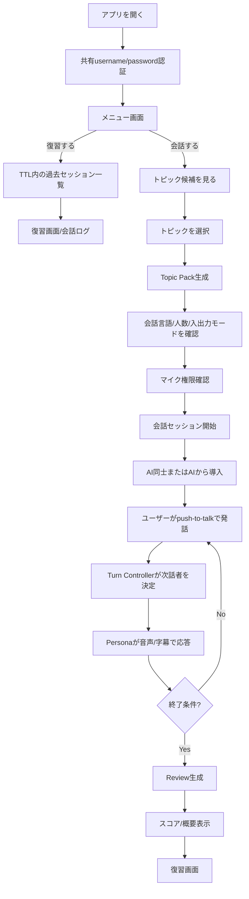

# ユーザー体験設計メモ（ドラフト）

## 0. この文書の位置づけ

この文書は、リアルな複数人会話トレーニングエージェントにおけるユーザー体験を、バックエンドとAgent設計へ落とし込むための初期設計メモである。

前回の「ドラフトのドラフト」に、`docs/backend/MEMO.md` と `docs/backend/RESEARCH.md` の内容を反映し、MVPで優先する体験、現行実装に合わせた共有password認証、会話履歴の扱い、仮決定事項、未決定事項を更新する。

関連文書:

- `docs/REQUIREMENTS_DEFINITION.md`
- `docs/BASIC_DESIGN.md`
- `docs/backend/MEMO.md`
- `docs/backend/RESEARCH.md`
- `docs/backend/02_BACKEND_PROCESS_DRAFT.md`
- `docs/backend/03_AGENT_ORCHESTRATION_DRAFT.md`

## 1. 体験コンセプト

ユーザーは、複数のAI会話相手がいる会話セッションに参加する。AIは単に順番に話すのではなく、それぞれのPersona、関心、立場、声を持ち、ユーザーが自然に会話へ混ざれる状態を作る。

今回の整理では、英会話だけに閉じず、会話セッションの言語をユーザーが指定できる方向へ広げる。ただし、想定ユーザーは日本人であり、会話外のUIや復習説明は日本語・英語を中心に設計する。

## 2. MVPで優先する体験

| 優先度 | 体験価値 | 説明 |
|---|---|---|
| High | 複数人会話に混ざる感覚 | 1〜3人のAI会話相手を設定可能にし、MVPでは2〜3人を主対象にする。 |
| High | ステージ型の会話セッション | 1回の会話をステージとして扱い、制限時間・会話の進行・スコア・復習までを1セットにする。 |
| High | ユーザーが遮られない安心感 | push-to-talkを基本にし、ユーザーが話している間はAIが発話しない。 |
| High | 音声中心だがテキスト代替可能 | 通常は音声入力・音声出力を優先するが、音声不可の場合はテキスト入力/テキスト表示のみでもプレイ可能にする。 |
| High | 会話後の学習価値 | 文法フィードバック、会話全体の要約、スコア、会話ログを復習できる。 |
| Medium | トレンド由来の話題 | X APIとWeb調査を使って、今話せるTopic Packを生成する。失敗時は固定トピックへfallbackする。 |
| Medium | ヒントによる参加支援 | 会話に混ざるためのチートシート、話題ヒント、使えそうなフレーズを必要時に確認できる。 |

## 3. 仮決定している利用フロー

## 4. 画面・体験単位の整理

### 4.1 メニュー画面

| 項目 | 仮決定していること | これから決めること |
|---|---|---|
| 入口 | 最初に共有username/passwordの認証画面を挟み、成功後に短期access tokenを保持する。 | 認証画面の文言、失敗時の案内、token期限切れ時の戻し先。 |
| 復習 | 保存期間内のセッションは復習画面と会話ログを確認できる。復習APIも短期access tokenで保護する。 | セッション一覧に表示する情報、復習可能期限の表示、token期限切れ時の扱い。 |
| ユーザー識別 | ユーザーアカウント、個人別password、OAuthは持たない。共有passwordはアプリ全体の入口制限であり、個人識別には使わない。 | 共有passwordをデモ参加者へどう配布・ローテーションするか。 |
| 会話session | 会話開始時に推測困難な `session_id` を作る。これはユーザー認証tokenではなく、会話と復習データを短期的に参照するためのIDである。 | 復習一覧をtoken保持中の画面状態で扱うか、ブラウザlocal stateにも残すか。 |

### 4.2 トピック選択

| 項目 | 仮決定していること | これから決めること |
|---|---|---|
| トピック候補 | Xトレンド由来候補と固定トピックを統一形式で表示する。 | 候補表示数、カテゴリ、地域選択UI。 |
| 任意入力 | 今回のメモではMVPから外す方向。 | 完全に外すか、開発者/デモ用隠し機能として残すか。 |
| 地域 | X Trendsは地域指定可能。日本/東京などを候補にする。 | 地域をユーザーが選べるようにするか、MVPでは固定にするか。 |
| fallback | X API失敗時も固定トピックだけで会話開始できる。 | 固定トピック5件程度の具体案。 |

### 4.3 Topic Pack生成

Topic Packは、選択されたトピックを会話セッションで使える構造へ変換したもの。

含める情報の例:

- 会話用の概要
- 検証済み事実
- 不確かな主張の扱い
- 議論軸
- 個人的な話につなげる角度
- Personaごとの関心・初期立場
- ユーザーが介入しなかった場合の会話beats
- チートシート、話題ヒント、便利フレーズ
- 参照元

| 項目 | 仮決定していること | これから決めること |
|---|---|---|
| 生成タイミング | 会話開始前の同期処理。Frontendはローディング表示する。 | 許容待ち時間、キャッシュ再利用条件。 |
| 調査方法 | X API + Gemini Interactions APIのGoogle Search Grounding / URL Contextを使う案。 | 実APIでの実装可否、利用quota、リージョン。 |
| 台本との違い | `conversation_beats`は固定台本ではなく、ユーザー未介入時の柔軟な進行目標。会話ログそのものとは別に扱う。 | beatsをスコアや制限時間にどう使うか。 |

### 4.4 セッション設定

| 項目 | 仮決定していること | これから決めること |
|---|---|---|
| 会話人数 | 1〜3人を設定可能にし、MVPの主体験は2〜3人。 | デフォルト人数、1人会話の位置づけ。 |
| 会話言語 | 任意の会話言語を指定可能にする。 | 初期候補、モデル品質が低い言語の注意表示。 |
| 入力モード | audio / textを選べる。audioはpush-to-talk。 | セッション中に切り替え可能にするか。 |
| 出力モード | audio_and_text / text_onlyを想定。 | 音声を出せない環境でのデフォルト。 |
| Persona確認 | 相手の特徴を見たい場合だけ確認できる形にする。 | 会話前にどこまで開示するか。 |

### 4.5 会話セッション

| 項目 | 仮決定していること | これから決めること |
|---|---|---|
| 会話形式 | 会話マナーは守る。基本的に相手の話を最後まで聞く。 | AI同士の連続発話上限、ユーザーへのfloor返却条件。 |
| ユーザー発話 | push-to-talkで発話開始/終了を明示する。 | ボタンUI、キーボード入力時の状態管理。 |
| barge-in | ユーザーが音声ボタンを押したらAI再生bufferを破棄し、interruptを送る。 | Live APIのinterrupt応答とUI状態の同期。 |
| ステージ制 | ユーザーが介入しない場合の会話beatsを制限時間のように扱う。 | 時間延長条件、絶対最大時間、終了演出。 |
| 会話履歴 | ユーザーとAIの確定発話を会話ログとして保持し、Agentの文脈共有・再接続・復習に使う。 | partial字幕、interrupted発話、要約済み履歴をUIにどこまで見せるか。 |
| ヒント | チートシート、話題ヒント、便利フレーズ、助け舟を用意する。 | ヒント利用をスコアへ影響させるか。 |
| エラー | 継続困難な場合はセッション中断画面へ遷移する。 | 再開、途中終了、ホームへ戻る導線。 |

### 4.6 スコア表示・復習

| 項目 | 仮決定していること | これから決めること |
|---|---|---|
| スコア | 会話終了時に総合スコアを表示する。 | 点数の軸、重み、UI表現。 |
| 会話評価 | 質問への回答、相手への関心、話題展開への貢献などを見る。 | 会話品質評価のJSON schema。 |
| 語学評価 | 文法、自然な表現、語彙、言い回しを提示する。 | 日本語説明/英語説明の切り替え。 |
| 会話ログ | 復習画面で確定発話のテキストログを確認できる。 | 音声は保存せず、text中心にする。interrupted発話の見せ方を決める。 |
| 保存期間 | セッション終了後24hを基本にする。 | UI表示上の期限、TTL削除遅延への対応。 |

## 5. バックエンドに影響する体験要求

| 体験要求 | バックエンド/Agentへの要求 |
|---|---|
| トレンドから会話を始めたい | `GET /v1/topics`、`POST /v1/topic-packs`、Topic Pack保存が必要。 |
| 会話開始前の待ち時間を許容できる形にしたい | Topic Pack生成中の状態、timeout、fallbackが必要。 |
| 1本の自然な会話として扱いたい | Realtime経路はWebSocketに統一し、音声binaryとJSON eventを流す。 |
| 話者と音声を区別したい | Personaごとのvoice設定、speaker event、subtitle同期が必要。 |
| ユーザーがAIを遮れるようにしたい | push-to-talk開始時にinterrupt、再生buffer破棄、Agent側interrupt処理が必要。 |
| デモ公開時の入口を制限したい | ユーザーアカウントは作らず、共有username/password、短期access token、stream ticket、rate limitで保護する。 |
| 会話内容を踏まえて返答してほしい | `conversation_beats`とは別に、確定発話履歴、会話状態、必要に応じた要約を保持する。 |
| スコアと復習を出したい | 会話中の軽量指標、終了後Review Agent、Firestore保存が必要。 |
| TTL内で復習したい | session一覧、review取得、`expires_at`による表示可否判定が必要。 |

## 6. 状態案

### 6.1 Menu / Setup

| 状態 | 説明 |
|---|---|
| unauthenticated | 共有username/password認証前。 |
| authenticated | 短期access token取得済み。 |
| menu | 会話開始または復習選択。 |
| topic_loading | トピック候補取得中。 |
| topic_pack_generating | Topic Pack生成中。 |
| configuring_session | 会話言語、人数、入出力モード確認中。 |
| permission_required | マイク権限確認中。 |
| setup_error | 認証、トピック取得、Topic Pack生成、権限、API失敗。 |

### 6.2 Conversation

| 状態 | 説明 |
|---|---|
| connecting | WebSocket / Agent Runtime接続準備中。 |
| session_ready | Agent側ストリーム準備完了。 |
| floor_opened | ユーザーが発話可能。 |
| user_speaking | push-to-talk中。AIは発話開始しない。 |
| agent_speaking | Persona発話中。 |
| interrupted | ユーザー割り込みによりAI発話停止。 |
| hint_available | ヒント表示可能。 |
| reconnecting | WebSocket切断後、同じsessionへ再接続中。 |
| ending | セッション終了処理中。 |
| suspended | 継続困難なエラーで中断画面表示。 |

### 6.3 Review

| 状態 | 説明 |
|---|---|
| generating_review | Review生成中。 |
| review_ready | スコア/要約/文法フィードバック/会話ログ表示可能。 |
| review_failed | Review生成失敗。再試行導線を表示。 |
| expired | `expires_at`超過により復習不可。 |

## 7. MVPで割り切る候補

| 項目 | 割り切り案 | 理由 |
|---|---|---|
| 任意トピック入力 | MVPから外し、X由来候補 + 固定トピックに集中する。 | Topic Pack生成と安全化に設計を寄せるため。 |
| 会話人数 | 主体験は2〜3人、1人は設定可能に留める。 | 複数人感と安定性のバランス。 |
| 音声保存 | 永続保存しない。 | プライバシーと実装負荷を抑える。 |
| 会話中評価 | 詳細LLM評価はしない。軽量メトリクスだけ更新する。 | 応答遅延を避ける。 |
| Review生成 | `POST /sessions/{id}/end`の同期処理にする。 | Worker / Cloud Tasksを使わない方針と整合。 |
| X連携 | ユーザーのXアカウント接続は使わず、サーバー側のX API Bearer Token + 地域トレンドを優先する。 | 個人OAuthを増やさず、共有認証の範囲に収めるため。 |
| 会話履歴 | 確定発話テキストを保存し、生音声は保存しない。 | 復習とAgent文脈に必要な最小データへ絞るため。 |

## 8. 未決定事項

| TBD ID | 未決定事項 | 判断観点 |
|---|---|---|
| TBD-UX-001 | 任意トピック入力を完全にMVP外にするか | ユーザー自由度とTopic Pack品質・安全性のバランス。 |
| TBD-UX-002 | 会話言語の候補 | UIの複雑さ、モデル品質、復習説明の言語。 |
| TBD-UX-003 | スコア軸と重み | コミュニケーション評価と言語評価の比率。 |
| TBD-UX-004 | ヒント利用時の扱い | スコア減点、利用ログ、表示タイミング。 |
| TBD-UX-005 | Topic Pack生成の許容待ち時間 | UX上の待機許容、fallback、キャッシュ。 |
| TBD-UX-006 | セッション制限時間 | トークンコスト、会話体験、ステージ感。 |
| TBD-UX-007 | 中断画面の導線 | 再接続、途中終了、Review生成、ホーム復帰。 |
| TBD-UX-008 | Persona情報の事前開示範囲 | 初対面感と安心感のバランス。 |
| TBD-UX-009 | 共有認証下での復習導線 | token保持中の画面状態、同一ブラウザ内の履歴、session URL、復習期限表示のどれを採用するか。 |
| TBD-UX-010 | token期限切れ時の復習導線 | 再認証後に同じreviewへ戻せるようにするか、メニューへ戻すか。 |
| TBD-UX-011 | interrupted発話のログ表示 | 生成途中のAI発話を復習画面でどう表現するか。 |

## 9. 次に決めること

1. MVPの会話入口を「X由来候補 + 固定トピック」に確定するか。
2. Topic Pack生成時にUIへ返す最小情報を決める。
3. スコアの軸を、会話参加・会話展開・語学面に分けて定義する。
4. セッション中断画面の状態遷移をFrontend/Backendで揃える。
5. 復習一覧と復習画面で必要なFirestoreデータを確定する。
6. 共有認証構成でのaccess token / session_id / stream ticket / local stateの役割を確定する。
