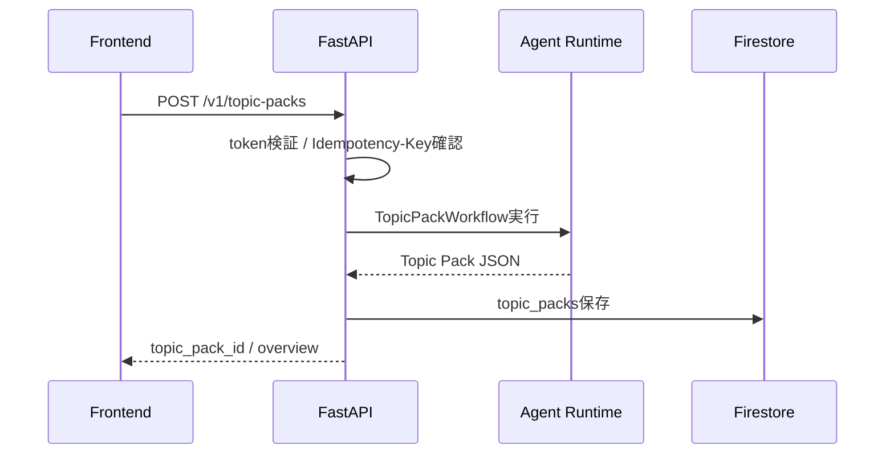
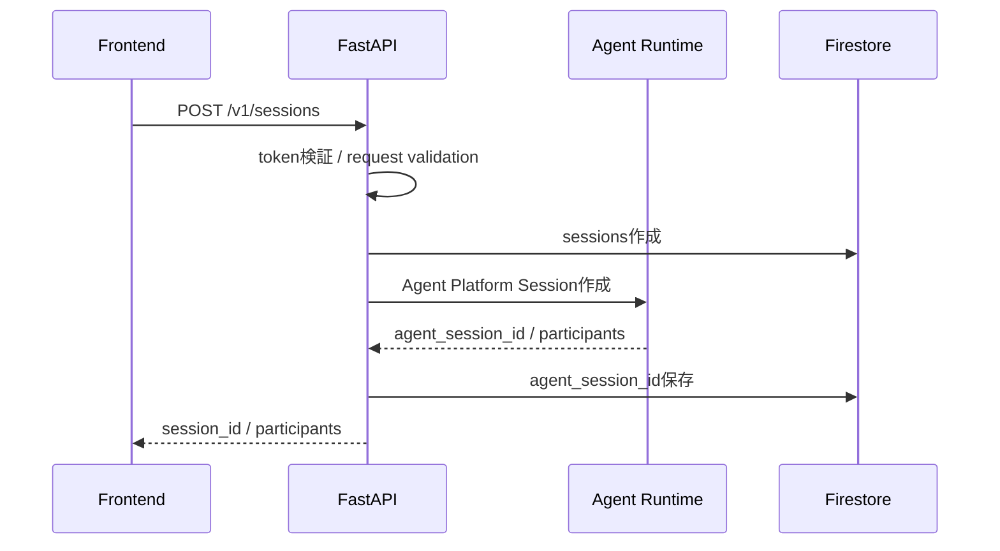
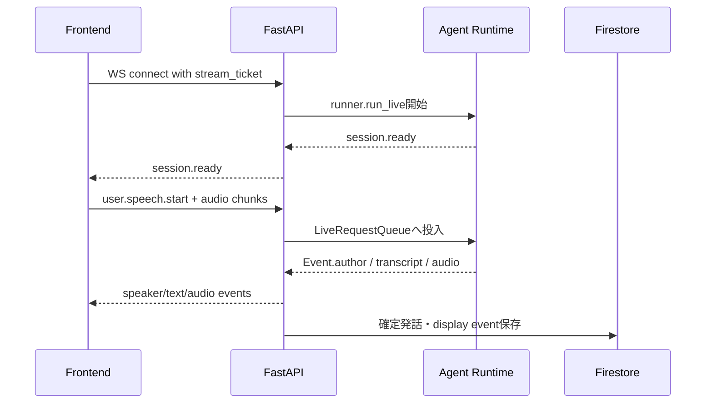
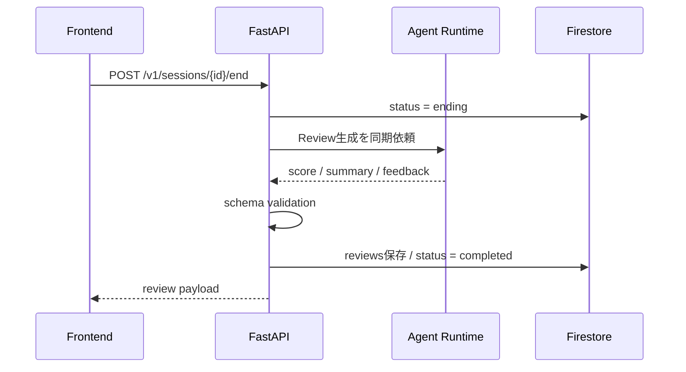

# バックエンド処理分担メモ（ドラフト）

## 0. この文書の位置づけ

この文書は、FastAPI Gateway、Agent Runtime（既存文書でのVertex AI Agent Engine）、Firestore、Secret Managerの処理分担を整理するための初期設計メモである。

`docs/backend/MEMO.md` と `docs/backend/RESEARCH.md` の内容を反映し、前回の曖昧だったRealtime API方式、Topic Pack生成、Firestore collection案を更新する。

インフラ配置、IAM、dev/prd差分は `docs/infra/` を正とする。

## 1. 現時点の大きな方針

| 項目 | 方針 |
|---|---|
| API Gateway | FastAPI on Cloud Run。REST、WebSocket、認証、validation、中継、Firestore保存、backpressureを担当する。 |
| Agent実行基盤 | Agent Runtime（旧称/既存文書表記: Vertex AI Agent Engine）にADK Agentをデプロイする。 |
| Realtime通信 | FrontendとFastAPI間はWebSocketに統一する。JSON frameで制御/字幕/状態、binary frameで音声を扱う。 |
| Agent streaming | 1アプリ会話セッションにつき、1つのAgent Platform Session、1つの`LiveRequestQueue`、1つの`runner.run_live()`を使う。 |
| DB | Firestore Native mode。復習・表示用データ、短期ログ、Topic Packを保存する。 |
| Agent状態SoT | 会話文脈・Agent作業状態はAgent Platform Sessionsを正とする。 |
| Worker / Cloud Tasks | MVPでは採用しない。Topic PackとReviewは同期生成し、Frontendにローディングを出す。 |
| 認証 | ログインなし。共有passwordから短期tokenを発行する。WebSocketには短時間のstream ticketを使う。 |

## 2. コンポーネント責務

| コンポーネント | 持つ責務 | 持たない責務 |
|---|---|---|
| Frontend | 音声取得、音声再生、字幕、話者UI、push-to-talk、再生buffer破棄、WebSocket接続 | secret保持、Firestore直接アクセス、Gemini Live API直接接続 |
| FastAPI Gateway | REST API、WebSocket、認証/token発行、stream ticket、入力validation、Agent Runtime中継、event順序管理、Firestore保存、rate/backpressure、エラー変換 | Persona判断、発話内容生成、会話評価の本体、Frontendへのsecret露出 |
| Agent Runtime / ADK | Topic Pack Workflow、Conversation Director、Persona Agents、Scoring Observer、Hint Generator、Review Agent、Gemini Live API連携 | 公開HTTP入口、password認証、Cloud Armor代替 |
| Firestore | session metadata、messages、reviews、topic_packs、display_eventsの短期保存 | Agent会話文脈の一次管理、生音声保存、secret保存 |
| Secret Manager | 共有password、token署名鍵、X API Bearer Token、外部API secret | アプリデータ保存 |
| Cloud Logging / Monitoring | エラー、遅延、接続、利用量、Agent Runtime/Cloud Run監視 | 復習画面の正規データ保存 |

## 3. 処理分類

| 分類 | 処理 | 方針 |
|---|---|---|
| 会話開始前の同期処理 | トピック候補取得、Topic Pack生成、Persona初期設定、Agent Platform Session作成 | 会話品質のためにここで重い調査を済ませる。Frontendはローディング表示。 |
| 会話中の双方向ストリーミング | 音声、文字起こし、話者切替、Persona発話、interrupt、turn completion、軽量状態更新 | 応答遅延を最優先。Web検索や詳細評価は置かない。 |
| 会話終了後の同期処理 | 文法フィードバック、会話評価、スコア、要約、復習データ生成 | `POST /v1/sessions/{id}/end`からAgent Runtimeを同期呼び出しする。 |

## 4. REST API案

### 4.1 認証

| API | 用途 | 主な処理 |
|---|---|---|
| `POST /v1/auth` | 共有password認証 | Secret Managerのpasswordと照合し、短期access tokenを返す。 |

Response案:

```json
{
  "access_token": "signed-short-lived-token",
  "token_type": "Bearer",
  "expires_at": "2026-07-11T12:00:00Z"
}
```

### 4.2 トピック・Topic Pack

| API | 用途 | 主な処理 |
|---|---|---|
| `GET /v1/topics` | 固定トピックとXトレンド由来候補の取得 | X API失敗時も固定トピックのみで正常応答する。 |
| `POST /v1/topic-packs` | 選択トピックの追加調査とTopic Pack生成 | X News/Search、Gemini Interactions API、Structured Outputを使う。同期処理。 |
| `GET /v1/topic-packs/{topic_pack_id}` | Topic Pack再取得 | キャッシュ利用、デバッグ、セッション再開に使う。 |

`POST /v1/topic-packs` は二重生成を避けるため、`Idempotency-Key` ヘッダー利用を前提にする。

### 4.3 セッション

| API | 用途 | 主な処理 |
|---|---|---|
| `POST /v1/sessions` | 会話セッション作成 | Firestore session作成、Agent Platform Session作成、Topic Pack/Persona設定登録。 |
| `GET /v1/sessions/{session_id}` | 状態確認 | status、review availability、expires_atを返す。 |
| `POST /v1/sessions/{session_id}/stream-ticket` | WebSocket接続用ticket発行 | 一回限り・短時間有効なticketを返す。 |
| `POST /v1/sessions/{session_id}/end` | セッション終了とReview生成 | status更新、Agent Runtime同期呼び出し、Firestore保存、Review payload返却。 |
| `POST /v1/sessions/{session_id}/review/retry` | Review生成再試行 | Review失敗時の明示的再試行。 |
| `GET /v1/sessions/{session_id}/review` | 復習取得 | Firestoreに保存されたReviewを返す。 |

旧案にあった `POST /sessions/{id}/utterances` と `POST /sessions/{id}/interrupt` は主要経路から外す。テキスト発話とinterruptはWebSocket eventとして扱い、会話中の経路を一本化する。

### 4.4 運用

| API | 用途 |
|---|---|
| `GET /health` | Cloud Runプロセスの生存確認。 |
| `GET /ready` | Firestore、Agent Runtime等の依存先を含む準備状態確認。 |

## 5. WebSocket設計案

### 5.1 接続

```text
POST /v1/sessions/{session_id}/stream-ticket
  -> one-time stream_ticket

WS /v1/sessions/{session_id}/stream?ticket=...
```

通常のaccess tokenをWebSocket URLへ長時間露出させないため、専用ticketを使う。

### 5.2 frame種別

| 種別 | 用途 |
|---|---|
| JSON text frame | 制御、字幕、話者変更、状態、警告、エラー。 |
| binary frame | ユーザー音声チャンク、AI音声チャンク。 |

### 5.3 共通JSON event

```json
{
  "type": "agent.text.delta",
  "event_id": "evt_123",
  "session_id": "session_123",
  "turn_id": "turn_008",
  "sequence": 12,
  "timestamp": "2026-07-11T09:05:00.125Z",
  "speaker_id": "alice",
  "payload": {}
}
```

### 5.4 Client -> Server event

| type | 用途 |
|---|---|
| `client.ready` | 音声デバイス準備完了。 |
| `user.speech.start` | push-to-talk開始。floorをユーザーへ移す。 |
| binary audio | ユーザー音声チャンク。 |
| `user.speech.end` | push-to-talk終了。 |
| `user.text` | テキスト入力。 |
| `user.interrupt` | AI発話の明示的中断。 |
| `session.end.request` | セッション終了要求。 |
| `ping` | 接続維持。 |

### 5.5 Server -> Client event

| type | 用途 |
|---|---|
| `session.ready` | Agent側ストリーム準備完了。 |
| `speaker.changed` | アクティブPersona変更。 |
| `user.transcript.partial` | ユーザー発話途中字幕。 |
| `user.transcript.final` | ユーザー発話確定。 |
| `agent.text.delta` | AI字幕差分。 |
| `agent.text.final` | AI発話確定テキスト。 |
| binary audio | AI音声チャンク。 |
| `agent.interrupted` | AI出力中断。 |
| `turn.complete` | 1発話終了。 |
| `floor.opened` | ユーザーが発話可能。 |
| `hint.available` | 助け舟/チートシート表示可能。 |
| `session.state` | 残り時間、スコア暫定値などの更新。 |
| `system.warning` | 復旧可能な警告。 |
| `system.error` | セッション継続困難なエラー。 |
| `pong` | heartbeat応答。 |

## 6. 主要処理フロー

### 6.1 Topic Pack生成



### 6.2 セッション作成



### 6.3 リアルタイム会話



Cloud Run WebSocketは長時間HTTP requestとして扱われるため、timeout、切断、再接続を前提にする。会話状態をCloud Runインスタンスメモリだけに保持しない。

### 6.4 会話終了・Review生成



## 7. Firestore collection案

MVPではTTL対象データをtop-level collectionとして持つ。Firestore TTLで親documentを消してもsubcollectionは自動削除されないため、subcollection中心の設計は避ける。

```text
sessions/{session_id}
session_messages/{message_id}
reviews/{session_id}
topic_packs/{topic_pack_id}
display_events/{event_id}
```

すべての短期保存documentに `expires_at` を持たせる。

```json
{
  "expires_at": "2026-07-12T09:00:00Z"
}
```

復習可能期間はセッション終了後24時間を基本とする。TTL削除は期限時刻に即時実行されるわけではないため、UI上の復習可否は物理削除ではなく `expires_at` で判断する。

## 8. データSoT

| データ | Source of Truth |
|---|---|
| 会話文脈 | Agent Platform Sessions |
| Agent作業状態 | Agent Platform Sessions |
| セッションメタデータ | Firestore |
| 復習画面データ | Firestore |
| Topic Pack | Firestore + Agent state |
| ユーザー発話テキスト | FirestoreとAgent Platform Session |
| AI発話テキスト | FirestoreとAgent Platform Session |
| 生音声 | 永続SoTなし |
| API secret | Secret Manager |
| 運用ログ | Cloud Logging |

## 9. エラー処理

| エラー | APIの扱い | Frontend表示 |
|---|---|---|
| password不一致 | `401` | password再入力。 |
| token期限切れ | `401` | 再認証。 |
| 入力不備 | `400` | 該当項目の修正。 |
| stream ticket不正 | `401 / 403` | 接続再発行。 |
| 同時接続上限 | `429 + Retry-After` | 少し待って再試行。 |
| Agent Runtime接続失敗 | `502 / 503` | 再接続または中断画面。 |
| Live API rate limit | retry後 `429 / 503` | 混雑表示、再試行。 |
| X API失敗 | preset topicへfallback | 固定トピックで続行。 |
| Web調査失敗 | X情報とpreset情報で限定Topic Pack生成 | 調査範囲が限定されたことを表示検討。 |
| Firestore保存失敗 | 会話継続、Review保存失敗を通知 | 復習保存失敗の案内。 |
| Review失敗 | `review_failed`、再試行導線 | Review再試行。 |
| WebSocket切断 | 再接続、Session resume | 接続復旧中表示。 |
| 重大なAgent障害 | セッション中断画面 | 再始動、途中終了、ホームへ戻る。 |

## 10. バックプレッシャー

| 制御対象 | 方針 |
|---|---|
| 最大同時セッション数 | 上限超過時は `429`。 |
| 1セッション最大時間 | ステージ制とコスト制御の両方で使う。 |
| Topic Pack生成同時数 | 重い調査処理を制限する。 |
| Review生成同時数 | 終了後処理の同時実行を制限する。 |
| 音声帯域 | 1接続あたりの最大chunkサイズ/送信頻度を制限する。 |
| 再試行回数 | 1ユーザーのretryを制限する。 |
| Agent Runtime timeout | 処理種別ごとにtimeoutを設定する。 |

## 11. 採用しない構成

| 構成 | 不採用理由 |
|---|---|
| Personaごとに独立Live Sessionを常時維持 | 履歴同期、barge-in反映、接続管理、コストがPersona数分増える。 |
| 1つのAgentが全Personaを演じる | Personaや声が混ざりやすく、複数人音声体験が弱い。ただしfallbackとして保持。 |
| FrontendからGemini Live APIへ直接接続 | credential保護、Agent state/log統合、話者event制御のため不可。 |
| 会話中の通常Web検索 | ツール結果待ちで会話が停止しやすい。調査は会話前Topic Packへ集約する。 |
| Cloud Tasks / Worker | MVPでは同期生成で足りる。利用増加時はReview生成の非同期化を最初に検討。 |

## 12. 未決定事項

| TBD ID | 未決定事項 | 判断観点 |
|---|---|---|
| TBD-BE-001 | Agent Runtime / Agent Engine名称のドキュメント統一 | 既存infra文書との整合、GCP最新名称の扱い。 |
| TBD-BE-002 | Topic Pack schemaの確定 | UI表示、Agent state、Firestore保存、source管理。 |
| TBD-BE-003 | WebSocket再接続仕様 | sequence復元、未確定発話、Agent Platform Session resume。 |
| TBD-BE-004 | stream ticket仕様 | 有効期限、一回限り判定、保存場所。 |
| TBD-BE-005 | timeout値 | Topic Pack、WebSocket、Review、Agent Runtime接続。 |
| TBD-BE-006 | Firestore index設計 | session一覧、review取得、topic_pack再利用。 |
| TBD-BE-007 | スコア保存形式 | 軽量指標、最終score、評価理由、ヒント利用履歴。 |
| TBD-BE-008 | fallback mode | 共通Voice、単一Live Agent、テキスト会話、固定応答デモ。 |

## 13. 次に作るべき詳細設計

1. OpenAPI相当のREST schema。
2. WebSocket event schema。
3. Topic Pack JSON schema。
4. Firestore document schema / index / TTL。
5. stream ticket / token / CORS / error code設計。
6. 再接続・中断画面の状態遷移。
