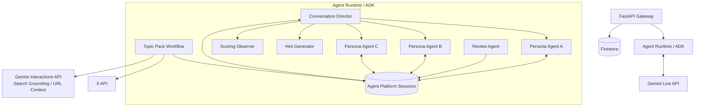
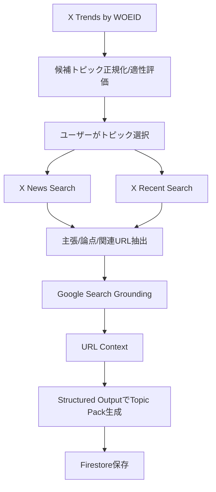

# Agent構成・連携設計メモ（ドラフト）

## 0. この文書の位置づけ

この文書は、ADK / Agent Runtime（既存文書でのVertex AI Agent Engine）上で動かすAgent群の構成と連携方法を整理するための初期設計メモである。

`docs/backend/MEMO.md` と `docs/backend/RESEARCH.md` の内容を反映し、Conversation Manager中心の前回案を、Conversation Director、Topic Pack Workflow、Scoring Observer、Hint Generator、Review Agentを含む構成へ更新する。

## 1. 現時点の大きな方針

| 項目 | 方針 |
|---|---|
| 実行基盤 | Agent Runtime（旧称/既存文書表記: Vertex AI Agent Engine）。 |
| 開発方式 | Google ADKでAgent、tool、state、Agent間遷移を実装する。 |
| Realtime方式 | 1会話セッションにつき、1つのAgent Platform Session、1つの`LiveRequestQueue`、1つの`runner.run_live()`、1つのFrontend WebSocket。 |
| Persona表現 | 複数Persona Agentをsub_agentsとして扱い、Personaごとの`Gemini`インスタンス、`speech_config`、`voice_name`を持たせる。 |
| Agent状態 | Agent Platform Sessionsが会話文脈・イベント・作業状態のSoT。 |
| Topic生成 | 会話前に固定順序のTopic Pack Workflowで生成する。自由探索型Research Agentにはしない。 |
| 会話中評価 | 詳細LLM評価はクリティカルパスに置かず、軽量指標またはObserverに分離する。 |
| Review | 会話終了後にReview AgentがStructured Outputで生成する。 |

## 2. Agent / Workflow一覧

| 名称 | 種別 | クリティカルパス | 主な責務 |
|---|---|---|---|
| Topic Pack Workflow | workflow | 会話前 | X API、Web調査、Topic Pack JSON生成。 |
| Conversation Director | Agent | Yes | 次話者選択、floor control、会話beats管理、ヒント条件、終了条件。 |
| Persona Agent A/B/C | Agent | 発話対象のみYes | Persona固有の性格・関心・声で発話する。 |
| Scoring Observer | Agent/logic | No | 会話中の軽量指標、終了後評価材料の整理。 |
| Hint Generator | Agent/tool | 要求時のみ | チートシート、話題ヒント、使えるフレーズ、助け舟。 |
| Review Agent | Agent | 会話終了後 | 文法、自然表現、会話参加度、スコア、サマリー生成。 |

## 3. 全体構成



## 4. Topic Pack Workflow

トピック作成は、会話中ではなく会話開始前に行う。LLMに任意のURLやパラメータを自由生成させるのではなく、型付きPython関数と固定順序で実装する。

```text
TopicPackWorkflow
├─ TrendNormalizer
├─ XNewsTool
├─ XRecentPostsTool
├─ ClaimExtractor
├─ GroundedResearch
└─ TopicPackCompiler
```

### 4.1 処理フロー



### 4.2 Topic Packに含めるもの

| 項目 | 用途 |
|---|---|
| overview | 会話前提の短い説明。 |
| verified_facts | Personaが断定してよい事実。 |
| uncertain_claims | 不確かな主張と扱い。 |
| discussion_axes | 議論の軸、導入質問、立場候補。 |
| personal_angles | ユーザー自身の経験へつなげる角度。 |
| persona_hooks | Personaごとの関心・初期立場。 |
| conversation_beats | ユーザー未介入時の柔軟な進行目標。 |
| user_cheat_sheet | 話題ヒント、便利フレーズ。 |
| sources | 参照元。 |

### 4.3 未決定

- Topic Pack生成の最大待ち時間。
- Web調査失敗時にどの程度限定的なTopic Packを許容するか。
- Structured Output schemaの厳密さ。
- Topic Pack cacheの再利用期間。

## 5. Conversation Director

Directorはユーザーに直接話すPersonaではなく、会話全体を制御するCoordinatorである。

### 5.1 主な責務

- 次の発話者を選ぶ。
- Persona Agentへ遷移する。
- 話題の現在位置とconversation beatsを管理する。
- AI同士の連続発話を制限する。
- ユーザーへfloorを戻す。
- 会話の停滞を検知する。
- ヒント表示条件を判定する。
- セッション終了条件を判定する。

### 5.2 Director出力案

```json
{
  "action": "persona_speaks",
  "speaker_id": "bob",
  "intent": "respond_to_user",
  "topic_axis_id": "axis_002",
  "response_goal": "Give a cautious counterpoint and ask one question",
  "allow_followup_agent": false
}
```

```json
{
  "action": "open_user_floor",
  "prompt_user": true,
  "prompt_style": "light_question"
}
```

## 6. Persona Agent

各Persona Agentは独立した設定を持つ。

- `name`
- `instruction`
- 性格
- Topic Pack上の関心
- 初期立場
- 発話スタイル
- 専用`Gemini`インスタンス
- 専用`speech_config`
- 専用`voice_name`

### 6.1 Persona定義案

```json
{
  "persona_id": "alice",
  "display_name": "Alice",
  "role": "friendly classmate",
  "speaking_style": "warm, casual, asks follow-up questions",
  "topic_interest": "how the topic affects daily life",
  "initial_position": "curious and optimistic",
  "voice_name": "Aoede"
}
```

### 6.2 発話ルール

- 1回の発話では1人だけが話す。
- 原則1〜3文。
- 他Personaの発言を繰り返さない。
- 新しい情報、反応、質問のいずれかを含める。
- ユーザーの質問には原則1人が最初に答える。
- 全Personaが毎ターン回答しない。
- ユーザーを無視してAI同士だけで長く話さない。
- Topic Packにない事実を断定しない。

## 7. 1つのストリームでのAgent遷移

Personaごとに独立したLive Sessionを常時維持しない。1つの`runner.run_live()`イベントループと1つの`LiveRequestQueue`を継続して使う。

```python
async for event in runner.run_live(
    user_id=user_id,
    session_id=agent_session_id,
    live_request_queue=live_request_queue,
):
    await handle_event(event)
```

Agentの切り替え時も同じQueueを使う。

```text
User audio
   ↓
LiveRequestQueue
   ↓
現在アクティブなAgent
   ↓
run_live() Event
   ↓
FastAPI
   ↓
Frontend
```

FrontendはADK eventの`author`またはFastAPIが整形した`speaker_id`で話者を識別する。

## 8. 文字起こしと文脈共有

マルチエージェント構成では、Agent遷移時に直前までの会話をテキスト文脈として渡す必要がある。

Persona間で共有する情報:

- ユーザー発話の確定文字起こし
- AI発話の確定文字起こし
- Topic Pack
- 会話の現在位置
- 既に質問した内容
- ユーザーから得た情報
- 現在のスコア状態

一方、生音声の感情やニュアンスが次のAgentへ完全に引き継がれるとは限らない。必要に応じて補助状態を保持するが、MVP必須ではない。

## 9. Floor Control

自然なグループ会話には、「誰が今話してよいか」を管理するFloor Controlが必要である。

### 9.1 状態案

```json
{
  "floor_owner": "user",
  "active_speaker": null,
  "user_is_speaking": false,
  "ai_consecutive_turns": 0,
  "current_turn_id": "turn_008"
}
```

### 9.2 基本規則

1. ユーザーが音声ボタンを押したら、floorを即座にユーザーへ移す。
2. ユーザー発話中は、どのPersonaも発話開始しない。
3. ユーザー発話終了後、Directorが第一話者を1人選ぶ。
4. 必要な場合だけ、別Personaが1回追加反応する。
5. AIの連続発話は最大2回。
6. 上限に達したら必ずユーザーへfloorを戻す。
7. Persona発話中にユーザーが割り込んだら、AI音声を停止する。

## 10. Barge-in

push-to-talk方式を採用する。

```text
ユーザーが音声ボタンを押す
        │
        ├─ FrontendのAI再生bufferを即時破棄
        ├─ user.interrupt送信
        ├─ user.speech.start送信
        └─ 音声chunk送信開始
```

途中で切れたAI発話は、Firestoreに以下のように保存する。

```json
{
  "status": "interrupted",
  "generated_text": "生成された全文または途中結果",
  "delivered_text": "ユーザーへ実際に提示された範囲"
}
```

## 11. Scoring Observer

会話中に詳細なLLM評価を同期実行しない。会話中は、次の軽量指標を更新する。

- ユーザー発話回数
- ユーザー発話時間
- 質問回数
- 応答率
- 無言時間
- Topic Packとのキーワード対応
- Personaからの質問に回答したか
- 会話展開を発生させたか
- ヒント利用回数

必要であれば確定文字起こしをScoring Observerへ渡すが、その結果を次のPersona発話生成の前提にはしない。

## 12. Hint Generator

Hint Generatorは、常時クリティカルパスに置かず、要求時またはDirectorが必要と判断した場合のみ使う。

出力候補:

- Topic Packに基づく話題ヒント
- ユーザーが言えそうな質問
- 会話言語で使える短いフレーズ
- 相手の直前発話に対する返し方

ヒントは会話参加を助けるためのものだが、スコアへどう影響させるかは未決定。

## 13. Review Agent

Review Agentは会話終了後に、復習画面向けのStructured Outputを生成する。

出力候補:

- 文法上の誤り
- より自然な表現
- 語彙・言い回し
- 質問への答え方
- 会話への参加度
- 話題の発展への貢献
- 相手への関心
- 総合スコア
- セッション要約

### 13.1 Review出力案

```json
{
  "summary": "You discussed campus life and club activities.",
  "score": {
    "total": 78,
    "communication": 42,
    "language": 36
  },
  "grammar_feedback": [
    {
      "utterance_id": "utt_001",
      "original": "I am agree with you.",
      "suggestion": "I agree with you.",
      "explanation_ja": "agree は動詞なので be 動詞は不要です。",
      "severity": "medium"
    }
  ],
  "conversation_feedback": [
    {
      "category": "follow_up_question",
      "comment_ja": "相手の発言に対して質問を返せていました。"
    }
  ]
}
```

## 14. 採用しない/ fallback

| 優先順位 | 構成 | 位置づけ |
|---|---|---|
| 1 | ADK複数Persona + Persona別Voice | 第一候補。 |
| 2 | ADK複数Persona + 共通Voice | Voice分離が不安定な場合。 |
| 3 | 単一Live AgentによるPersona演じ分け | マルチAgentが不安定な場合。 |
| 4 | テキスト会話 | 音声経路が不安定な場合。 |
| 5 | 固定応答デモモード | 外部API障害・デモ保険。 |

採用しない構成:

- Personaごとに独立Live Sessionを常時維持する。
- FrontendからGemini Live APIへ直接接続する。
- 会話中に通常Web検索を行う。
- ReviewやTopic PackのためにCloud Tasks / WorkerをMVPから導入する。

## 15. 検証項目

### 15.1 性能

- ユーザー発話終了から最初のAI音声まで。
- Persona A終了からPersona B音声開始まで。
- interrupt操作から音声停止まで。
- 入力字幕確定まで。
- 出力字幕と音声のずれ。
- Agent Runtime接続開始時間。
- WebSocket再接続時間。

### 15.2 会話品質

- Personaごとの声が維持されるか。
- Personaの性格が混ざらないか。
- 直前の別Persona発話を理解できるか。
- ユーザーの発言内容を全Personaが共有できるか。
- AI同士が長く話し続けないか。
- Personaが同じ内容を繰り返さないか。
- ユーザーへ自然に発話権を戻せるか。

## 16. 未決定事項

| TBD ID | 未決定事項 | 判断観点 |
|---|---|---|
| TBD-AGT-001 | ADK上の具体的なroot/sub_agents構成 | Directorをrootにするか、別rootからDirectorへ委譲するか。 |
| TBD-AGT-002 | Persona別Voiceの実動作 | ADK/Live APIのバージョン固定、実環境検証。 |
| TBD-AGT-003 | Topic Pack Workflowの実装場所 | Agent Runtime内workflowか、FastAPIから個別tool呼び出しか。 |
| TBD-AGT-004 | Directorの次話者決定方式 | LLM判断、ルールベース、ハイブリッド。 |
| TBD-AGT-005 | Scoring Observerの実行方式 | コードで軽量計算、Agentで非同期評価、終了後のみ評価。 |
| TBD-AGT-006 | Hint Generatorのトリガー | ユーザー要求、沈黙、低参加度、Director判断。 |
| TBD-AGT-007 | Review JSON Schema | スコア軸、文法カテゴリ、説明言語。 |
| TBD-AGT-008 | Agent Runtime名称統一 | 既存文書のAgent Engine表記との整合。 |

## 17. 次に作るべき詳細設計

1. ADK runtime構成図とroot/sub_agents定義。
2. Topic Pack JSON Schema。
3. Director action schema。
4. Persona初期セットとvoice設定。
5. WebSocket eventとADK eventの対応表。
6. Floor Control state machine。
7. Review Agent Structured Output schema。
8. Agent Behavior Testの固定入力と期待挙動。
