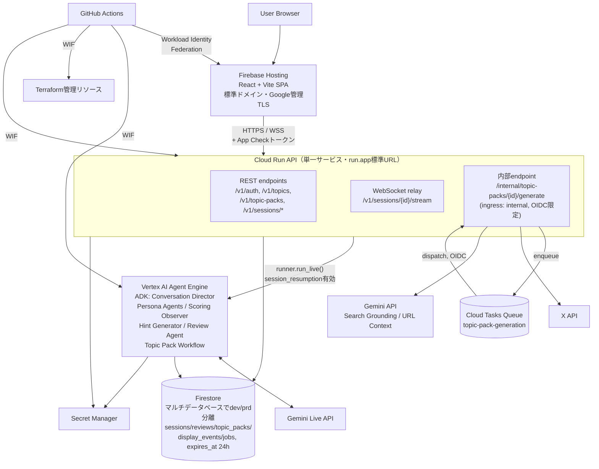
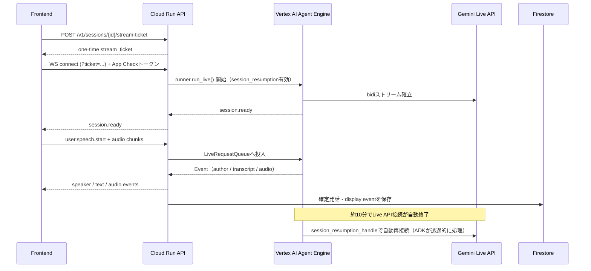
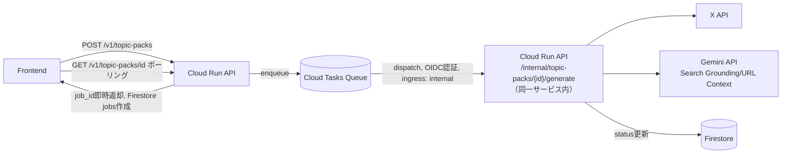
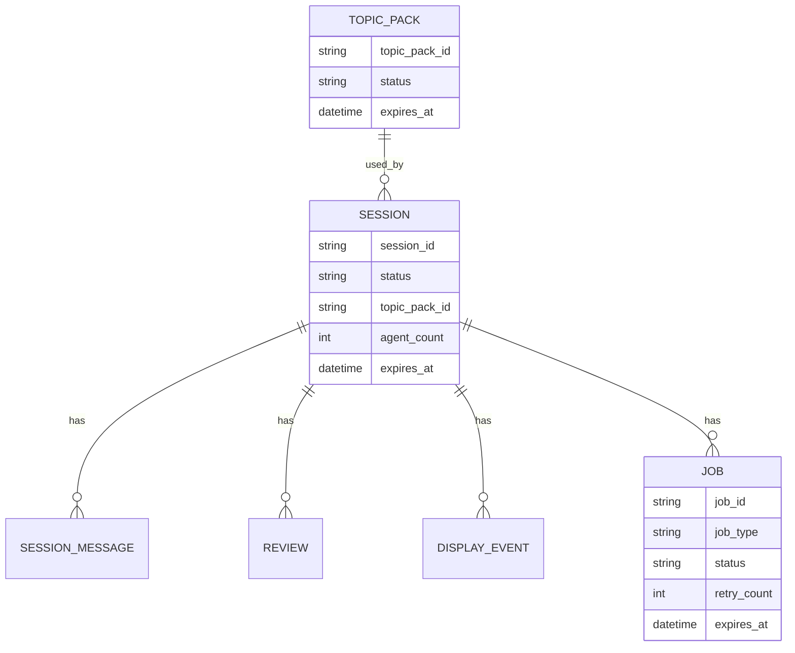

# リアルな複数人英会話トレーニングエージェント インフラアーキテクチャ設計書

## 目次

- [0. 文書情報](#0-文書情報)
- [1. 全体構成図](#1-全体構成図)
- [2. リポジトリ構成](#2-リポジトリ構成)
- [3. コンポーネント別設計](#3-コンポーネント別設計)
- [4. リアルタイム会話の経路設計](#4-リアルタイム会話の経路設計)
- [5. Cloud Tasksによる非同期処理設計](#5-cloud-tasksによる非同期処理設計)
- [6. データ設計](#6-データ設計)
- [7. 採用しなかった構成とその理由](#7-採用しなかった構成とその理由)
- [8. 未決定事項](#8-未決定事項)
- [9. 参考資料](#9-参考資料)

---

## 0. 文書情報

| 項目 | 内容 |
|---|---|
| 文書名 | リアルな複数人英会話トレーニングエージェント インフラアーキテクチャ設計書 |
| 版数 | v0.2 |
| 作成日 | 2026-07-11 |
| 前提文書 | `docs/infra/00_OVERVIEW.md`、`docs/BASIC_DESIGN.md`、`docs/backend/01〜03_*_DRAFT.md` |
| 位置づけ | GCP構成の詳細はこの文書を正とする。`docs/BASIC_DESIGN.md` §4は本書の要約 |
| 注意 | `_internal/real_conversation_agents_infra_architecture.md`（Worker常時稼働・ALB・API Gateway・Cloud Armor前提の旧草案）は本書に置き換えられている。参照しないこと |

---

## 1. 全体構成図



---

## 2. リポジトリ構成

```text
real_conversation_agents/
├── README.md / AGENTS.md / CLAUDE.md / COC.md / CHANGE_LOG.md
├── .env.example / .dockerignore / .gitignore
├── docs/
│
├── frontend/                          # → Firebase Hosting
│   ├── src/
│   ├── tests/
│   └── package.json
│
├── api/                                # → Cloud Run API（1サービス）
│   ├── src/
│   │   ├── routes/                    # REST + WebSocket
│   │   ├── middleware/                # 認証, App Check検証, rate limit
│   │   ├── services/                  # Firestore, Agent Engine client, X API client
│   │   ├── tasks/                     # Cloud Tasksが叩く内部handler（Workerは別サービス化しない）
│   │   └── main.py
│   ├── tests/
│   ├── Dockerfile
│   └── pyproject.toml
│
├── agent/                              # → Vertex AI Agent Engine（独立デプロイ対象）
│   ├── src/
│   │   ├── director/                  # Conversation Director
│   │   ├── personas/
│   │   ├── topic_pack_workflow/
│   │   ├── scoring/
│   │   ├── hint/
│   │   └── review/
│   ├── tests/
│   ├── deploy.py                       # agent_engines.create / update
│   └── requirements.txt
│
├── packages/
│   └── shared-schemas/                 # WebSocket event / Topic Pack / Review JSON Schema
│       └── schemas/*.json
│
├── infra/
│   ├── README.md
│   ├── bootstrap/                      # 最初に人力で1回だけ実行。詳細は04_DEPLOY.md
│   └── terraform/
│       ├── environments/
│       │   ├── dev/
│       │   └── prod/
│       └── modules/
│           ├── cloud-run/
│           ├── cloud-tasks/
│           ├── firestore/
│           ├── secret-manager/
│           ├── artifact-registry/
│           ├── agent-engine-iam/       # Agent Engine実行用SA/IAMのみ。コード本体は含めない
│           ├── workload-identity-federation/
│           └── iam/
│
└── .github/
    ├── ISSUE_TEMPLATE/
    ├── PULL_REQUEST_TEMPLATE.md
    └── workflows/
        ├── ci.yml
        └── cd.yml
```

旧構成との差分は以下の通り。

| 変更 | 理由 |
|---|---|
| `worker/`を廃止し`api/src/tasks/`へ統合 | Cloud TasksのターゲットはCloud Run APIと同一サービス内の内部エンドポイントで足りるため、独立したWorker Cloud Runサービスは不要 |
| `agent/`をトップレベルに新設 | Agent EngineはCloud Run APIとは別のデプロイ対象（Inline Source Deployment）であり、CI/CDのパスフィルタ上も独立させる必要がある |
| `packages/shared-schemas/` | frontend(TypeScript)とapi/agent(Python)で言語が異なるため、コードそのものの共有ではなくJSON Schemaを一次情報として置く |
| `infra/bootstrap/`を新設 | Terraform state用GCSバケット・WIF・SA作成は人力実行専用とし、CI管理下の`environments/`と明確に分離する |

---

## 3. コンポーネント別設計

### 3.1 Frontend（Firebase Hosting）

| 項目 | 内容 |
|---|---|
| 技術 | React（Vite）+ TypeScript + Tailwind CSS |
| ホスティング | Firebase Hosting（標準ドメイン、Google管理TLS） |
| 環境分離 | Firebase Hostingの複数サイト機能でdev/prdを分離 |
| App Check | reCAPTCHA Enterprise（prd）、debugプロバイダ（local・CI） |
| 前段 | ALBは設けない（Firebase HostingはServerless NEGのbackend対象外のため構成不可。詳細は§7） |

### 3.2 API（Cloud Run）

| 項目 | 内容 |
|---|---|
| 技術 | FastAPI on Cloud Run |
| 公開方式 | run.app標準URL直接公開。ALB/API Gatewayは設けない（理由は§7） |
| 責務 | password認証・短期token発行、WebSocket用stream ticket発行、Agent Engineへの中継、Firestore保存、Cloud Tasksへのenqueue、rate limit・backpressure |
| ingress | Cloud Run既定（`authentication required`はdev環境のみ追加。詳細は`03_SECURITY.md`） |
| WebSocket | Cloud Run既定でサポート。request timeoutを長め（最大60分）に設定 |

### 3.3 Agent Runtime（Vertex AI Agent Engine）

| 項目 | 内容 |
|---|---|
| 実行基盤 | Vertex AI Agent Engine（ADK） |
| 接続方式 | Cloud Run APIが`runner.run_live()`を保持し、Agent EngineのGemini Live APIとの双方向ストリームを中継する。フロントエンドからの直接接続は行わない（理由は§7） |
| セッション継続 | `RunConfig(session_resumption=...)`を必須実装。Live APIの約10分の接続上限、および途中のネットワーク瞬断の両方に対応する |
| セッション時間上限 | 1会話10分（MVP方針） |
| Agent構成 | Conversation Director / Persona Agent×N / Scoring Observer / Hint Generator / Review Agent / Topic Pack Workflow（詳細は`docs/backend/03_AGENT_ORCHESTRATION_DRAFT.md`） |

### 3.4 Firestore

| 項目 | 内容 |
|---|---|
| モード | Native mode |
| 環境分離 | マルチデータベース機能でdev/prdを分離（`FIRESTORE_DATABASE_ID`） |
| コレクション | `sessions` / `session_messages` / `reviews` / `topic_packs` / `display_events` / `jobs` |
| TTL | 全コレクションに`expires_at`を持たせ、24時間でTTL失効 |
| アクセス制御 | IAM・Service Account経由のみ。Frontendから直接アクセスしない |

### 3.5 Secret Manager

| 項目 | 内容 |
|---|---|
| 管理対象 | password（ハッシュ）、token署名鍵、X API Bearer Token等 |
| 参照元 | Cloud Run API・Agent Engine実行SAのみ。Frontendは参照しない |

---

## 4. リアルタイム会話の経路設計



---

## 5. Cloud Tasksによる非同期処理設計

X API呼び出し・Topic Pack生成（Gemini Search Grounding/URL Context）はCloud Run API内部で完結させず、Cloud Tasks経由で処理する。**会話そのものはCloud Tasksを経由しない**（§7参照）。



| 項目 | 方針 |
|---|---|
| Workerサービス | 設けない。Cloud TasksのターゲットはCloud Run APIと同一サービス内の内部エンドポイント |
| レート制御 | キュー設定の`max_concurrent_dispatches`/`max_dispatches_per_second`でX API/Geminiのバースト・レート制限を吸収する |
| dispatch_deadline | 最大30分（Cloud Tasks HTTPターゲットの上限） |
| フロント連携 | Topic Pack生成は非同期化されるため、`job_id`発行後は`GET /v1/topic-packs/{id}`でstatus（pending/ready/failed）をポーリングする |
| Review生成 | 引き続き同期呼び出し（`POST /v1/sessions/{id}/end`）。外部調査を伴わずTopic Pack生成ほど重くないため |

---

## 6. データ設計

### 6.1 SoT（Source of Truth）

| データ | SoT |
|---|---|
| 会話文脈・Agent作業状態 | Agent Platform Sessions |
| セッションメタデータ・復習画面データ | Firestore |
| 生音声 | 永続SoTなし（原則保存しない） |
| API secret | Secret Manager |
| 運用ログ | Cloud Logging |

### 6.2 概念データモデル



詳細な設定値・環境変数は`02_PARAMS_DEF.md`を参照。

---

## 7. 採用しなかった構成とその理由

これまでの検討過程で候補に上がったが不採用とした構成を、再検討を避けるために明記する。

| 検討した構成 | 不採用の理由 |
|---|---|
| API前段にExternal Application Load Balancer + Cloud Armorを配置 | Google管理SSL証明書はドメイン所有が前提であり、「独自ドメインを取得しない」方針と矛盾する。自己署名証明書ではブラウザ警告が出て審査員向け公開デモに使えない |
| Firebase HostingやCloud Run FrontendにALBを前段配置 | Firebase HostingはServerless NEGのbackend対象外（Cloud Run/Cloud Functions/App Engine/API Gatewayのみ対応）であり、標準構成として作れない |
| API前段にAPI Gatewayを配置 | API Gateway（ESPv2ベース）はWebSocketを公式サポートしない（対応するのはApigee Xのみ）。会話のリアルタイム経路が通らなくなる。また認証認可はFastAPIミドルウェアで既に完結しており機能が重複する |
| フロントエンドからVertex AI Agent Engineへ直接接続 | Vertex AI系APIはOAuth2アクセストークンのみを受け付け、APIキー認証を拒否する。ブラウザにサービスアカウント相当のクレデンシャルを持たせるのは重大な漏洩リスクであり、安全にやるには結局サーバー側でのトークン発行が必要になり、Cloud Runを経路から外す意味がなくなる |
| Cloud Tasks + 常設Workerサービスでエージェントとの会話そのものを処理 | Cloud TasksのHTTPターゲットタスクは最大30分のdispatch deadlineを持つ一回限りのリクエスト/レスポンスであり、双方向でストリーミングし続けるライブ会話のループを保持できない。Worker/Tasksが担えるのはTopic Pack生成等の単発処理のみ |
| VPCに全コンポーネントを収容してFirestore等を保護 | Firestore/Secret Manager/Vertex AIへのアクセス制御はもともとIAM・Service Accountベースであり、VPCに置くこと自体はこれらの保護に直接寄与しない。ネットワーク境界での保護が必要ならVPC Service Controlsが本来の道具だが、Organizationが無いため導入できない |
| VPC Service Controls | サービス境界（perimeter）の構成はOrganizationレベルのリソースとしてのみ可能であり、Organization配下にない本プロジェクトでは技術的に利用できない |

---

## 8. 未決定事項

| TBD ID | 内容 | 判断観点 |
|---|---|---|
| TBD-ARCH-001 | `packages/shared-schemas/`のcodegen自動化範囲 | フロント(TS)とapi/agent(Python)の型追従を手動にするか自動生成するか |
| TBD-ARCH-002 | Cloud Run APIのconcurrency/min-instances具体値 | デモ時の同時接続数想定とコストのバランス |
| TBD-ARCH-003 | dev環境のIAP for Cloud Run詳細設定 | `03_SECURITY.md`で確定 |

---

## 9. 参考資料

- `docs/backend/01_USER_EXPERIENCE_DRAFT.md`
- `docs/backend/02_BACKEND_PROCESS_DRAFT.md`
- `docs/backend/03_AGENT_ORCHESTRATION_DRAFT.md`
- Bidirectional streaming with Vertex AI Agent Engine Runtime: https://cloud.google.com/vertex-ai/generative-ai/docs/agent-engine/bidirectional-streaming
- Using WebSockets | Cloud Run: https://docs.cloud.google.com/run/docs/triggering/websockets
- Serverless network endpoint groups overview: https://docs.cloud.google.com/load-balancing/docs/negs/serverless-neg-concepts
- Manage multiple Firestore databases in a project: https://cloud.google.com/blog/products/databases/manage-multiple-firestore-databases-is-now-generally-available
