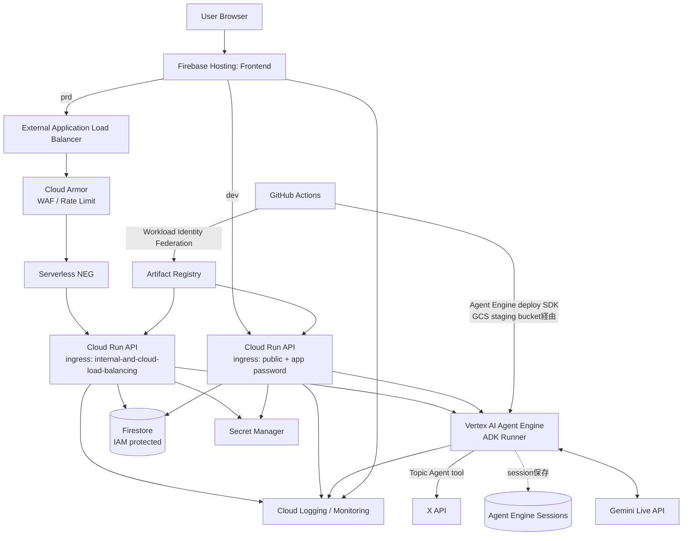

# リアルな複数人英会話トレーニングエージェント インフラアーキテクチャ設計書

## 目次

- [0. 文書情報](#0-文書情報)
- [1. 本書の目的](#1-本書の目的)
- [2. インフラ設計の基本方針](#2-インフラ設計の基本方針)
- [3. 全体アーキテクチャ](#3-全体アーキテクチャ)
- [4. ネットワーク境界・閉域化方針](#4-ネットワーク境界閉域化方針)
- [5. 公開入口設計](#5-公開入口設計)
- [6. Frontendホスティング設計](#6-frontendホスティング設計)
- [7. API設計（FastAPI Gateway）](#7-api設計fastapi-gateway)
- [8. 非同期処理方針（Worker / Cloud Tasksは採用しない）](#8-非同期処理方針worker--cloud-tasksは採用しない)
- [9. Firestore設計](#9-firestore設計)
- [10. Secret Manager設計](#10-secret-manager設計)
- [11. IAM / Service Account設計](#11-iam--service-account設計)
- [12. Gemini / ADK / Vertex AI Agent Engine連携設計](#12-gemini--adk--vertex-ai-agent-engine連携設計)
- [13. X API連携・外向き通信設計](#13-x-api連携外向き通信設計)
- [14. WAF / Cloud Armor設計](#14-waf--cloud-armor設計)
- [15. Load Balancer / Serverless NEG設計](#15-load-balancer--serverless-neg設計)
- [16. Cloud Run ingress / egress設計](#16-cloud-run-ingress--egress設計)
- [17. CI/CD設計](#17-cicd設計)
- [18. Terraform / IaC管理方針](#18-terraform--iac管理方針)
- [19. ログ・監視・アラート設計](#19-ログ監視アラート設計)
- [20. MVP採用範囲](#20-mvp採用範囲)
- [21. 将来拡張](#21-将来拡張)
- [22. 未決定事項](#22-未決定事項)
- [23. 参考資料](#23-参考資料)

---

## 0. 文書情報

| 項目 | 内容 |
|---|---|
| 文書名 | リアルな複数人英会話トレーニングエージェント インフラアーキテクチャ設計書 |
| 版数 | v0.1 |
| 作成日 | 2026-07-09 |
| 対象 | 開発メンバー、インフラ担当、セキュリティ設計担当 |
| 関連文書 | `docs/REQUIREMENTS_DEFINITION.md`, `docs/BASIC_DESIGN.md`, `docs/CONTRIBUTION.md` |
| 目的 | GCP上で本システムを安全かつ拡張可能に構築するためのインフラ方針を定義する |
| 前提 | FrontendはFirebase Hosting（React / Vite SPA）、APIはCloud Run（prdのみExternal Application Load Balancer + Cloud Armor + Serverless NEG経由、devはCloud Run単体を直接公開）、AgentはADKで実装しVertex AI Agent Engineにデプロイ（Worker / Cloud Tasksは採用しない）、DBはFirestore、CI/CDはGitHub Actionsを利用する |

---

## 1. 本書の目的

本書は、英会話トレーニングエージェントをGCP上で稼働させるためのインフラアーキテクチャを定義する。

特に以下を明確にする。

- どのコンポーネントをインターネットへ公開するか（dev/prdで方針が異なる点を含む）
- どのコンポーネントを外部から直接到達不能にするか
- API前段にWAF / Load Balancerをどのように配置するか（prd限定）
- Cloud Run、Firestore、Secret Manager、Gemini / Vertex AI Agent Engine（ADK）をどのようにつなぐか
- Cloud VPNを使わずに、IAM設定ミスに対する多層防御をどう実現するか（Organization Policy等）
- TerraformでどのGCPリソースを管理するか
- GitHub ActionsからGCPへどのように安全にデプロイするか（Agent Engineへのデプロイ経路を含む）

---

## 2. インフラ設計の基本方針

| ID | 方針 | 説明 |
|---|---|---|
| INF-001 | 公開入口を限定する | 一般ユーザーが到達できる入口はFrontendとAPI用External Application Load Balancerに限定する。 |
| INF-002 | APIはCloud Armor配下に置く（prdのみ） | Gemini Live API、Firestore、Agent Engineにつながる中継点であるAPIを最重要保護対象とし、WAFとrate limitを適用する。devはこの限りではない（7章）。 |
| INF-003 | Cloud Run APIの直アクセスを避ける（prdのみ） | API用Cloud Runの `run.app` URLを正規入口にせず、ALB経由に集約する。devは意図的に直接公開する。 |
| INF-004 | Agent Engineは外部公開しない | Agent EngineはIAM（`api-sa`のみ）で保護し、ユーザーやFrontendから直接叩かせない。Vertex AI系APIはCloud Runと異なり匿名アクセスの概念自体がない。 |
| INF-005 | FirestoreはIAMで保護する | FrontendからFirestoreへ直接アクセスさせず、API / Agent EngineのService Account経由でアクセスする。 |
| INF-006 | SecretはSecret Managerで管理する | Gemini、X API、署名鍵などのsecretをリポジトリやFrontendへ置かない。 |
| INF-007 | CI/CDはkeyless認証を優先する | GitHub ActionsからGCPへはWorkload Identity Federationを利用する。 |
| INF-008 | MVPでは過剰なVPC化を避ける | Cloud VPN、VPC Service Controls、Private Service Connectは必要に応じて段階導入する。 |
| INF-009 | AIアプリ特有のコスト濫用を防ぐ | Cloud Armor、API側session数制限・会話時間上限、FastAPI側の同時実行数バックプレッシャーによりGemini / Agent Engine利用量を制御する。 |
| INF-010 | Organization Policyで公開バインディングを禁止する | `iam.allowedPolicyMemberDomains`（Domain Restricted Sharing）により、Firestore・Secret Manager・Agent Engine・Cloud Run等への`allUsers`/`allAuthenticatedUsers`バインディングをIAM API側で拒否する。IAM設定ミスによる意図しない公開を、権限運用ではなくポリシーで機械的に防ぐ。devのCloud Run APIのみ、意図的な公開のため明示的な例外を設定する。 |

### VPNと閉域化の整理

本システムには、オンプレミスや他VPCと接続する対象が存在しないため、**Cloud VPNは採用しない**（採用検討の対象にもならない）。一般ユーザーは通常のブラウザからHTTPSでアクセスする。

「IAM設定ミスによる意図しない公開を防ぎたい」という要求に対しては、VPNではなく以下の組み合わせで対応する。

- **Organization Policy（Domain Restricted Sharing）**: `allUsers`/`allAuthenticatedUsers`のIAMバインディング自体を拒否する。Firestore、Secret Manager、Agent Engineなど、ingressという概念を持たないリソースに対する主たる防御はこれになる。
- **Cloud Run ingress制限**（prd）: `internal-and-cloud-load-balancing`により、invoker権限を誤って公開してもALB経路以外は物理的に到達不能。
- Service Account分離、Firestore / Secret ManagerのIAM最小権限
- 必要に応じたVPC Service Controls（MVPでは見送り。§22 TBD-INF-008参照）、Private Service Connect、Cloud NAT

これらを組み合わせることで、VPNなしでも「一般ユーザー向け通信は公開、内部コンポーネントはIAM設定ミスがあっても到達不能」という閉域化に近い境界を作る。

---

## 3. 全体アーキテクチャ

### 3.1 推奨構成



Worker / Cloud Tasksは採用しない。会話後フィードバック・要約はAPIからAgent Engineへの同期呼び出しで完結させ、トレンド取得はTopic AgentのtoolとしてAgent Engine内から呼び出す（詳細は8章）。

### 3.2 コンポーネント一覧

| コンポーネント | 技術 / GCPサービス | 役割 | 外部公開 |
|---|---|---|---|
| Frontend | Firebase Hosting | Web UI配信（React / Vite SPA）、会話画面、復習画面 | Yes |
| API Gateway | Cloud Run | セッション管理、password認証、Agent Engineへの中継、同時実行数バックプレッシャー | prd: ALB経由のみ / dev: 直接公開 |
| WAF / Rate Limit | Cloud Armor | APIへの攻撃・過剰アクセスを抑制 | prdのみ |
| API Load Balancer | External Application Load Balancer | prdのAPI公開入口、HTTPS終端、Serverless NEGへのルーティング | prdのみ |
| Serverless NEG | Cloud Load Balancing | Cloud Run APIをLoad Balancer backendとして接続 | prdのみ |
| Agent実行基盤 | Vertex AI Agent Engine（ADK Runner） | Conversation Manager / Persona / Grammar Feedback / Topic / Summary Agentの実行、Gemini Live APIとの双方向ストリーミング保持、セッション永続化 | No（IAM保護、api-saのみ呼び出し可） |
| セッションストア | Vertex AI Agent Engine Sessions（`VertexAiSessionService`） | Agentの会話状態（発話順序・文脈）の永続化・再開 | No |
| DB | Firestore | セッションメタデータ、復習画面用の発話ログ、文法フィードバック保存（詳細は`docs/backend/03_DATA_DESIGN.md`） | No |
| Secret | Secret Manager | API key、token、環境別secret管理 | No |
| AI Model | Gemini Live API / Gemini API / Vertex AI Gemini | リアルタイム会話、フィードバック、要約、トピック生成 | No direct user access |
| CI/CD | GitHub Actions | test、build、deploy、Agent Engineデプロイ | No |
| Registry | Artifact Registry | Frontend / API のcontainer image管理 | No |
| Observability | Cloud Logging / Monitoring | ログ、監視、アラート | No |
| ガバナンス | Organization Policy（Domain Restricted Sharing） | `allUsers`/`allAuthenticatedUsers`バインディングを拒否 | - |

---

## 4. ネットワーク境界・閉域化方針

### 4.1 境界の考え方

| 層 | 内容 | 方針 |
|---|---|---|
| Public Edge | Frontend、External Application Load Balancer、Cloud Armor | 一般ユーザーが到達可能な入口 |
| Protected Serverless Zone | Cloud Run API（prd）、Vertex AI Agent Engine | 外部から直接到達させない |
| Managed Google Services Zone | Firestore、Secret Manager、Gemini / Vertex AI | IAMとService Accountで制御 |

### 4.2 外部公開するもの

| 対象 | 公開理由 | 防御 |
|---|---|---|
| Frontend | ユーザーがブラウザで利用するため | HTTPS、Hosting側保護、CORS方針 |
| API Load Balancer | FrontendからAPIを呼び出すため | Cloud Armor、rate limit、HTTPS、URL path制御 |

### 4.3 外部公開しないもの

| 対象 | 理由 | 保護方法 |
|---|---|---|
| Cloud Run APIの直接URL（prdのみ） | Cloud Armor / ALBを迂回させないため | `ingress: internal-and-cloud-load-balancing`、default URL無効化検討 |
| Vertex AI Agent Engine | ユーザーが直接叩く必要がないため | IAM（`api-sa`のみ呼び出し可）。Vertex AI系APIはCloud Runと異なり、そもそも`allUsers`のような匿名公開の概念を持たない |
| Firestore | DBを直接触らせないため | IAM、Service Account分離、Organization Policy |
| Secret Manager | secret流出防止 | IAM、Secret Accessor最小化、Organization Policy |
| Gemini API認証情報 | コスト濫用・secret流出防止 | Secret Manager、Service Account |
| X API token | secret流出防止 | Secret Manager（Agent Engine内のTopic Agent toolからのみ参照） |

dev環境のCloud Run APIについては、ローカル開発からの直接アクセスを許容するため、この閉域化方針の**意図的な例外**とする（5章参照）。

### 4.4 Cloud VPN利用方針

**本システムではCloud VPNを採用しない。** 接続すべきオンプレミス環境や他VPCが存在しないため、そもそも適用対象がない。「IAM設定ミスによる意図しない公開を防ぎたい」という要求には、VPNではなくOrganization Policy（Domain Restricted Sharing）とCloud Run ingress制限で対応する（2章参照、詳細は`03_SECURITY.md`）。

---

## 5. 公開入口設計

公開入口は環境によって異なる。

### 5.1 prd

```text
User Browser
  ├── Frontend URL (Firebase Hosting)
  └── API Load Balancer URL
        ↓ HTTPS
      External Application Load Balancer
        ↓
      Cloud Armor
        ↓
      Serverless NEG
        ↓
      Cloud Run API
```

Cloud Run APIの `run.app` URLは正規入口としない。APIへの直接到達経路を閉じ、ALBとCloud Armorを経由させることで、入口制御、WAF、rate limit、ログ集約を行う。

### 5.2 dev

```text
User Browser / ローカル開発機
  ├── Frontend URL (Firebase Hosting dev)
  └── Cloud Run API の `run.app` URL（直接公開）
```

devはALB / Cloud Armorを経由せず、Cloud Run APIの標準URLをそのまま利用する。理由と代替の防御手段は7章を参照。ローカルのフロントエンド開発サーバー（`http://localhost:5173`等）からこのURLへ直接アクセスできることを前提とする。

---

## 6. Frontendホスティング設計

### 6.1 採用技術（確定）

FrontendはReact（Vite） + Tailwind CSSのSPAとして実装し、**Firebase Hosting**（静的ホスティング）でホストする。

Next.js等のSSRフレームワークを前提とする**Firebase App Hostingは採用しない**。プレーンなReact/Vite SPAに対してApp Hostingを使うと、内部的にCloud Run + サーバーコンポーネント（superstatic等）を挟む構成になり不要な複雑さが増えるため、素のFirebase Hostingの方が構成・デプロイともにシンプルである（TBD-INF-001は解決）。

### 6.2 MVP方針

MVPでは独自ドメイン取得を必須としないため、FrontendはFirebase Hostingの標準公開URLで利用できる構成とする。

Frontend入口はCloud Armor配下に置かないため、以下を守る。

- Frontendにsecretを持たせない
- Firestoreへ直接アクセスしない
- Gemini API、Agent Engine、X APIを直接呼ばない
- 重要処理はAPI（prd: Load Balancer配下 / dev: Cloud Run直接）へ集約する
- CORSはFrontend origin（devは`http://localhost:5173`等のローカル開発オリジンも含む）を明示的に許可する

### 6.3 本番寄り構成

独自ドメインを取得する場合は、FrontendとAPIを同一External Application Load Balancer配下に置く構成を検討する。

```text
https://example.com/      → Frontend
https://example.com/api/* → API
https://example.com/ws/*  → Realtime API
```

---

## 7. API設計（FastAPI Gateway）

### 7.1 役割

Cloud Run上のFastAPIは、Agent Engineへの**薄いゲートウェイ**として以下を担当する。ADK Agentのロジックやtool callはAgent Engine側の責務であり、ここには持たない（詳細は`docs/backend/`）。

- password認証・セッション（トークン）発行
- 会話セッション作成・Firestoreへのメタデータ保存
- ユーザー発話イベントの受信、Agent Engineへの中継
- Agent Engineとのセッション（Live API双方向ストリーミング含む）の橋渡し
- 会話終了時のフィードバック・要約生成の同期呼び出し（8章）
- 同時実行数バックプレッシャー（8章）
- API validation、CORS制御、エラー処理

### 7.2 Cloud Run設定方針

| 項目 | prd | dev |
|---|---|---|
| ingress | `internal-and-cloud-load-balancing` | 標準（public） |
| 正規入口 | External Application Load Balancer + Cloud Armor | Cloud Runの`run.app` URL直接 |
| authentication | ALB経由の公開APIとして扱う。アプリ側でpassword由来のsession tokenを検証する。 | アプリ側のpassword検証のみで保護する（ネットワーク層の保護なし） |
| CORS | Frontend本番originのみ許可 | Frontend dev origin + `http://localhost:*` を許可 |
| timeout | WebSocket / Agent Engineとの長時間ストリーミングを考慮して長めに設定。LB側backend serviceのタイムアウトもCloud Run側と揃えて明示的に引き上げる（デフォルト30秒のままだとLB側で先に切れる）。 | 同左（LBが無いためCloud Run側設定のみ） |
| concurrency | Gemini Live APIセッション数とセッションアフィニティを考慮し、WebSocket保持中のインスタンスに新規リクエストが混ざらないよう調整する（極端な場合`concurrency=1`も検討） | 同左（規模は小さいため緩めでよい） |
| min instances | デモ安定性のため設定を検討 | 不要 |
| service account | `api-sa` | `api-sa`（dev用） |

### 7.3 パスワード認証フロー

「ログイン機能は持たないが、簡易パスワードで保護する」という要件に対し、以下のフローとする。

```text
1. Frontend → POST /auth { password }
2. API: Secret Managerに保存された共有パスワードと照合
3. 一致すればサーバー署名付きセッションtoken（JWT等）を発行しFrontendへ返す
4. Frontend: 以降のREST / WebSocket呼び出しにtokenを添付
5. API: 各リクエストでtokenを検証。不一致・期限切れは401
```

Cloud ArmorはWAF / rate limitとしては機能するが、このパスワード検証自体は代替できないため、必ずアプリケーション層で実装する。prdでは、Cloud Armor側にも簡易ヘッダー一致ルールを追加し、悪用トラフィックの一次フィルタとする（`03_SECURITY.md`）。

### 7.4 API側防御

Cloud Armor（prdのみ）で前段防御しつつ、アプリケーション側でも以下を行う（dev/prd共通）。

- request schema validation
- 入力文字数制限
- 会話時間制限
- 同時セッション数制限
- password由来のsession token検証
- CORS制御
- Gemini API / Agent Engine利用量制御（同時実行数バックプレッシャー、8章）
- prompt injectionを想定した入力分離
- tool call allowlist / schema validationはAgent Engine側（`docs/backend/02_AGENT_DESIGN.md`）で行う

---

## 8. 非同期処理方針（Worker / Cloud Tasksは採用しない）

### 8.1 方針転換の理由

当初はCloud Run Worker + Cloud Tasksで非同期処理を行う設計だったが、Agentの実行基盤をVertex AI Agent Engineに寄せたことで、Worker/Cloud Tasksが担っていた役割の多くをAgent Engine自身やGCPのネイティブ機能で代替できるため、MVPでは採用しない。

Cloud Tasksが提供していた「確実な再試行・永続キュー」の保証は失われる。EXT-005（429時のretry/backoff）は、Cloud Tasksの自動retryではなく**アプリコード側で明示的に実装する**（Gemini / Agent Engine呼び出しを`tenacity`等でラップする）。ハッカソンMVP規模の同時接続数であれば妥当なトレードオフと判断する。

### 8.2 旧Workerジョブの移設先

| 旧job | 移設先 | 備考 |
|---|---|---|
| `feedback_generation` | 会話終了API（`POST /sessions/{id}/end`等）内でAgent Engineを**同期呼び出し** | クライアントは数秒待つ（スピナー表示）。Cloud Runはレスポンス返却後にCPUをスロットリングするため、非同期のfire-and-forgetは避ける |
| `conversation_summary` | 同上（同一呼び出しでまとめて生成） | 同上 |
| `trend_topic_fetch` | Topic AgentのADK tool（Agent Engine内で完結） | X API失敗時は事前トピックへtool内でfallback |
| `session_cleanup` | **Firestore TTLポリシー**で自動削除 | Cloud Functions/cron不要。TTLフィールドを持つtop-levelコレクション設計とする（subcollectionはTTLでは消えない点に注意）。削除は期限後最大24時間以内に非同期実行される |
| `agent_eval` | CI/CDのオフライン評価ステップへ移動 | 元々ランタイムjobとして紛れ込んでいたのが設計ミスだったため、ここで是正する |

### 8.3 過負荷保護（バックプレッシャー）

Cloud Tasksのdispatch rate制御が無くなる代わりに、以下でGemini / Agent Engine呼び出しの過負荷を防ぐ。

- FastAPI側で同時実行中の重い処理（フィードバック/要約生成）をカウントする簡易セマフォを持つ
- 閾値超過時は`429 Too Many Requests` + `Retry-After`ヘッダーを返す
- Cloud Armor rate limit（prdのみ、`03_SECURITY.md`）
- 会話時間上限・同時セッション数制限（アプリ側）

これは「確実に後で実行する」ジョブ管理ではなく、単純な過負荷保護（load shedding）である点に注意する。

---

## 9. Firestore設計

本システムでは、DBとしてFirestore Native modeを利用する。Cloud SQLはMVPでは利用しない。

### 9.1 Firestoreを使う理由

- セッション・発話・フィードバックなどドキュメント指向データと相性がよい
- スキーマ変更に柔軟
- サーバーレス構成と相性がよい
- MVP段階での運用負荷が低い

### 9.2 コレクション案

```text
sessions
utterances
agent_messages
grammar_feedbacks
jobs
system_events
```

### 9.3 アクセス方針

| アクセス元 | Firestoreアクセス |
|---|---|
| Frontend | 原則直接アクセスしない |
| API（`api-sa`） | session、utterance、agent_message、grammar_feedback作成・更新 |
| Agent Engine（`agent-engine-sa`） | 必要に応じてgrammar_feedback、system_eventの書き込み（詳細は`docs/backend/03_DATA_DESIGN.md`） |
| 管理者 | MVPでは管理画面なし。必要に応じて専用権限を検討 |

### 9.4 データ保存方針

| データ | 保存方針 |
|---|---|
| 音声データ | 原則保存しない |
| 文字起こし | セッション復習・フィードバック用に保存可 |
| AI発話 | 会話ログ・復習用に保存可 |
| 文法フィードバック | 復習画面表示用に保存 |
| system event | デバッグ・監視用に保存 |
| secret | Firestoreに保存しない |

### 9.5 セッション状態の情報源（Source of Truth）の整理

Agentの会話状態（発話履歴・文脈・誰の番か等の「作業メモリ」）は、Firestoreではなく**Vertex AI Agent Engine Sessions（`VertexAiSessionService`）が正**とする。Firestoreは、復習画面表示やログ用途の**派生データ（表示用コピー）**を保持する。

- Agent Engine Sessions: Agentが会話を継続・再開するための一次情報源。WebSocket切断からの再接続時もここから文脈を復元する
- Firestore: FastAPIがAgent Engineとのやり取りを中継しながら書き込む、復習画面・監視用の記録

書き込みタイミング（APIが中継しながら都度Firestoreに書くか、Agent Engine側からも書き戻すか）は`docs/backend/03_DATA_DESIGN.md`で詳細化する。

### 9.6 データ保持・削除（TTL）

`session_cleanup`ジョブの代替として、Firestoreの**TTLポリシー**を利用する。

- 各コレクションにexpire用のTimestampフィールドを持たせる（例: `expires_at`）
- top-levelコレクション構成とし、subcollectionは使わない（TTLは子ドキュメントを自動削除しないため）
- 削除は期限到達後、最大24時間以内に非同期実行される（即時ではない点に注意）

---

## 10. Secret Manager設計

### 10.1 管理対象

Secret Managerで管理するもの。

- Gemini API key またはVertex AI関連設定
- X API key / token
- **共有password（app層認証用）**
- session signing secret（JWT署名鍵等）
- webhook secret
- 環境別設定値
- その他外部API認証情報

### 10.2 参照方針

| コンポーネント | 参照するsecret |
|---|---|
| API（`api-sa`） | 共有password、session signing secret、Vertex AI関連設定 |
| Agent Engine（`agent-engine-sa`） | Vertex AI関連設定、X API token |
| Frontend | 原則secretを参照しない |
| GitHub Actions | 原則GCP secretを直接持たず、Workload Identity Federationで認証する |

### 10.3 権限方針

`roles/secretmanager.secretAccessor` は必要なService Accountにのみ付与する。可能であれば、API用secretとAgent Engine用secretを分離する。詳細な権限表は`03_SECURITY.md`に集約する。

---

## 11. IAM / Service Account設計

Service Account構成は`api-sa`（Cloud Run API実行ID）、`agent-engine-sa`（Vertex AI Agent Engine実行ID、デフォルトのCompute Engine SAは使わず専用SAを指定）、`github-actions-deploy-sa`、`terraform-sa`の4つを基本とする。Worker/Cloud Tasksを採用しないため、`worker-sa` / `cloud-tasks-invoker-sa` / `frontend-sa`（Firebase Hostingは実行IDを持たない静的ホスティングのため不要）は廃止した。

具体的な命名は`02_PARAMS_DEF.md` §7、権限（ロールバインディング）の詳細は`03_SECURITY.md` §4を参照。

---

## 12. Gemini / ADK / Vertex AI Agent Engine連携設計

> Agentの役割・prompt方針・tool schema等の**論理設計**は`docs/backend/02_AGENT_DESIGN.md`（別途執筆）に記載する。本節はインフラ視点（デプロイ先・IAM・ネットワーク・リージョン）のみを扱う。

### 12.1 デプロイ先の決定：Vertex AI Agent Engine

AI AgentはADKで実装し、**Vertex AI Agent Engineにデプロイする**（自前でCloud Run上にADKをホストする方式は採用しない）。

理由：
- Agent EngineはGemini Live APIとの双方向ストリーミング（bidi streaming）を標準サポートしており、Cloud Run + External ALBでは避けられないWebSocketセッションアフィニティの問題（ベストエフォートでしかない）を、Google管理のランタイムに委譲できる
- `VertexAiSessionService`により会話状態（発話履歴・文脈）が永続化され、接続が切れても再接続時に文脈を復元できる
- 自前Cloud Run上にADKをホストする方式は、結局同じセッションアフィニティ問題を一段下流に移すだけで解決にならないため採用しない

### 12.2 デプロイ方式

- ADKで実装したAgentコードはGCSステージングバケットへアップロードし、`agent_engines.create()` / `.update()`（Vertex AI SDK）でデプロイする
- Container build → Artifact Registry → Cloud Run deployという既存のCI/CDパターンとは別のデプロイ経路になるため、`04_DEPLOY.md`にAgent Engine専用のパイプラインを定義する
- Terraformでは`google_vertex_ai_reasoning_engine`リソースで管理可能（`google`/`google-beta`プロバイダ対応済み）

### 12.3 リージョン

Agent EngineおよびGemini Live API bidi streamingが利用可能なリージョンに、Cloud Run / Firestore等の他コンポーネントも揃える。音声のレイテンシに直結するため、リージョン選定を早期に確定する（§22 TBD-INF-011）。

### 12.4 Gemini利用

| 用途 | 利用候補 |
|---|---|
| リアルタイム音声会話 | Gemini Live API（Agent Engine経由） |
| 文法フィードバック | Gemini API / Vertex AI Gemini（Agent Engine経由） |
| 会話要約 | Gemini API / Vertex AI Gemini（Agent Engine経由） |
| トピック生成 | Gemini API / Vertex AI Gemini（Agent Engine経由） |
| X APIトレンドの安全化 | Gemini API / Vertex AI Gemini（Topic Agent tool内） |

### 12.5 quota / rate limit方針

Agent Engine経由でも、Gemini API / Vertex AI / Agent Platformのquotaは適用される前提で設計する。

対策。

- API前段のCloud Armor rate limit（prdのみ）
- API側のsession数制限、会話時間上限
- API側の同時実行数バックプレッシャー（8章、Cloud Tasksの代替）
- Gemini / Agent Engine呼び出し時のretry / backoff（アプリコードで明示的に実装）
- 利用量ログ記録

---

## 13. X API連携・外向き通信設計

X APIは、最新トレンドをもとに英会話トピックを生成する任意機能として扱う。MVPでは、X APIが失敗しても事前トピックで会話体験を継続できるようにする。

### 13.1 呼び出し元

X APIはWorkerではなく、**Agent Engine内のTopic AgentのADK tool**として呼び出す。

```text
Agent Engine (Topic Agent tool)
  ↓
X API
```

FastAPI Gatewayから直接X APIを呼ぶ構成は避ける。理由は、リアルタイム会話本体の遅延・失敗要因を増やさないためである。失敗時のfallback（事前トピックへの切り替え）もtool関数内で完結させる。

### 13.2 egress管理

MVPでは通常の外向き通信を許容する。将来的にX APIへのegress IP固定が必要になった場合は、以下を検討する（Agent Engineのegress制御オプションを別途確認する必要がある。§22 TBD-INF-006）。

```text
Agent Engine
  ↓ (要検証: Agent EngineのVPC/egress制御オプション)
Cloud NAT
  ↓ static IP
X API
```

---

## 14. WAF / Cloud Armor設計

> **prd限定の設計である。** devはALB/Cloud Armorを経由しない（5章・7章参照）。Cloud Armor自体の詳細ルールは`03_SECURITY.md`に集約予定（作業中）。

### 14.1 配置

Cloud ArmorはAPI用External Application Load Balancerに適用する（prdのみ）。

```text
Frontend
  ↓
External Application Load Balancer
  ↓
Cloud Armor
  ↓
Serverless NEG
  ↓
Cloud Run API
```

### 14.2 保護対象

MVPでCloud Armorの保護対象とするのはAPIである。理由は、APIが以下に接続するためである。

- Gemini Live API
- Firestore
- Secret Manager
- Vertex AI Agent Engine（ADK Agent実行）

FrontendはFirebase Hostingの標準公開URLで開始するため、Cloud Armor配下に置かれない。ただし、Frontendはsecretを持たず、重要処理はAPIへ集約する。

### 14.3 ルールセット・WAFの限界

具体的なルール一覧、Serverless NEGのhealth check非対応に関する注意、アプリ側で必ず行うべき入力検証項目は`03_SECURITY.md` §5に集約した。

---

## 15. Load Balancer / Serverless NEG設計

### 15.1 API用External Application Load Balancer

APIの正規公開入口としてExternal Application Load Balancerを配置する。

構成要素。

- Forwarding rule
- Target HTTPS proxy
- SSL certificate
- URL map
- Backend service
- Serverless NEG
- Cloud Armor security policy

### 15.2 Serverless NEG

Cloud Run APIをLoad Balancer backendとして接続するため、Serverless NEGを利用する。

### 15.3 独自ドメイン

APIをExternal Application Load Balancer + Cloud ArmorでHTTPS公開する場合、実運用上はAPI用ドメインを用意するのが望ましい。

推奨。

```text
Frontend:
  Firebase Hostingの標準URL

API:
  https://api.<project-domain>
```

将来的には以下も検討する。

```text
https://example.com/      → Frontend
https://example.com/api/* → API
https://example.com/ws/*  → Realtime API
```

---

## 16. Cloud Run ingress / egress設計

### 16.1 ingress

| Service | ingress | 理由 |
|---|---|---|
| Frontend（Firebase Hosting） | public | 一般ユーザーがアクセスするため |
| API（prd） | `internal-and-cloud-load-balancing` | External ALB経由に限定するため |
| API（dev） | 標準（public） | ローカル開発から直接アクセスするため（意図的な例外） |
| Agent Engine | ingressという概念を持たない。IAMのみで制御（`api-sa`のみ呼び出し可） | Vertex AI系APIは匿名アクセスの概念自体がない |

### 16.2 authentication

| Service | 認証 |
|---|---|
| Frontend | public |
| API（prd） | ALB経由の公開API。アプリ側でpassword由来のsession tokenを検証する |
| API（dev） | アプリ側のpassword検証のみ（ネットワーク層の保護なし） |
| Agent Engine | IAM（OAuthトークン必須） |

### 16.3 egress

MVPでは、API / Agent EngineからGoogle APIsおよびX APIへの通常egressを許容する。

将来的に以下を検討する。

| 要件 | 対応 |
|---|---|
| Google APIsへのprivate接続 | Private Service Connect for Google APIs |
| X APIへの固定egress IP | Direct VPC egress + Cloud NAT |
| VPC内リソース接続 | Direct VPC egress |
| より強いデータ境界 | VPC Service Controls |

### 16.4 WebSocket / Realtime注意点

Gemini Live APIを利用するRealtime APIでは、WebSocketまたは長時間接続が発生する可能性がある。

対策。

- Cloud Run timeoutを長めに設定する
- 1セッションの最大会話時間を制限する
- frontendで再接続処理を実装する
- API側でactive session数を制御する
- 切断時にGemini Live API sessionを適切に閉じる

---

## 17. CI/CD設計

CI/CDはGitHub Actionsで実行し、GCP認証はWorkload Identity Federationを用いる（長期Service Account KeyをGitHub Secretsに保存しない）。環境戦略は**dev / prdから開始**し、stgは必要になった時点で追加する。

Frontend（Firebase Hosting）、API（Cloud Run）、Agent（Vertex AI Agent Engine）でデプロイ経路が異なるため、それぞれ別のパイプラインjobとして構成する。パイプライン図・対象別CI内容・Artifact Registry運用の詳細は`04_DEPLOY.md`に集約した。

---

## 18. Terraform / IaC管理方針

> 具体的なvariables・命名規則は`02_PARAMS_DEF.md`、apply手順は`04_DEPLOY.md` §7に集約する。

### 18.1 管理対象

| 分類 | リソース |
|---|---|
| Network / Edge | External Application Load Balancer、Serverless NEG、Cloud Armor、SSL certificate、forwarding rule（**prdのみ**） |
| Compute | Cloud Run API（dev/prd） |
| Agent | Vertex AI Agent Engine（`google_vertex_ai_reasoning_engine`） |
| DB | Firestore（TTLポリシー含む） |
| Secret | Secret Manager secret |
| IAM | Service Accounts、IAM bindings |
| Governance | Organization Policy（Domain Restricted Sharing） |
| CI/CD | Workload Identity Pool / Provider、GitHub Actions用Service Account |
| Registry | Artifact Registry |
| Observability | Log-based metrics、alert policy |

Cloud Tasks queue、Cloud Run Workerは採用しないため管理対象から除外した。

### 18.2 ディレクトリ構成案

```text
infra/
├── README.md
└── terraform/
    ├── environments/
    │   ├── dev/
    │   ├── prod/
    │   └── stg/            # 未使用。導入時に有効化
    └── modules/
        ├── cloud-run/
        ├── vertex-ai-agent-engine/
        ├── cloud-armor/                    # prd環境のみ利用
        ├── load-balancer-serverless-neg/   # prd環境のみ利用
        ├── firestore/
        ├── secret-manager/
        ├── artifact-registry/
        ├── workload-identity-federation/
        ├── org-policy/
        └── iam/
```

### 18.3 MVPでのIaC方針

MVPでは全リソースの完全Terraform化が難しい場合がある。その場合でも、以下は優先的にIaC管理する。

- Service Account / IAM bindings
- Organization Policy
- Cloud Run API
- Vertex AI Agent Engine
- Secret Manager
- Firestore
- Cloud Armor / Load Balancer（prdのみ）
- Workload Identity Federation

手動作成したものは`docs/infra/02_PARAMS_DEF.md`に記録し、後でTerraformへ移行する。

---

## 19. ログ・監視・アラート設計

### 19.1 Cloud Logging

| イベント | 内容 |
|---|---|
| request | request_id、path、status、latency |
| session | session_id、状態遷移、開始終了 |
| realtime | 接続、切断、再接続、応答遅延、WebSocketセッションアフィニティ状況 |
| agent | Agent名、tool call、処理時間。**呼び出し時にsession_idをAgent Engineのcontext/labelとして明示的に渡し、Cloud Logging上で相関可能にする** |
| gemini | model名、latency、error、429 |
| backpressure | 同時実行数、429返却回数（Cloud Tasksのjob管理に代わる指標） |
| x_api | 取得成否、error、rate limit（Topic Agent tool内のログ） |
| security | Cloud Armor block、rate limit、validation error（prdのみ） |

### 19.2 Cloud Monitoring

| 項目 | 指標 |
|---|---|
| API | request count、5xx rate、latency |
| Realtime | active sessions、disconnect count、response delay |
| Agent Engine | 同期呼び出し成功率、429/エラー率、backpressureによる429返却率 |
| Gemini | 429 count、timeout count、latency |
| Firestore | read/write count、error count、TTL削除件数 |
| Cloud Armor | blocked requests、rate limited requests（prdのみ） |
| Cost | sessionあたりの推定利用量 |

### 19.3 Alert候補

| アラート | 条件例 |
|---|---|
| API 5xx急増 | 5xx率が一定値を超える |
| Gemini 429増加 | 429が一定回数を超える |
| Agent Engine呼び出し失敗増加 | フィードバック/要約生成のエラー率が増える |
| バックプレッシャー429増加 | 同時実行数超過が頻発している（キャパシティ不足のシグナル） |
| Cloud Armor block急増（prdのみ） | 攻撃・スキャンの可能性 |
| Firestore error増加 | DB操作失敗の可能性 |
| コスト異常 | セッション数またはAPI呼び出し数が急増 |

---

## 20. MVP採用範囲

### 20.1 Must

- Firebase Hosting（Frontend）
- Cloud Run API（dev / prd）
- Vertex AI Agent Engine（ADK Agent実行）
- External Application Load Balancer for API（**prdのみ**）
- Cloud Armor Standard for API（**prdのみ**）
- Serverless NEG（**prdのみ**）
- Cloud Run API ingress制限（**prdのみ**。devは意図的に公開）
- FastAPI層のpassword認証
- Firestore（TTLポリシー含む）
- Secret Manager
- Service Account分離（`api-sa` / `agent-engine-sa`）
- Organization Policy（Domain Restricted Sharing）
- GitHub Actions
- Workload Identity Federation
- Artifact Registry
- Cloud Logging / Monitoring

Cloud Tasks / Cloud Run Workerは採用しない（8章）。

### 20.2 Should

- Cloud Run default URL無効化（prd）
- Cloud Armor preconfigured WAF rules（prd）
- Cloud Armor rate limit（prd）
- Terraformによる全リソース管理
- Artifact vulnerability scanning
- Log-based metrics
- Alert policy
- stg環境の追加（時間があれば）

### 20.3 Could

- Direct VPC egress
- Cloud NAT固定egress IP
- Private Service Connect for Google APIs
- Private Google Access
- VPC Service Controls（Firestore / Secret Manager / Agent Engineとも対応済みだが、MVPでは見送り。`03_SECURITY.md`参照）
- Internal Application Load Balancer for admin
- IAP for admin UI
- Cloud CDN for frontend

Cloud VPNは適用対象が存在しないため、Could/将来拡張のいずれにも含めない（4章参照）。

---

## 21. 将来拡張

### 21.1 FrontendもCloud Armor配下に置く

独自ドメインを取得し、FrontendとAPIを同一External Application Load Balancer配下へ統合する。

```text
https://example.com/      → Frontend
https://example.com/api/* → API
https://example.com/ws/*  → Realtime API
```

### 21.2 管理者用入口

将来、管理画面やdebug APIを作る場合は、一般公開入口とは分離する。

候補。

- IAP
- Cloud VPN
- Internal Application Load Balancer
- 管理者IP allowlist

### 21.3 より強いGoogle API閉域化

高いセキュリティが必要になった場合は以下を検討する。

- Direct VPC egress
- Private Service Connect for Google APIs
- Private Google Access
- VPC Service Controls

### 21.4 X API egress固定

X API側の制約や監査要件がある場合、Agent EngineのegressをCloud NAT経由にする（Agent EngineのVPC/egress制御オプションを別途要調査、§22 TBD-INF-006）。

```text
Agent Engine
  ↓ (要検証)
Cloud NAT
  ↓ static IP
X API
```

---

## 22. 未決定事項

### 22.1 解決済み（本セッションで確定）

| TBD ID | 結論 |
|---|---|
| ~~TBD-INF-001~~ | Firebase Hosting（App Hostingではない）に確定。React/Vite SPAのため |
| ~~TBD-INF-009~~ | Cloud VPNは採用しない（適用対象が存在しないため） |
| ~~TBD-INF-010~~ | dev/prdは単一GCPプロジェクト＋リソース名サフィックス（`-dev` / `-prd`）で開始。project分離はstg導入時に再検討 |

### 22.2 未決定事項

| TBD ID | 未決定事項 | 判断観点 |
|---|---|---|
| TBD-INF-002 | API用独自ドメインを取得するか | ALB + HTTPS + Cloud Armorの実用性 |
| TBD-INF-003 | Cloud Armorルールの初期セット | WAF、rate limit、false positive（`03_SECURITY.md`で検討） |
| TBD-INF-004 | Firestoreの環境分離方法 | 単一project内でのコレクション/prefix分離を軸に検討 |
| TBD-INF-005 | Cloud Run default URLを無効化するか（prdのみ） | ALBバイパス防止、運用容易性 |
| TBD-INF-006 | Agent EngineのVPC/egress制御オプション | X API固定egress・監査要件があるかどうか次第。要調査 |
| TBD-INF-007 | Cloud NATを使うか | TBD-INF-006の結論次第 |
| TBD-INF-008 | VPC Service Controlsを使うか | 技術的にはFirestore/Secret Manager/Agent Engineとも対応済み。MVPでは見送り方針だが、審査・実運用要件次第でprd限定に再検討（`03_SECURITY.md`） |
| TBD-INF-011（新規） | Agent Engine / Live API bidi streamingの利用可能リージョン確定 | 音声レイテンシに直結するため優先度高 |
| TBD-INF-012（新規） | Agent Engine実行IDのIAM権限の最終確定（`aiplatform.user`で十分か、より狭いカスタムロールが必要か） | 最小権限方針との整合 |
| TBD-INF-013（新規） | Firestore/Agent Engine Sessionsの書き込みタイミングの実装詳細 | `docs/backend/03_DATA_DESIGN.md`で具体化 |
| TBD-INF-014（新規） | stg環境をいつ・どう追加するか | 時間が許せばprd構成をコピーする方針（1章参照） |

---

## 23. 参考資料

- Cloud Run ingress settings  
  https://docs.cloud.google.com/run/docs/securing/ingress

- Cloud Run private networking  
  https://docs.cloud.google.com/run/docs/securing/private-networking

- Cloud Run service-to-service authentication  
  https://docs.cloud.google.com/run/docs/authenticating/service-to-service

- Cloud Run Direct VPC egress  
  https://docs.cloud.google.com/run/docs/configuring/vpc-direct-vpc

- Serverless NEG overview  
  https://docs.cloud.google.com/load-balancing/docs/negs/serverless-neg-concepts

- Set up external Application Load Balancer with Cloud Run  
  https://docs.cloud.google.com/load-balancing/docs/https/setup-global-ext-https-serverless

- Cloud Armor overview  
  https://cloud.google.com/security/products/armor

- Cloud Armor security policy overview  
  https://docs.cloud.google.com/armor/docs/security-policy-overview

- Cloud Armor pricing  
  https://cloud.google.com/armor/pricing

- Cloud Load Balancing pricing  
  https://cloud.google.com/load-balancing/pricing

- Workload Identity Federation for deployment pipelines  
  https://docs.cloud.google.com/iam/docs/workload-identity-federation-with-deployment-pipelines

- google-github-actions/auth  
  https://github.com/google-github-actions/auth

- Firestore IAM  
  https://docs.cloud.google.com/firestore/native/docs/security/iam

- Secret Manager  
  https://docs.cloud.google.com/secret-manager/docs

- Private Service Connect for Google APIs  
  https://docs.cloud.google.com/vpc/docs/configure-private-service-connect-apis

- Private Google Access  
  https://docs.cloud.google.com/vpc/docs/configure-private-google-access

- Vertex AI Agent Engine Sessions overview  
  https://cloud.google.com/vertex-ai/generative-ai/docs/agent-engine/sessions/overview

- Manage sessions with ADK on Vertex AI Agent Engine  
  https://docs.cloud.google.com/vertex-ai/generative-ai/docs/agent-engine/sessions/manage-sessions-adk

- Bidirectional streaming with Vertex AI Agent Engine Runtime  
  https://docs.cloud.google.com/agent-builder/agent-engine/bidirectional-streaming

- google_vertex_ai_reasoning_engine (Terraform Registry)  
  https://registry.terraform.io/providers/hashicorp/google/latest/docs/resources/vertex_ai_reasoning_engine

- Managing access for deployed agents (Vertex AI Agent Engine)  
  https://cloud.google.com/vertex-ai/generative-ai/docs/agent-engine/manage/access

- Manage data retention with TTL policies (Firestore in Native mode)  
  https://docs.cloud.google.com/firestore/native/docs/ttl

- Cloud Run session affinity  
  https://docs.cloud.google.com/run/docs/configuring/session-affinity

- Cloud Run WebSockets  
  https://docs.cloud.google.com/run/docs/triggering/websockets

- Cloud Run always-on CPU allocation for background work  
  https://cloud.google.com/blog/topics/developers-practitioners/use-cloud-run-always-cpu-allocation-background-work

- Backend services overview（Serverless NEGはhealth check非対応）  
  https://docs.cloud.google.com/load-balancing/docs/backend-service

- Restrict identities with domain-restricted sharing (Organization Policy)  
  https://cloud.google.com/resource-manager/docs/organization-policy/restricting-domains

- VPC Service Controls supported products and limitations  
  https://docs.cloud.google.com/vpc-service-controls/docs/supported-products
