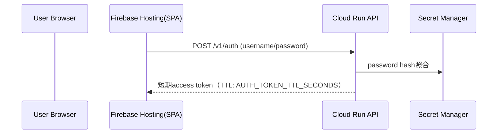
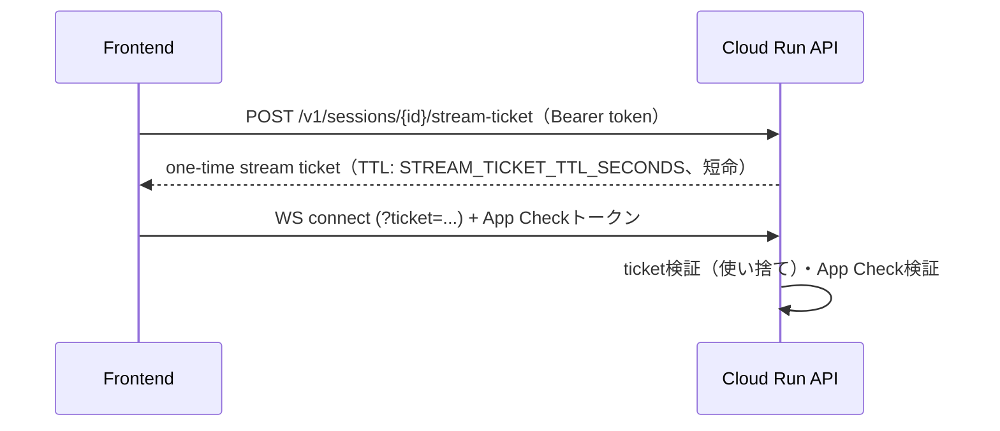

# リアルな複数人英会話トレーニングエージェント セキュリティ設計書

## 目次

- [0. 文書情報](#0-文書情報)
- [1. セキュリティ設計の基本方針](#1-セキュリティ設計の基本方針)
- [2. 認証・認可設計](#2-認証認可設計)
- [3. dev環境のアクセス制御](#3-dev環境のアクセス制御)
- [4. IAM / Service Account設計](#4-iam--service-account設計)
- [5. Secret Manager設計](#5-secret-manager設計)
- [6. レート制限・バックプレッシャー](#6-レート制限バックプレッシャー)
- [7. データ保護方針](#7-データ保護方針)
- [8. 採用しなかった対策とその理由](#8-採用しなかった対策とその理由)
- [9. 残存リスクと軽減策](#9-残存リスクと軽減策)
- [10. 未決定事項](#10-未決定事項)

---

## 0. 文書情報

| 項目 | 内容 |
|---|---|
| 文書名 | リアルな複数人英会話トレーニングエージェント セキュリティ設計書 |
| 版数 | v0.1 |
| 作成日 | 2026-07-11 |
| 前提文書 | `docs/infra/00_OVERVIEW.md`、`docs/infra/01_ARCHITECTURE.md` |
| 位置づけ | Cloud Armor/ALB/API Gateway/VPC Service Controlsを採用しない前提で、認証・認可・IAM・レート制限・データ保護をどう担保するかを定義する |

---

## 1. セキュリティ設計の基本方針

| ID | 方針 |
|---|---|
| SEC-001 | 公開入口の防御はWAF（Cloud Armor）ではなく、アプリ層の認証（password＋短期token）とFirebase App Checkで行う |
| SEC-002 | APIキー・署名鍵・password等はSecret Managerで一元管理し、フロントエンドやリポジトリに置かない |
| SEC-003 | Cloud Run・Agent Engineの実行Service Accountは最小権限とする |
| SEC-004 | ログにAPIキー・secret・不要な個人情報・音声データ本体を出力しない |
| SEC-005 | 音声データは原則永続保存しない |
| SEC-006 | ネットワーク境界（VPC Service Controls）に頼らず、IAM・アプリ層制御で防御する（Organization不在のため技術的にも選択肢に無い） |

---

## 2. 認証・認可設計

### 2.1 ユーザー認証（password → 短期token）

- ログイン機能は持たず、共有のusername/passwordをアプリ全体のゲートとして使う。
- passwordはSecret Managerにハッシュ化して保存し、平文はどこにも保存しない。
- 発行される短期tokenは`token-signing-secret`で署名し、REST API呼び出し時に`Authorization: Bearer`で検証する。

### 2.2 WebSocket用stream ticket

- 通常のaccess tokenをWebSocket URLへ長時間露出させないため、専用の一回限りticketを発行する。
- ticketは発行後1回の接続のみ有効とし、有効期限は短く設定する（`02_PARAMS_DEF.md` §3）。

### 2.3 App Check

| 項目 | 内容 |
|---|---|
| 本番（prd） | reCAPTCHA Enterprise。Firebase Hostingの各サイトドメインごとにキーを発行 |
| ローカル開発・CI | debugプロバイダ。debugトークンはFirebaseコンソールで登録し、GitHub Actionsのencrypted secretsに保存する |
| 運用ルール | debugトークンは本番ビルドに含めない、リポジトリにコミットしない、漏洩時は即座に失効する |
| 導入方式 | `APP_CHECK_ENFORCEMENT_MODE`を`monitor`から開始し、動作確認後`enforce`へ切り替える段階導入とする |

---

## 3. dev環境のアクセス制御

dev環境は開発者がブラウザで実際のUIとして利用できる必要があるため、以下の3層を重ねる。

| 層 | 手段 | 防ぐ脅威 |
|---|---|---|
| プラットフォーム層 | Cloud Run `authentication required` + `roles/run.invoker`をdev環境の開発者アカウント/グループに付与 | GCPレベルでの未認可アクセス |
| ブラウザ層 | IAP for Cloud Run（ALBを介さない直接統合） | ブラウザ経由のログイン制御。IAPがOAuthハンドシェイクを仲介し、ブラウザにIDトークンを持たせる必要がある問題を解消する |
| アプリ層 | FastAPIのpassword認証（§2.1） | アプリレベルのゲート。IAM/IAPを突破されても最終防衛線として機能する |

3層とも省略せず実装する（ユーザー確定事項）。prd環境はIAM層・IAP層を持たず、App Check＋password＋rate limitで防御する（一般公開のデモ環境のため）。

---

## 4. IAM / Service Account設計

| Service Account | 用途 | 主な権限 |
|---|---|---|
| `api-sa` | Cloud Run API実行 | Firestore read/write、Secret Manager read、Cloud Tasks enqueue、Agent Engine呼び出し |
| `agent-engine-sa` | Agent Engine実行 | Firestore read/write、Secret Manager read、Gemini/Vertex AI利用、X API呼び出し |
| `cloud-tasks-invoker-sa` | Cloud TasksからAPI内部エンドポイントを呼ぶ専用 | 当該Cloud Run serviceのInvokerのみ |
| `github-actions-deploy-sa` | frontend/api/agent/terraformのデプロイ | Artifact Registry push、Cloud Run deploy、Firebase Hosting deploy、必要なSAへのactAs |
| `terraform-sa` | Terraform実行（bootstrap含む） | IaC管理対象リソースの作成・更新権限 |

広めの権限を一時的に付与する場合は理由をIssueに記録し、後続で縮小する。

---

## 5. Secret Manager設計

詳細は`02_PARAMS_DEF.md` §4を参照。参照可能なコンポーネントは`api-sa`・`agent-engine-sa`のみとし、Frontendおよび`github-actions-deploy-sa`（デプロイのみ行うため）には秘密情報へのアクセス権を付与しない。

---

## 6. レート制限・バックプレッシャー

Cloud Armorを採用しないため、以下の4層でコスト濫用・過負荷を防ぐ。

| 層 | 内容 |
|---|---|
| アプリ層rate limit | `RATE_LIMIT_PER_IP_PER_MINUTE`（dev/prd共通で厳しめに設定） |
| Cloud Run同時実行制御 | `concurrency`/`max-instances`で上限を設定 |
| セッション数バックプレッシャー | `MAX_CONCURRENT_SESSIONS`超過時は`429 + Retry-After`を返す |
| Cloud Tasksキューのレート制御 | `max_concurrent_dispatches`/`max_dispatches_per_second`でX API/Gemini呼び出しのバーストを吸収 |

「確実な実行の保証」ではなく「過負荷保護」が目的である点に注意する（`docs/BASIC_DESIGN.md` §11 JOB-004と整合）。

---

## 7. データ保護方針

| データ | 保存方針 |
|---|---|
| 音声データ | 原則保存しない |
| 文字起こし・AI発話テキスト | セッション復習用にFirestoreへ保存可（24h TTL） |
| 文法フィードバック・Review | 同上 |
| secret | Firestoreに保存しない。Secret Manager限定 |
| system event/ログ | デバッグ・監視用に保存。個人識別情報は含めない |

Firestoreへのアクセス制御はIAM・Service Accountベースであり、ネットワーク境界（VPC Service Controls）には依存しない設計とする（理由は§8）。

---

## 8. 採用しなかった対策とその理由

技術的な詳細は`01_ARCHITECTURE.md` §7を正とし、ここではセキュリティ観点での結論のみ要約する。

| 対策 | 不採用の理由（要約） |
|---|---|
| Cloud Armor（WAF） | 独自ドメインが前提となり、方針（ドメイン非取得）と矛盾する |
| API Gatewayでの認証認可集約 | WebSocketが通らず、FastAPIミドルウェアと機能が重複する |
| VPC Service Controls | Organization配下でないプロジェクトでは技術的に利用不可 |
| VPCでFirestore等を包囲 | Firestore/Secret Manager/Vertex AIのアクセス制御は元々IAMベースであり、VPCに置くこと自体は保護に寄与しない |

---

## 9. 残存リスクと軽減策

| リスク | 軽減策 |
|---|---|
| WAFが無いことによる既知の攻撃パターン（XSS/SQLi等）への露出 | アプリ側でのinput validation、FastAPIのスキーマバリデーション、出力エスケープを徹底する |
| ネットワーク層でのデータ持ち出し防止が無い | IAMの最小権限徹底、Secret Managerでのsecret一元管理、監査ログ（Cloud Logging）でカバーする |
| App Check debugトークン漏洩 | GitHub Actions encrypted secretsで管理し、定期的な棚卸し・失効を行う |
| password/tokenの漏洩 | 短期TTL、Secret Managerでのハッシュ管理、rate limitとの併用で被害を限定する |

---

## 10. 未決定事項

| TBD ID | 内容 | 判断観点 |
|---|---|---|
| TBD-SEC-001 | IAP for Cloud Runの具体的なOAuth同意画面設定・許可アカウント範囲 | 開発者アカウントの管理方法 |
| TBD-SEC-002 | App Check `enforce`モードへの切り替えタイミング | 動作検証の完了度合い |
| TBD-SEC-003 | rate limitの具体的な閾値 | デモ利用シナリオでの実測に基づき決定 |
