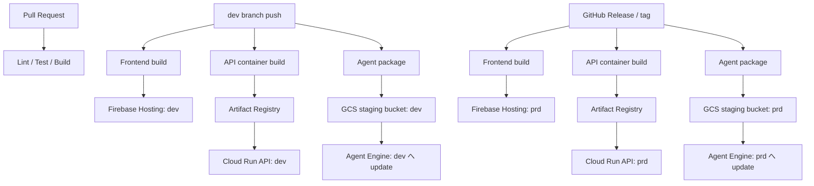

# リアルな複数人英会話トレーニングエージェント デプロイ設計書

## 目次

- [0. 文書情報](#0-文書情報)
- [1. 本書の目的](#1-本書の目的)
- [2. デプロイ対象とデプロイ経路](#2-デプロイ対象とデプロイ経路)
- [3. CI/CDパイプライン](#3-cicdパイプライン)
- [4. Frontend（Firebase Hosting）デプロイ](#4-frontendfirebase-hostingデプロイ)
- [5. API（Cloud Run）デプロイ](#5-apicloud-runデプロイ)
- [6. Agent（Vertex AI Agent Engine）デプロイ](#6-agentvertex-ai-agent-engineデプロイ)
- [7. Terraform適用フロー](#7-terraform適用フロー)
- [8. 環境戦略：dev/prdから開始しstgを後日追加](#8-環境戦略devprdから開始しstgを後日追加)
- [9. release手順](#9-release手順)
- [10. ロールバック方針](#10-ロールバック方針)
- [11. 未決定事項](#11-未決定事項)
- [12. 参考資料](#12-参考資料)

---

## 0. 文書情報

| 項目 | 内容 |
|---|---|
| 文書名 | リアルな複数人英会話トレーニングエージェント デプロイ設計書 |
| 版数 | v0.1 |
| 作成日 | 2026-07-09 |
| 関連文書 | `docs/infra/01_ARCHITECTURE.md`, `docs/infra/02_PARAMS_DEF.md`, `docs/CONTRIBUTION.md` |
| 位置づけ | CI/CDパイプライン、Terraform適用、Agent Engineデプロイ、release手順を集約する。**frontend/backend/infraのデプロイ手順をここに一本化し、重複させない。** |

---

## 1. 本書の目的

`01_ARCHITECTURE.md`で決めた構成を、実際にどう構築・更新するかを定義する。`CONTRIBUTION.md`のブランチ運用・PRルールと整合させつつ、本書はデプロイの技術的な手順に特化する。

---

## 2. デプロイ対象とデプロイ経路

| 対象 | 経路 | 備考 |
|---|---|---|
| Frontend | build → Firebase Hosting deploy | Reactの静的ビルド成果物をデプロイするのみ |
| API（FastAPI） | container build → Artifact Registry → Cloud Run deploy | 既存のコンテナデプロイパターン |
| Agent（ADK） | パッケージング → GCSステージングバケット → Vertex AI SDK (`agent_engines.create()`/`.update()`) → Agent Engine | **Frontend/APIとは全く別のデプロイ経路** |
| Infra（Terraform） | `terraform plan` → レビュー → `terraform apply` | 7章参照 |

Agent Engineへのデプロイは、コンテナデプロイの流用ができない点が最大の注意点である。CI/CDのjob定義を分ける。

---

## 3. CI/CDパイプライン

### 3.1 方針

CI/CDはGitHub Actionsで実行する。GCP認証はWorkload Identity Federationを用い、長期Service Account KeyをGitHub Secretsに保存しない（`03_SECURITY.md`と整合）。

### 3.2 全体像（dev/prd構成）



### 3.3 対象別CI内容

| 対象 | CI内容 |
|---|---|
| Frontend | lint、typecheck、build、test |
| API | lint、test、container build |
| Agent（ADK） | lint、test、tool schema check、Agent behavior test |
| Infra | terraform fmt、validate、plan |

`CONTRIBUTION.md` §9（テスト規則）のMVP必須ラインと整合させる。

---

## 4. Frontend（Firebase Hosting）デプロイ

1. `frontend/` をbuild（`npm run build`等）
2. Firebase CLI（`firebase deploy --only hosting:{target}`）でdev/prdそれぞれのHostingサイト/ターゲットへデプロイ
3. GitHub ActionsからのFirebaseデプロイは、`FirebaseExtended/action-hosting-deploy`等のOIDC対応actionを使い、長期トークンを持たない

Firebase Hosting自体はCloud Runのようなingress設定を持たないため、環境ごとの差はHostingサイト/ターゲットの向き先（dev用 or prd用のAPI URLをbuild時の環境変数で切り替える）のみで表現する。

---

## 5. API（Cloud Run）デプロイ

1. `api/` をcontainer build（Dockerfile）
2. Artifact Registryへpush
3. `gcloud run deploy`（またはTerraform経由）でdev/prdそれぞれのCloud Runサービスを更新
4. prdのみ、デプロイ後にALB/Serverless NEGのbackendが新リビジョンを向いていることを確認する

環境ごとの差分（ingress設定、CORS許可オリジン、Cloud Armorの有無）は`02_PARAMS_DEF.md`の環境変数・Terraform variablesで切り替える。

---

## 6. Agent（Vertex AI Agent Engine）デプロイ

### 6.1 手順概要

1. ADKで実装したAgentコード一式をパッケージング
2. GCSステージングバケットへアップロード
3. Vertex AI SDK（Python）で`agent_engines.create()`（初回）または`.update()`（更新時）を実行
4. デプロイ後、Reasoning Engineのリソース名（`AGENT_ENGINE_RESOURCE_NAME`）をAPI側の環境変数に反映する

### 6.2 CI/CDへの組み込み

- GitHub Actions上でPython環境を用意し、Vertex AI SDKからデプロイを実行するjobを追加する
- 認証はWorkload Identity Federation経由（`github-actions-deploy-sa`が`agent_engine_sa`へのactAs権限を持つ、または直接Agent Engineへのデプロイ権限を持つ）
- 「登録は歴史的にcurlコマンドでのAPI呼び出しが確実」という情報もあるため、SDK呼び出しが不安定な場合はcurlベースのデプロイスクリプトも検討する（§11 TBD）

### 6.3 IAM

デプロイに必要な権限は`03_SECURITY.md` §4を参照。Agent Engine自体の実行IDは`agent-engine-sa`（デフォルトのCompute Engine SAは使わない）。

---

## 7. Terraform適用フロー

```text
PR作成 → terraform fmt / validate / plan（CI） → レビュー → main merge → terraform apply（手動 or CD）
```

| 項目 | 方針 |
|---|---|
| State管理 | GCSバックエンド（バケットは`02_PARAMS_DEF.md`で定義） |
| 環境分離 | `infra/terraform/environments/{dev,prod}`ディレクトリで変数を分離（`01_ARCHITECTURE.md` §18.2） |
| apply権限 | `terraform-sa`のみ。人間のオペレーターはWorkload Identity Federation経由で一時的に権限を借用する |
| 手動作成分 | MVPで間に合わない場合は手動作成を許容し、`02_PARAMS_DEF.md`に記録した上で後日Terraform化する（`CONTRIBUTION.md` §18.2と整合） |

---

## 8. 環境戦略：dev/prdから開始しstgを後日追加

### 8.1 現在の方針

- **dev**: 開発者向け。ALB/Cloud Armorなし、Cloud Run標準URL直接公開、password保護。継続的にdeploy（devブランチpush等）
- **prd**: デモ・審査用。ALB + Cloud Armor + Serverless NEG。GitHub Release / tagを起点にdeploy
- **stg**: 現時点では作らない。時間が許せば、prd構成をコピーする形で追加する

### 8.2 stg追加時の変更点（将来の参考）

- Terraformの`environments/stg/`を有効化（ディレクトリは`01_ARCHITECTURE.md` §18.2で予約済み）
- CI/CDに「mainブランチpush → stg deploy」のステップを追加（`CONTRIBUTION.md` §10.2の元の設計に相当）
- GCPプロジェクト分離を行うかどうかは、その時点のコスト・運用負荷で再評価する（`01_ARCHITECTURE.md` TBD-INF-010は「単一project」で確定済みだが、stg追加時に見直す余地を残す）

---

## 9. release手順

`CONTRIBUTION.md` §11（リリース規則）をベースに、Agent Engineデプロイを追加した手順とする。

1. devで主要フローが動作することを確認する
2. `release/vX.Y.Z`ブランチを作成する（または直接tagを打つ、チーム規模的に省略も可）
3. GitHub Releaseを作成する
4. CI/CDが起動し、Frontend / API / Agentをprdへデプロイする
5. prdで以下を確認する（smoke test）
   - Setup → Conversation → Reviewの主要フローが動く
   - password認証が機能する
   - Agent Engineとの音声セッションが確立する
   - フォールバック（トレンド取得失敗時に事前トピックへ切り替わる等）が機能する
6. release noteを記録する

---

## 10. ロールバック方針

| 対象 | ロールバック方法 |
|---|---|
| Frontend | Firebase Hostingの過去バージョンへのロールバック機能を利用 |
| API（Cloud Run） | 直前の安定リビジョンへトラフィックを戻す（`gcloud run services update-traffic`） |
| Agent Engine | 直前のAgent Engineバージョンへ`.update()`し直す、またはリソースを再作成する（バージョニング方法は§11 TBDで詳細化） |
| Infra | Terraform stateを前のcommitに対応する状態へ`plan`し直し、`apply` |

prdで重大障害が発生した場合は、直前の安定状態へロールバックし、原因調査用のIssueを作成する（`CONTRIBUTION.md` §11.4と整合）。

---

## 11. 未決定事項

| TBD ID | 内容 |
|---|---|
| TBD-DEPLOY-001 | Agent EngineデプロイをVertex AI SDK経由にするか、curlベースのAPI呼び出しにするか |
| TBD-DEPLOY-002 | Terraform stateのGCSバケット名・命名規則 |
| TBD-DEPLOY-003 | Agent Engineのバージョニング・ロールバック方法の具体化 |
| TBD-DEPLOY-004 | Firebase Hostingのdev/prdサイト分離方法（複数サイト or 1サイト+ターゲット） |
| TBD-DEPLOY-005 | release/vX.Y.Zブランチを実際に作るか、tagのみで運用するか（チーム規模的に簡略化してよいか） |

---

## 12. 参考資料

- `docs/infra/01_ARCHITECTURE.md`
- `docs/infra/02_PARAMS_DEF.md`
- `docs/infra/03_SECURITY.md`
- `docs/CONTRIBUTION.md`（§9〜§11）
- google-github-actions/auth  
  https://github.com/google-github-actions/auth
- Workload Identity Federation for deployment pipelines  
  https://docs.cloud.google.com/iam/docs/workload-identity-federation-with-deployment-pipelines
