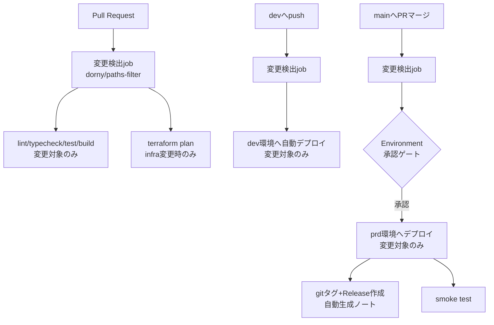

# リアルな複数人英会話トレーニングエージェント CI/CD・デプロイ設計書

## 目次

- [0. 文書情報](#0-文書情報)
- [1. CI/CD対象の一覧](#1-cicd対象の一覧)
- [2. ブランチ・環境マッピング](#2-ブランチ環境マッピング)
- [3. パイプライン構成](#3-パイプライン構成)
- [4. Terraformのbootstrapと継続的applyの分離](#4-terraformのbootstrapと継続的applyの分離)
- [5. 各コンポーネントのデプロイ手順](#5-各コンポーネントのデプロイ手順)
- [6. リリースとタグ運用](#6-リリースとタグ運用)
- [7. ロールバック方針](#7-ロールバック方針)
- [8. 未決定事項](#8-未決定事項)
- [9. 参考資料](#9-参考資料)

---

## 0. 文書情報

| 項目 | 内容 |
|---|---|
| 文書名 | リアルな複数人英会話トレーニングエージェント CI/CD・デプロイ設計書 |
| 版数 | v0.1 |
| 作成日 | 2026-07-11 |
| 前提文書 | `docs/infra/00_OVERVIEW.md`、`docs/infra/01_ARCHITECTURE.md`、`docs/CONTRIBUTION.md` |
| 位置づけ | モノレポにおける差分（affected-only）デプロイの実現方法、Terraform運用、リリース・ロールバック手順を定義する |

---

## 1. CI/CD対象の一覧

モノレポ内の変更は、影響を受けた対象だけをビルド・デプロイする（affected-only）。これはNx/Turborepo/Bazel等のモノレポツールが掲げる原則と同じ考え方だが、本プロジェクトの規模（4系統）では`dorny/paths-filter`によるパスフィルタで十分であり、専用ツールの導入は行わない。

| 対象パス | フィルタキー | デプロイ先 | 手段 |
|---|---|---|---|
| `frontend/**` | `frontend` | Firebase Hosting | firebase-tools / FirebaseExtended action、WIF認証 |
| `api/**`（`tasks/`含む） | `api` | Cloud Run API | Docker build → Artifact Registry（tag: git SHA）→ `google-github-actions/deploy-cloudrun` |
| `agent/**` | `agent` | Vertex AI Agent Engine | Pythonスクリプトで`agent_engines.update()`（Inline Source Deployment） |
| `infra/terraform/**` | `infra` | GCPリソース一式 | `terraform plan`（PR）／`terraform apply`（merge、承認ゲート付き） |
| `packages/shared-schemas/**` | `frontend`+`api`+`agent`全部 | - | 依存元すべてを変更ありとして扱う（手動でこの対応関係を維持する） |
| `infra/bootstrap/**` | 対象外 | - | CIでは実行しない。人力のみ（§4） |

---

## 2. ブランチ・環境マッピング

| イベント | 環境 | 挙動 |
|---|---|---|
| PR（対main/dev） | なし | lint/typecheck/test/build（変更対象のみ）＋terraform plan。デプロイしない |
| `dev`へpush（force push可） | dev | 変更対象のみ自動デプロイ（承認不要、高速イテレーション優先） |
| `main`へのPRマージ | prd | 変更対象のみデプロイ、GitHub Environmentの「required reviewers」で承認ゲート |

stg環境は当面設けない。GitHub Environments機能で`dev`/`prd`を分け、環境ごとにWIFプロバイダ・シークレットをスコープし、`prd`にのみ承認必須ルールを設定する。

---

## 3. パイプライン構成

1つのworkflow内で変更検出ジョブ→条件付き後続ジョブという構成にする（複数workflowに分割すると実行タイミングの競合や設定重複が起きやすいため）。



`.github/workflows/`は`ci.yml`（PR時の検証）と`cd.yml`（push時のデプロイ）の2ファイルに分ける。

Agent Engineの実コード（`agent/**`）を対象とする自動テストは、実Gemini呼び出しを伴いコスト・時間がかかるため、**Agent behavior testは`agent/**`変更時のみ実行**する（他パス変更時は実行しない）。

---

## 4. Terraformのbootstrapと継続的applyの分離

継続的な変更（`infra/terraform/environments/{dev,prod}`）はCI/CDで自動化するが、**最初のstate用GCSバケット作成だけは自動化できない**。これは「Terraformがstateを保存するバケット自体を、そのバックエンド設定で管理しようとする」循環（鶏と卵問題）に加え、GitHub Actions自身が使うWorkload Identity Federationという信頼関係を、GitHub Actions自身に作らせるのはセキュリティ上望ましくないためである。Googleの公式リファレンス実装（terraform-example-foundation）も同様に、人力実行専用の"0-bootstrap"ステージを設けている。

```text
infra/bootstrap/ で1回だけ人力実行すること
1. GCSバケット作成（terraform state用）
   - Object Versioning: 有効
   - Uniform bucket-level access: 有効
   - Public access prevention: enforced
2. terraform-sa（Terraform実行用SA）作成・IAM付与
3. github-actions-deploy-sa 作成・IAM付与
4. Workload Identity Federation の Pool / Provider作成
   - 対象リポジトリに限定するattribute conditionを設定
5. 上記SAに対して、WIF経由でのimpersonation権限を付与
6. bootstrap自体のtiny stateを、作成したバケット内
   （例: terraform/state/bootstrap）へ terraform init -migrate-state で移す
   → ローカルのみに残さず、チームで後から参照・変更できるようにする
```

これ以降、`infra/terraform/environments/{dev,prod}`はこのバケットをGCSバックエンドとして使い、GitHub Actions（WIF経由）が通常のplan/applyを自動で回す。Terraform 1.10以降、GCSバックエンドは追加設定なしでネイティブに状態ロックが効くため、Firestore等の別ロック機構は不要。

bootstrap自体は「一度作ったらほぼ触らない」ものであり、CIのplan/apply対象には含めない。

---

## 5. 各コンポーネントのデプロイ手順

### 5.1 Frontend（Firebase Hosting）

`frontend/**`変更時、firebase-tools（またはFirebaseExtended action）でWIF認証を用いてデプロイする。dev/prdはFirebase Hostingの複数サイト機能で分離する。

### 5.2 API（Cloud Run）

1. Dockerイメージをbuildし、Artifact Registryへpush（タグ: git SHA）
2. `google-github-actions/deploy-cloudrun`でCloud Runへデプロイ
3. Terraformはサービスの枠（scaling, ingress, IAM等）のみを管理し、コンテナイメージの参照は`lifecycle.ignore_changes`でTerraform管理外にする（CIが毎コミットterraform applyを要求しないようにするため）

### 5.3 Agent（Vertex AI Agent Engine）

1. `agent/**`変更時、Pythonスクリプト（`agent/deploy.py`）を実行
2. 初回は`agent_engines.create()`、以降は`resource_name`を指定して`agent_engines.update()`
3. Agent自体のコードはTerraform管理に含めない。Terraformは実行用Service Account・IAMなど周辺のみを管理する（Cloud Runのコンテナイメージと同じ考え方）

### 5.4 Infra（Terraform）

1. PRでは`terraform fmt -check` / `terraform validate` / `terraform plan`を実行し、結果をPRコメントに出す
2. `dev`へのpushでは自動apply
3. `main`へのマージではGitHub Environmentの承認ゲートを経てapply

---

## 6. リリースとタグ運用

デプロイのトリガーは`main`マージ＋承認ゲートであり、gitタグはトリガーではなく**記録**として扱う。

1. prdデプロイジョブの最終ステップとして、`gh release create --generate-notes`でタグ＋リリースノートを自動作成する
2. リリースノートはマージ済みPRタイトルから自動生成する（`CHANGE_LOG.md`の「release pageを見て」という既存方針と整合）
3. タグ命名は`v0.1.0`のような手動採番、または`vYYYY.MM.DD-<short-sha>`のような自動採番のいずれかを採用する（要確定、§8参照）

`docs/CONTRIBUTION.md`にある旧`release/*`ブランチ＋タグでprodデプロイ、というフローはこの方針に合わせて更新済み（詳細は`docs/CONTRIBUTION.md` §4）。

---

## 7. ロールバック方針

コンポーネントごとにロールバック手段が異なるため、障害対応時に混同しないよう明記する。

| コンポーネント | ロールバック手段 |
|---|---|
| Cloud Run API | `gcloud run services update-traffic --to-revisions=PREVIOUS=100`で即座にトラフィックを戻す |
| Firebase Hosting | Firebaseコンソール／CLIのリリース履歴からロールバック |
| Vertex AI Agent Engine | トラフィック分割の概念が無いため、直前の良好コミットの`agent/`ソースで`agent_engines.update()`を再実行する |
| Firestore | ロールバック対象外（データ破壊的操作は想定しない） |

---

## 8. 未決定事項

| TBD ID | 内容 | 判断観点 |
|---|---|---|
| TBD-DEP-001 | タグ命名規則（手動semver vs 自動日付ベース） | チームの運用しやすさ |
| TBD-DEP-002 | Agent Engine deploy.pyのCI実行環境（Python версии、requirements固定方法） | 依存関係の再現性 |
| TBD-DEP-003 | Cloud Run scaling値（min/max instances, concurrency）の具体的な数値 | デモ時の同時接続数想定とコスト |

---

## 9. 参考資料

- dorny/paths-filter: https://github.com/dorny/paths-filter
- terraform-example-foundation 0-bootstrap: https://github.com/terraform-google-modules/terraform-example-foundation/blob/main/0-bootstrap/README.md
- Deploying Agents with Inline Source on Vertex AI Agent Engine: https://discuss.google.dev/t/deploying-agents-with-inline-source-on-vertex-ai-agent-engine/288935
- Backend Type: gcs | Terraform: https://developer.hashicorp.com/terraform/language/backend/gcs
